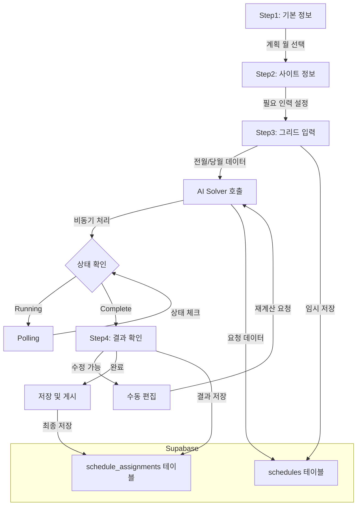
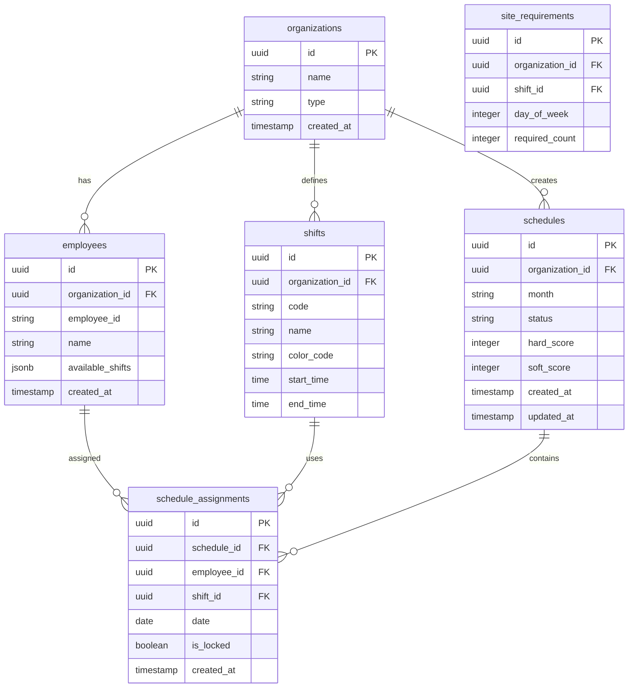

# EveryShift MVP PRD - 근무표 생성 시스템

## 문서 정보

- **버전**: MVP 1.0
- **작성일**: 2025-11-12
- **목적**: 7장(근무표 생성) 중심 MVP 구현 가이드
- **대상**: Claude Code, Cursor를 활용한 AI 기반 개발
- **개발 기간**: 8주

---

# 목차

1. [프로젝트 개요](https://claude.ai/chat/2d454247-b657-4dec-af6b-c9caecef1f44#1-%ED%94%84%EB%A1%9C%EC%A0%9D%ED%8A%B8-%EA%B0%9C%EC%9A%94)
2. [기술 아키텍처](https://claude.ai/chat/2d454247-b657-4dec-af6b-c9caecef1f44#2-%EA%B8%B0%EC%88%A0-%EC%95%84%ED%82%A4%ED%85%8D%EC%B2%98)
3. [데이터베이스 설계](https://claude.ai/chat/2d454247-b657-4dec-af6b-c9caecef1f44#3-%EB%8D%B0%EC%9D%B4%ED%84%B0%EB%B2%A0%EC%9D%B4%EC%8A%A4-%EC%84%A4%EA%B3%84)
4. [기능 명세](https://claude.ai/chat/2d454247-b657-4dec-af6b-c9caecef1f44#4-%EA%B8%B0%EB%8A%A5-%EB%AA%85%EC%84%B8)
5. [컴포넌트 설계](https://claude.ai/chat/2d454247-b657-4dec-af6b-c9caecef1f44#5-%EC%BB%B4%ED%8F%AC%EB%84%8C%ED%8A%B8-%EC%84%A4%EA%B3%84)
6. [API 설계](https://claude.ai/chat/2d454247-b657-4dec-af6b-c9caecef1f44#6-api-%EC%84%A4%EA%B3%84)
7. [개발 가이드](https://claude.ai/chat/2d454247-b657-4dec-af6b-c9caecef1f44#7-%EA%B0%9C%EB%B0%9C-%EA%B0%80%EC%9D%B4%EB%93%9C-8%EC%A3%BC-%EA%B3%84%ED%9A%8D)
8. [부록](https://claude.ai/chat/2d454247-b657-4dec-af6b-c9caecef1f44#8-%EB%B6%80%EB%A1%9D)

---

# 1. 프로젝트 개요

## 1.1 문제 정의

### 현재 상황

병원 등 24시간 운영 조직에서 간호사 등 근무자의 교대 근무 일정 관리는 매우 복잡합니다:

**실제 현장 분석 결과**:

- 📊 **엑셀 수작업**: 31일 × 30명 = 930개 셀을 수동으로 관리
- ⏱️ **시간 소요**: 월 1회, 4-8시간 소요
- ❌ **오류 발생**: 제약 조건 위반, 불공정한 배분
- 😓 **근무자 불만**: 야간 근무 편중, 투명성 부족

**핵심 문제**:

1. D(Day), E(Evening), N(Night) 시프트의 공정한 배분
2. 근로기준법 준수 (주 52시간 제한, 연속 야간 근무 제한)
3. 개인 휴가/선호 시간대 반영
4. 필요 인력 충족

## 1.2 MVP 목표

### 가치 제안

**"엑셀 근무표 작성 시간을 90% 단축하고, 공정성을 보장한다"**

### MVP 범위

이 MVP는 **7장(근무표 생성)에만 집중**하며, 다음을 구현합니다:

#### ✅ In-Scope (포함)

- **7.1 기본 정보 설정**: 계획 월 선택, 조직 정보 확인
- **7.2 사이트 정보 설정**: 일별 필요 인력 설정
- **7.3 근무표 초기 정보 입력**: 그리드 UI로 전월/당월 데이터 입력
- **7.4 근무표 생성 결과 확인**: AI Solver 결과 조회 및 수정

#### ❌ Out-of-Scope (제외)

- 회원가입 및 승인 프로세스 (간소화: 이메일/비밀번호만)
- 조직/직원 관리 CRUD (Seed 데이터로 제공)
- 대시보드 및 통계
- 알림 시스템
- 다국어 지원
- 모바일 대응

### 성공 지표

- ✅ **기능 완성도**: 7.1~7.4 전체 플로우 동작
- ✅ **성능**: 그리드 30명×36일 렌더링 < 2초
- ✅ **AI 연동**: Mock 데이터로 시뮬레이션 완료
- ✅ **사용성**: 엑셀 대비 직관적인 UI

## 1.3 제약사항

### 기술적 제약

- **로컬 개발만**: 배포 환경 미구성
- **AI Solver**: Google Cloud Run URL만 알고 있음 (연동 구조만 구현, Mock 응답)
- **데이터**: Seed 스크립트로 초기 데이터 제공 (CRUD 없음)
- **사용자**: Admin 단일 역할 (권한 체계 단순화)

### 그리드 단순화

Enhanced PRD의 완전 기능 대신 다음으로 단순화:

- **근무자 수**: 최대 30명
- **기간**: 전월 5일 + 당월 31일 (36일)
- **3-level 헤더**: 포함
- **가상 스크롤**: 제외 (전체 렌더링)
- **고정 컬럼**: 이름 컬럼만 고정
- **통계**: 행/열 기본 합계만 (실시간 검증 제외)
- **특수 기능**: 키보드 단축키, 패턴 복사 제외

---

# 2. 기술 아키텍처

## 2.1 기술 스택

### Frontend

|항목|기술|버전|용도|
|---|---|---|---|
|**Framework**|Vue 3|3.5.17|Composition API 기반|
|**Language**|TypeScript|5.8.3|타입 안정성|
|**Build Tool**|Vite|6.3.5|빠른 개발 경험|
|**Styling**|Tailwind CSS|3.4.17|유틸리티 CSS|
|**Admin Template**|Vben Admin|5.x|레이아웃 및 구조 참고|
|**Grid**|TanStack Table|v8|스케줄링 그리드|
|**State**|Pinia|2.x|상태 관리|
|**Date**|Day.js|1.x|날짜 처리|
|**UI Components**|Naive UI|2.42.0|폼, 모달, 버튼 등|

### Backend

|항목|기술|용도|
|---|---|---|
|**Database**|Supabase PostgreSQL|데이터 저장|
|**Auth**|Supabase Auth|이메일/비밀번호 인증|
|**RLS**|Supabase RLS|행 단위 보안|

### AI Solver (외부)

|항목|기술|상태|
|---|---|---|
|**Platform**|Google Cloud Run|개발 완료|
|**Engine**|OptaPlanner|Java 기반|
|**연동**|REST API (추정)|MVP에서는 Mock|

## 2.2 Vben Admin 활용 전략

### 채택 범위

Vben Admin의 **부분 활용** - 전체 도입이 아닌 선택적 참고:

#### ✅ 활용할 것

1. **레이아웃 구조**
    - DefaultLayout (Header + Sidebar + Content)
    - 라우팅 구조
2. **인증 패턴**
    - 로그인 플로우
    - 라우트 가드 (beforeEach)
3. **코드 스타일**
    - Composable 패턴
    - 폴더 구조

#### ❌ 사용하지 않을 것

1. Vben의 복잡한 컴포넌트 (BasicTable, VbenForm 등)
2. Vben의 설정 시스템 (preference store 등)
3. Vben의 권한 시스템 (단순화)

### 이유

- Vben의 BasicTable은 복잡한 그리드에 부적합 → TanStack Table 직접 사용
- 불필요한 기능으로 인한 학습 곡선 및 번들 크기 증가 방지

## 2.3 프로젝트 구조

```
everyshift-mvp/
├── src/
│   ├── components/
│   │   ├── layout/
│   │   │   ├── DefaultLayout.vue
│   │   │   ├── Header.vue
│   │   │   └── Sidebar.vue
│   │   ├── schedule/
│   │   │   ├── ScheduleGrid.vue        # [핵심] TanStack Table 그리드
│   │   │   ├── ShiftSelector.vue       # 시프트 선택 버튼 그룹
│   │   │   ├── StepIndicator.vue       # 단계 표시
│   │   │   └── StatisticsSummary.vue   # 통계 요약
│   │   └── ui/
│   │       ├── Button.vue
│   │       ├── Card.vue
│   │       └── Modal.vue
│   ├── composables/
│   │   ├── useAuth.ts                  # Supabase 인증
│   │   ├── useScheduleGrid.ts          # 그리드 로직
│   │   └── useAISolver.ts              # AI Solver 연동
│   ├── stores/
│   │   ├── auth.ts                     # 인증 상태
│   │   ├── schedule.ts                 # 근무표 상태
│   │   └── organization.ts             # 조직 정보
│   ├── router/
│   │   ├── index.ts
│   │   ├── routes.ts
│   │   └── guards.ts                   # 인증 가드
│   ├── views/
│   │   ├── auth/
│   │   │   └── Login.vue
│   │   └── schedule/
│   │       ├── Step1BasicInfo.vue      # 7.1 기본 정보
│   │       ├── Step2SiteInfo.vue       # 7.2 사이트 정보
│   │       ├── Step3InitialData.vue    # 7.3 초기 데이터 (그리드)
│   │       └── Step4Result.vue         # 7.4 결과 확인
│   ├── api/
│   │   ├── supabase.ts                 # Supabase 클라이언트
│   │   ├── schedule.ts                 # 근무표 API
│   │   └── solver.ts                   # AI Solver API
│   ├── types/
│   │   ├── schedule.ts
│   │   ├── employee.ts
│   │   └── shift.ts
│   ├── utils/
│   │   ├── date.ts
│   │   └── validation.ts
│   ├── assets/
│   └── main.ts
├── supabase/
│   ├── migrations/
│   │   └── 001_initial_schema.sql
│   └── seed.sql                         # 초기 데이터
├── public/
├── .env.local
├── .env.example
├── package.json
├── tsconfig.json
├── tailwind.config.js
└── vite.config.ts
```

## 2.4 데이터 플로우



### 주요 플로우 설명

1. **Step 1-2**: Supabase에서 조직/직원 데이터 조회
2. **Step 3**:
    - 그리드에서 입력한 데이터를 Pinia 스토어에 저장
    - "근무표 생성" 클릭 시 Supabase에 요청 레코드 생성
3. **AI Solver 호출**:
    - Supabase에서 데이터를 읽어 AI Solver API 호출
    - 비동기 처리: status를 'running'으로 설정
    - Polling으로 상태 확인 (5초마다)
4. **Step 4**:
    - 결과 조회 및 그리드 표시
    - 수동 수정 시 schedule_assignments 업데이트

---

# 3. 데이터베이스 설계

## 3.1 MVP 테이블 (단순화)

Enhanced PRD의 13개 테이블을 MVP에 필요한 **6개**로 축소:

### ERD (Mermaid)



## 3.2 테이블 상세 스키마

### organizations (조직)

```sql
CREATE TABLE organizations (
    id UUID PRIMARY KEY DEFAULT gen_random_uuid(),
    name VARCHAR(255) NOT NULL,
    type VARCHAR(50) NOT NULL,  -- hospital, fire, police
    created_at TIMESTAMP WITH TIME ZONE DEFAULT NOW(),
    updated_at TIMESTAMP WITH TIME ZONE DEFAULT NOW()
);
```

**MVP 특징**:

- 단순화: logo_url, business_number 등 제거
- Seed 데이터: 1개 조직만 생성

### employees (직원)

```sql
CREATE TABLE employees (
    id UUID PRIMARY KEY DEFAULT gen_random_uuid(),
    organization_id UUID NOT NULL REFERENCES organizations(id),
    employee_id VARCHAR(50) NOT NULL,  -- 직번
    name VARCHAR(100) NOT NULL,
    available_shifts JSONB NOT NULL,  -- ["D", "E", "N", "O"]
    created_at TIMESTAMP WITH TIME ZONE DEFAULT NOW(),
    updated_at TIMESTAMP WITH TIME ZONE DEFAULT NOW(),
    UNIQUE(organization_id, employee_id)
);

CREATE INDEX idx_employees_org ON employees(organization_id);
```

**MVP 특징**:

- 단순화: position, site, skills 등 제거
- available_shifts: 근무 가능한 시프트 목록 (JSON 배열)

### shifts (시프트)

```sql
CREATE TABLE shifts (
    id UUID PRIMARY KEY DEFAULT gen_random_uuid(),
    organization_id UUID NOT NULL REFERENCES organizations(id),
    code VARCHAR(10) NOT NULL,  -- D, E, N, O, H
    name VARCHAR(50) NOT NULL,  -- Day, Evening, Night, Off, Holiday
    color_code VARCHAR(20) NOT NULL,  -- #92D050, #FFC000, ...
    start_time TIME,  -- 08:00:00
    end_time TIME,    -- 16:00:00
    created_at TIMESTAMP WITH TIME ZONE DEFAULT NOW(),
    UNIQUE(organization_id, code)
);
```

**데이터 예시**:

|code|name|color_code|start_time|end_time|
|---|---|---|---|---|
|D|Day|#92D050|08:00|16:00|
|E|Evening|#FFC000|16:00|00:00|
|N|Night|#4472C4|00:00|08:00|
|O|Off|#D9D9D9|NULL|NULL|

### schedules (근무표)

```sql
CREATE TABLE schedules (
    id UUID PRIMARY KEY DEFAULT gen_random_uuid(),
    organization_id UUID NOT NULL REFERENCES organizations(id),
    month VARCHAR(7) NOT NULL,  -- YYYY-MM
    status VARCHAR(20) NOT NULL DEFAULT 'created',  
    -- created, running, complete, changed, error
    hard_score INTEGER DEFAULT 0,
    soft_score INTEGER DEFAULT 0,
    created_at TIMESTAMP WITH TIME ZONE DEFAULT NOW(),
    updated_at TIMESTAMP WITH TIME ZONE DEFAULT NOW(),
    UNIQUE(organization_id, month)
);

CREATE INDEX idx_schedules_org_month ON schedules(organization_id, month);
```

**상태 전이**:

```
created → running → complete
                  → error
complete → changed (수동 수정 시)
```

### schedule_assignments (근무 배정)

```sql
CREATE TABLE schedule_assignments (
    id UUID PRIMARY KEY DEFAULT gen_random_uuid(),
    schedule_id UUID NOT NULL REFERENCES schedules(id) ON DELETE CASCADE,
    employee_id UUID NOT NULL REFERENCES employees(id),
    shift_id UUID NOT NULL REFERENCES shifts(id),
    date DATE NOT NULL,
    is_locked BOOLEAN DEFAULT FALSE,  -- 잠금 여부 (수정 불가)
    created_at TIMESTAMP WITH TIME ZONE DEFAULT NOW(),
    updated_at TIMESTAMP WITH TIME ZONE DEFAULT NOW(),
    UNIQUE(schedule_id, employee_id, date)
);

CREATE INDEX idx_assignments_schedule ON schedule_assignments(schedule_id);
CREATE INDEX idx_assignments_employee_date ON schedule_assignments(employee_id, date);
```

### site_requirements (사이트 필요 인력)

```sql
CREATE TABLE site_requirements (
    id UUID PRIMARY KEY DEFAULT gen_random_uuid(),
    organization_id UUID NOT NULL REFERENCES organizations(id),
    shift_id UUID NOT NULL REFERENCES shifts(id),
    day_of_week INTEGER NOT NULL,  -- 0(일) ~ 6(토)
    required_count INTEGER NOT NULL,
    created_at TIMESTAMP WITH TIME ZONE DEFAULT NOW(),
    UNIQUE(organization_id, shift_id, day_of_week)
);
```

**데이터 예시** (요일별 필요 인력):

|day_of_week|shift_code|required_count|
|---|---|---|
|0 (일)|D|3|
|0 (일)|E|3|
|1 (월)|D|3|
|1 (월)|E|4|

## 3.3 Seed 데이터

### seed.sql

```sql
-- 1. 조직 생성
INSERT INTO organizations (id, name, type) VALUES
('00000000-0000-0000-0000-000000000001', '세브란스병원', 'hospital');

-- 2. 시프트 정의
INSERT INTO shifts (organization_id, code, name, color_code, start_time, end_time) VALUES
('00000000-0000-0000-0000-000000000001', 'D', 'Day', '#92D050', '08:00', '16:00'),
('00000000-0000-0000-0000-000000000001', 'E', 'Evening', '#FFC000', '16:00', '00:00'),
('00000000-0000-0000-0000-000000000001', 'N', 'Night', '#4472C4', '00:00', '08:00'),
('00000000-0000-0000-0000-000000000001', 'O', 'Off', '#D9D9D9', NULL, NULL);

-- 3. 직원 생성 (30명)
INSERT INTO employees (organization_id, employee_id, name, available_shifts) VALUES
('00000000-0000-0000-0000-000000000001', '40627', '박지현', '["D","E","N","O"]'),
('00000000-0000-0000-0000-000000000001', '41482', '김수빈', '["D","E","N","O"]'),
('00000000-0000-0000-0000-000000000001', '42635', '김다래', '["D","E","N","O"]'),
-- ... 27명 더 추가

-- 4. 사이트 필요 인력 (요일별)
-- 일요일
INSERT INTO site_requirements (organization_id, shift_id, day_of_week, required_count)
SELECT '00000000-0000-0000-0000-000000000001', id, 0, 
    CASE code 
        WHEN 'D' THEN 3
        WHEN 'E' THEN 3
        WHEN 'N' THEN 3
        ELSE 0
    END
FROM shifts WHERE code IN ('D', 'E', 'N');

-- 월요일~토요일 반복...
```

## 3.4 RLS (Row Level Security)

MVP에서는 **단순화**: Admin만 사용하므로 RLS는 최소화

```sql
-- schedules 테이블: 조직 기반 필터링만
ALTER TABLE schedules ENABLE ROW LEVEL SECURITY;

CREATE POLICY "Users can view own organization schedules"
ON schedules FOR SELECT
USING (organization_id = current_setting('app.current_organization_id')::uuid);

CREATE POLICY "Users can insert own organization schedules"
ON schedules FOR INSERT
WITH CHECK (organization_id = current_setting('app.current_organization_id')::uuid);
```

---

# 4. 기능 명세

## 4.1 Step 1: 기본 정보 설정

### 목적

근무표 생성의 **계획 월**과 **조직 기본 정보**를 확인하는 단계

### 화면 구성

```
┌─────────────────────────────────────────────────────┐
│  [단계 표시] 1. 기본 정보 ● ○ ○ ○                      │
├─────────────────────────────────────────────────────┤
│                                                     │
│  근무표 생성 - 기본 정보 설정                        │
│                                                     │
│  ┌───────────────────────────────────────────────┐ │
│  │ 계획 월 선택                                   │ │
│  │                                               │ │
│  │  [ 2025년 12월 ▼ ]                           │ │
│  │                                               │ │
│  │  ℹ️ 다음 달 근무표를 생성합니다                 │ │
│  └───────────────────────────────────────────────┘ │
│                                                     │
│  ┌───────────────────────────────────────────────┐ │
│  │ 조직 정보 확인                                 │ │
│  │                                               │ │
│  │  조직: 세브란스병원 (병원)                     │ │
│  │  등록 직원: 30명                               │ │
│  │                                               │ │
│  │  등록된 시프트:                                │ │
│  │  • D (Day): 08:00 - 16:00                    │ │
│  │  • E (Evening): 16:00 - 00:00                │ │
│  │  • N (Night): 00:00 - 08:00                  │ │
│  │  • O (Off): 휴무                              │ │
│  │                                               │ │
│  └───────────────────────────────────────────────┘ │
│                                                     │
│  [취소]                            [다음 단계 →]    │
└─────────────────────────────────────────────────────┘
```

### 기능 요구사항

#### FR-1.1: 계획 월 선택

- 기본값: 다음 달 (예: 현재 11월이면 12월)
- 선택 가능: 이번 달, 다음 달, 다다음 달
- 드롭다운 형식
- 선택 시 즉시 반영

#### FR-1.2: 조직 정보 표시

- Supabase에서 organizations 조회
- 읽기 전용 (수정 불가)
- 표시 항목:
    - 조직명
    - 조직 유형
    - 등록 직원 수
    - 시프트 정의 (shifts 테이블 조회)

#### FR-1.3: 네비게이션

- "다음 단계" 버튼 클릭 → Step 2로 이동
- 선택한 월을 Pinia 스토어에 저장

### 데이터 모델

```typescript
// types/schedule.ts
export interface ScheduleBasicInfo {
  month: string;           // "2025-12"
  organizationId: string;  // UUID
  organizationName: string;
  organizationType: string;
  employeeCount: number;
  shifts: Shift[];
}

export interface Shift {
  id: string;
  code: string;      // "D", "E", "N", "O"
  name: string;      // "Day", "Evening", ...
  colorCode: string; // "#92D050"
  startTime: string | null;  // "08:00:00"
  endTime: string | null;    // "16:00:00"
}
```

### API

#### GET /api/organizations/:id

**응답**:

```json
{
  "id": "00000000-0000-0000-0000-000000000001",
  "name": "세브란스병원",
  "type": "hospital",
  "employeeCount": 30,
  "shifts": [
    {
      "id": "...",
      "code": "D",
      "name": "Day",
      "colorCode": "#92D050",
      "startTime": "08:00:00",
      "endTime": "16:00:00"
    }
  ]
}
```

### 구현 가이드

#### 1. 컴포넌트 구조

```
Step1BasicInfo.vue
├── MonthSelector.vue      # 월 선택 드롭다운
├── OrganizationInfo.vue   # 조직 정보 카드
└── ShiftList.vue          # 시프트 목록
```

#### 2. 상태 관리 (Pinia)

```typescript
// stores/schedule.ts
export const useScheduleStore = defineStore('schedule', {
  state: () => ({
    basicInfo: null as ScheduleBasicInfo | null,
    currentStep: 1,
  }),
  
  actions: {
    setBasicInfo(info: ScheduleBasicInfo) {
      this.basicInfo = info;
    },
    
    async loadOrganization(orgId: string) {
      // Supabase 조회
      const { data } = await supabase
        .from('organizations')
        .select(`
          *,
          employees(count),
          shifts(*)
        `)
        .eq('id', orgId)
        .single();
      
      this.setBasicInfo({
        month: getNextMonth(),
        organizationId: data.id,
        organizationName: data.name,
        organizationType: data.type,
        employeeCount: data.employees[0].count,
        shifts: data.shifts,
      });
    },
  },
});
```

#### 3. 월 계산 로직

```typescript
// utils/date.ts
import dayjs from 'dayjs';

export function getNextMonth(): string {
  return dayjs().add(1, 'month').format('YYYY-MM');
}

export function getAvailableMonths(): string[] {
  return [
    dayjs().format('YYYY-MM'),        // 이번 달
    dayjs().add(1, 'month').format('YYYY-MM'),  // 다음 달
    dayjs().add(2, 'month').format('YYYY-MM'),  // 다다음 달
  ];
}
```

---

## 4.2 Step 2: 사이트 정보 설정

### 목적

선택한 **계획 월**의 **일별 필요 인력**을 확인하고 수정하는 단계

### 화면 구성

```
┌─────────────────────────────────────────────────────────────┐
│  [단계 표시] 1. 기본 정보 ● 2. 사이트 정보 ● ○ ○               │
├─────────────────────────────────────────────────────────────┤
│                                                             │
│  근무표 생성 - 사이트 정보 설정                              │
│                                                             │
│  2025년 12월 필요 인력 (31일)                               │
│                                                             │
│  ┌─────────────────────────────────────────────────────┐  │
│  │  [그리드: 3-level 헤더]                              │  │
│  │                                                      │  │
│  │    Dec    Dec    Dec    Dec    Dec   ...            │  │
│  │    1일    2일    3일    4일    5일                   │  │
│  │    (일)   (월)   (화)   (수)   (목)                   │  │
│  │  ───────────────────────────────────────────────── │  │
│  │  Total  11     11     11     11     11     ...     │  │
│  │  D       3      3      3      3      3              │  │
│  │  E       4      4      4      4      4              │  │
│  │  N       3      3      3      3      3              │  │
│  │  O       1      1      1      1      1              │  │
│  │                                                      │  │
│  └──────────────────────────────────────────────────────┘  │
│                                                             │
│  ℹ️ 셀을 클릭하여 필요 인력 수를 수정할 수 있습니다            │
│                                                             │
│  [← 이전]                                   [다음 단계 →]   │
└─────────────────────────────────────────────────────────────┘
```

### 기능 요구사항

#### FR-2.1: 3-level 헤더 그리드

- **Level 1**: 월 이름 (예: "Dec")
- **Level 2**: 날짜 (1, 2, 3, ...)
- **Level 3**: 요일 (일, 월, 화, ...)
- Tailwind CSS + HTML table 사용 (TanStack Table 불필요)

#### FR-2.2: 자동 계산

- `site_requirements` 테이블에서 요일별 필요 인력 조회
- 선택한 월의 각 날짜에 맞는 요일 매핑
- 예: 12월 1일(일요일) → day_of_week=0의 데이터 적용

#### FR-2.3: 인라인 편집

- 셀 클릭 → 숫자 입력 가능
- Enter 또는 외부 클릭 시 저장
- 음수 불가 (최소 0)

#### FR-2.4: 합계 계산

- Total 행: D + E + N + O의 합
- 실시간 업데이트

### 데이터 모델

```typescript
// types/schedule.ts
export interface SiteRequirements {
  [date: string]: DailyRequirement;  // "2025-12-01": { D: 3, E: 4, ... }
}

export interface DailyRequirement {
  D: number;
  E: number;
  N: number;
  O: number;
  total: number;
}
```

### API

#### GET /api/site-requirements?organizationId=xxx&month=2025-12

**응답**:

```json
{
  "2025-12-01": { "D": 3, "E": 4, "N": 3, "O": 1, "total": 11 },
  "2025-12-02": { "D": 3, "E": 4, "N": 3, "O": 1, "total": 11 },
  ...
}
```

### 구현 가이드

#### 1. 요일 매핑 로직

```typescript
// utils/date.ts
import dayjs from 'dayjs';

export function getDaysInMonth(month: string): DayInfo[] {
  const start = dayjs(month + '-01');
  const daysCount = start.daysInMonth();
  
  return Array.from({ length: daysCount }, (_, i) => {
    const date = start.add(i, 'day');
    return {
      date: date.format('YYYY-MM-DD'),
      day: date.date(),
      dayOfWeek: date.day(),  // 0(일) ~ 6(토)
      dayName: date.format('ddd'),  // 일, 월, 화, ...
    };
  });
}

export interface DayInfo {
  date: string;      // "2025-12-01"
  day: number;       // 1
  dayOfWeek: number; // 0
  dayName: string;   // "일"
}
```

#### 2. 필요 인력 계산

```typescript
// composables/useSiteRequirements.ts
export function useSiteRequirements(month: string) {
  const requirements = ref<SiteRequirements>({});
  
  async function loadRequirements() {
    // 1. site_requirements 테이블 조회 (요일별)
    const { data: weeklyReqs } = await supabase
      .from('site_requirements')
      .select('day_of_week, shift_id, required_count, shifts(code)')
      .eq('organization_id', orgId);
    
    // 2. 월의 각 날짜에 매핑
    const days = getDaysInMonth(month);
    
    days.forEach(day => {
      const dailyReq: DailyRequirement = { D: 0, E: 0, N: 0, O: 0, total: 0 };
      
      weeklyReqs
        .filter(r => r.day_of_week === day.dayOfWeek)
        .forEach(r => {
          const shiftCode = r.shifts.code;
          dailyReq[shiftCode] = r.required_count;
        });
      
      dailyReq.total = dailyReq.D + dailyReq.E + dailyReq.N + dailyReq.O;
      requirements.value[day.date] = dailyReq;
    });
  }
  
  return { requirements, loadRequirements };
}
```

#### 3. 그리드 렌더링

- 일반 HTML `<table>` 사용
- Tailwind CSS로 스타일링
- 3-level 헤더: `<thead>` 내 3개 `<tr>`

---

## 4.3 Step 3: 근무표 초기 정보 입력 ⭐

### 목적

**전월 5일 + 당월 31일 = 36일** 동안의 근무자별 시프트를 입력하는 **핵심 단계**

이 단계가 **MVP의 가장 복잡하고 중요한 부분**입니다.

### 화면 구성

```
┌──────────────────────────────────────────────────────────────────────┐
│  [단계 표시] 1. 기본 정보 ● 2. 사이트 정보 ● 3. 초기 정보 ● ○          │
├──────────────────────────────────────────────────────────────────────┤
│                                                                      │
│  근무표 생성 - 초기 정보 입력                                         │
│                                                                      │
│  ┌────────────────────────────────────────────────────────────────┐ │
│  │  [TanStack Table 그리드]                                        │ │
│  │                                                                 │ │
│  │  [고정] 근무자   │ Last Month  │ This Month │ ... │ 통계 →      │ │
│  │  이름(ID)      │ 11/27 11/28 │ 12/1  12/2 │     │ D  E  N  Tot│ │
│  │  ────────────────────────────────────────────────────────────  │ │
│  │  박지현(40627) │ [D][E][N][O] │ [ ][ ][ ][ ] │ ... │ 0  0  0  0│ │
│  │  김수빈(41482) │ [D][E][N][O] │ [ ][ ][ ][ ] │ ... │ 0  0  0  0│ │
│  │  ...                                                            │ │
│  │  ────────────────────────────────────────────────────────────  │ │
│  │  Total         │ 0   0       │ 0   0      │     │             │ │
│  │  D             │ 0   0       │ 0   0      │     │             │ │
│  │  E             │ 0   0       │ 0   0      │     │             │ │
│  │  N             │ 0   0       │ 0   0      │     │             │ │
│  │                                                                 │ │
│  └─────────────────────────────────────────────────────────────────┘ │
│                                                                      │
│  [← 이전]  [임시 저장]                             [근무표 생성 →]   │
└──────────────────────────────────────────────────────────────────────┘
```

### 기능 요구사항

#### FR-3.1: TanStack Table 그리드 구성

- **행(Rows)**: 근무자 30명
- **열(Columns)**: 36일 (전월 5일 + 당월 31일) + 통계 4열
- **총 셀 수**: 30 × 40 = 1,200개
- **헤더**: 3-level
- **고정 컬럼**: 근무자 이름 (좌측 1개 컬럼)

#### FR-3.2: 시프트 선택 UI

각 셀은 **시프트 선택 버튼 그룹**:

```
┌─────────────────┐
│ [D] [E] [N] [O] │  ← 근무자가 가능한 시프트만 표시
└─────────────────┘
```

**상태**:

- **미선택**: 반투명 (opacity: 0.4), 테두리만
- **선택**: 불투명 (opacity: 1.0), 배경색 채움
- **선택 방식**: 라디오 버튼 (1개만 선택)

**색상**:

- D: `bg-lime-400` (#92D050)
- E: `bg-orange-400` (#FFC000)
- N: `bg-blue-600` (#4472C4)
- O: `bg-gray-400` (#D9D9D9)

#### FR-3.3: 전월 데이터 입력 (필수)

- **전월 마지막 5일 데이터는 반드시 입력**
- 배경색으로 구분: 전월은 `bg-gray-50`
- 모든 근무자의 5일 데이터 필수
- 입력 완료 전까지 "다음 단계" 비활성화

#### FR-3.4: 당월 데이터 입력 (선택)

- **미입력 가능**: AI Solver가 자동 배치
- **부분 입력 가능**: 확정된 근무만 입력
- 배경색: 당월은 흰색 (`bg-white`)

#### FR-3.5: 통계 (하단 및 우측)

- **하단 통계 (열별)**:
    - Total: 해당 일의 총 배정 근무자
    - D/E/N: 각 시프트별 배정 근무자
- **우측 통계 (행별)**:
    - D/E/N: 각 근무자의 시프트별 합계
    - Total: 전체 근무일 수

#### FR-3.6: 임시 저장

- Pinia 스토어에 현재 상태 저장
- 페이지 새로고침 시에도 복원 (localStorage 활용)

### 데이터 모델

```typescript
// types/schedule.ts
export interface ScheduleGridData {
  employees: Employee[];
  columns: GridColumn[];
  assignments: AssignmentMap;  // { employeeId: { date: shiftCode } }
  statistics: GridStatistics;
}

export interface Employee {
  id: string;
  employeeId: string;  // 직번
  name: string;
  availableShifts: string[];  // ["D", "E", "N", "O"]
}

export interface GridColumn {
  date: string;         // "2025-11-27"
  day: number;          // 27
  dayOfWeek: number;    // 0-6
  dayName: string;      // "일", "월", ...
  isLastMonth: boolean; // true/false
}

export type AssignmentMap = Record<string, Record<string, string>>;
// { "employee-1": { "2025-11-27": "D", "2025-11-28": "E" } }

export interface GridStatistics {
  rowStats: Record<string, RowStat>;    // 근무자별
  columnStats: Record<string, ColumnStat>;  // 날짜별
}

export interface RowStat {
  D: number;
  E: number;
  N: number;
  total: number;
}

export interface ColumnStat {
  D: number;
  E: number;
  N: number;
  total: number;
}
```

### TanStack Table 구성

#### 1. Column 정의

```typescript
// composables/useScheduleGrid.ts
import { createColumnHelper } from '@tanstack/vue-table';

const columnHelper = createColumnHelper<Employee>();

export function useScheduleGridColumns(dates: GridColumn[]) {
  const columns = [
    // 고정 컬럼: 근무자 정보
    columnHelper.accessor('name', {
      id: 'employee',
      header: '근무자',
      cell: (info) => {
        const row = info.row.original;
        return `${row.name} (${row.employeeId})`;
      },
      size: 150,
      enableSorting: false,
      meta: {
        sticky: 'left',  // 고정
      },
    }),
    
    // 날짜 컬럼 (36개)
    ...dates.map((date) => 
      columnHelper.display({
        id: date.date,
        header: () => date.day,
        cell: (info) => ShiftSelector,  // 컴포넌트
        size: 120,
        meta: {
          date: date.date,
          isLastMonth: date.isLastMonth,
        },
      })
    ),
    
    // 통계 컬럼 (4개)
    columnHelper.display({
      id: 'stat-D',
      header: 'D',
      cell: (info) => info.row.original.stats.D,
      size: 50,
    }),
    // E, N, Total 동일...
  ];
  
  return columns;
}
```

#### 2. 헤더 그룹 (3-level)

```typescript
export function useScheduleGridHeaders(dates: GridColumn[]) {
  // Level 1: Last Month / This Month
  const level1 = dates.reduce((acc, date) => {
    const key = date.isLastMonth ? 'Last Month' : 'This Month';
    if (!acc[key]) acc[key] = [];
    acc[key].push(date);
    return acc;
  }, {} as Record<string, GridColumn[]>);
  
  // Level 2: 월 이름 (11월, 12월)
  // Level 3: 요일 (일, 월, 화, ...)
  
  return {
    headerGroups: [
      { level: 1, groups: level1 },
      // ... Level 2, 3
    ],
  };
}
```

#### 3. 데이터 준비

```typescript
export function useScheduleGridData() {
  const employees = ref<Employee[]>([]);
  const assignments = ref<AssignmentMap>({});
  
  async function loadEmployees() {
    const { data } = await supabase
      .from('employees')
      .select('*')
      .eq('organization_id', orgId);
    
    employees.value = data;
    
    // 초기 assignments 객체 생성
    data.forEach(emp => {
      assignments.value[emp.id] = {};
    });
  }
  
  function setAssignment(employeeId: string, date: string, shiftCode: string) {
    if (!assignments.value[employeeId]) {
      assignments.value[employeeId] = {};
    }
    assignments.value[employeeId][date] = shiftCode;
    
    // 통계 재계산
    updateStatistics();
  }
  
  return { employees, assignments, loadEmployees, setAssignment };
}
```

#### 4. 통계 계산

```typescript
function updateStatistics() {
  const rowStats: Record<string, RowStat> = {};
  const columnStats: Record<string, ColumnStat> = {};
  
  // 행 통계 (근무자별)
  Object.entries(assignments.value).forEach(([employeeId, empAssignments]) => {
    const stat: RowStat = { D: 0, E: 0, N: 0, total: 0 };
    
    Object.values(empAssignments).forEach(shiftCode => {
      if (shiftCode === 'D') stat.D++;
      if (shiftCode === 'E') stat.E++;
      if (shiftCode === 'N') stat.N++;
      if (shiftCode !== 'O') stat.total++;
    });
    
    rowStats[employeeId] = stat;
  });
  
  // 열 통계 (날짜별)
  dates.forEach(date => {
    const stat: ColumnStat = { D: 0, E: 0, N: 0, total: 0 };
    
    Object.values(assignments.value).forEach(empAssignments => {
      const shiftCode = empAssignments[date.date];
      if (shiftCode === 'D') stat.D++;
      if (shiftCode === 'E') stat.E++;
      if (shiftCode === 'N') stat.N++;
      if (shiftCode && shiftCode !== 'O') stat.total++;
    });
    
    columnStats[date.date] = stat;
  });
  
  statistics.value = { rowStats, columnStats };
}
```

### ShiftSelector 컴포넌트 설계

#### 목적

각 그리드 셀에서 시프트를 선택하는 버튼 그룹

#### Props

```typescript
interface ShiftSelectorProps {
  employeeId: string;
  date: string;
  availableShifts: string[];  // ["D", "E", "N", "O"]
  currentShift: string | null;
  onSelect: (shiftCode: string) => void;
}
```

#### 템플릿 구조

```vue
<template>
  <div class="flex gap-1 p-1">
    <button
      v-for="shift in availableShifts"
      :key="shift"
      :class="getShiftButtonClass(shift)"
      @click="() => onSelect(shift)"
    >
      {{ shift }}
    </button>
  </div>
</template>

<script setup lang="ts">
const props = defineProps<ShiftSelectorProps>();

function getShiftButtonClass(shiftCode: string) {
  const isSelected = props.currentShift === shiftCode;
  const baseClass = 'w-8 h-8 rounded text-xs font-semibold border-2';
  
  const colorMap = {
    D: 'border-lime-400 text-lime-700',
    E: 'border-orange-400 text-orange-700',
    N: 'border-blue-600 text-blue-700',
    O: 'border-gray-400 text-gray-700',
  };
  
  const selectedColorMap = {
    D: 'bg-lime-400 text-white',
    E: 'bg-orange-400 text-white',
    N: 'bg-blue-600 text-white',
    O: 'bg-gray-400 text-white',
  };
  
  const color = isSelected ? selectedColorMap[shiftCode] : colorMap[shiftCode];
  const opacity = isSelected ? 'opacity-100' : 'opacity-40';
  
  return `${baseClass} ${color} ${opacity} hover:opacity-80 transition-opacity`;
}
</script>
```

### 고정 컬럼 (Sticky Column)

Tailwind CSS의 `sticky` 유틸리티 사용:

```vue
<template>
  <table class="border-collapse">
    <thead>
      <!-- 헤더 -->
    </thead>
    <tbody>
      <tr v-for="employee in employees" :key="employee.id">
        <!-- 고정 컬럼 -->
        <td class="sticky left-0 bg-white z-10 border-r-2">
          {{ employee.name }} ({{ employee.employeeId }})
        </td>
        
        <!-- 날짜 컬럼 -->
        <td v-for="date in dates" :key="date.date">
          <ShiftSelector ... />
        </td>
        
        <!-- 통계 컬럼 -->
        <td>{{ statistics.rowStats[employee.id]?.D }}</td>
        <!-- ... -->
      </tr>
    </tbody>
  </table>
</template>
```

### 전월 데이터 검증

```typescript
function validateLastMonthData(): boolean {
  const lastMonthDates = dates.filter(d => d.isLastMonth).map(d => d.date);
  
  for (const employee of employees.value) {
    for (const date of lastMonthDates) {
      const shift = assignments.value[employee.id]?.[date];
      if (!shift) {
        // 경고 표시
        console.error(`전월 데이터 미입력: ${employee.name}, ${date}`);
        return false;
      }
    }
  }
  
  return true;
}
```

### 임시 저장 (LocalStorage)

```typescript
// composables/useScheduleGrid.ts
import { watchDebounced } from '@vueuse/core';

export function useScheduleGrid() {
  const STORAGE_KEY = 'schedule-grid-draft';
  
  // assignments가 변경될 때마다 저장 (2초 디바운스)
  watchDebounced(
    assignments,
    (newVal) => {
      localStorage.setItem(STORAGE_KEY, JSON.stringify(newVal));
    },
    { debounce: 2000, deep: true }
  );
  
  // 초기 로드 시 복원
  function restoreFromStorage() {
    const saved = localStorage.getItem(STORAGE_KEY);
    if (saved) {
      assignments.value = JSON.parse(saved);
      updateStatistics();
    }
  }
  
  return { restoreFromStorage };
}
```

---

## 4.4 Step 4: 근무표 생성 결과 확인

### 목적

AI Solver가 생성한 근무표 결과를 확인하고, 필요시 수동 수정하는 단계

### 화면 구성

```
┌──────────────────────────────────────────────────────────────────────┐
│  [단계 표시] 1. 기본 정보 ● 2. 사이트 정보 ● 3. 초기 정보 ● 4. 결과 ●│
├──────────────────────────────────────────────────────────────────────┤
│  ┌────────────────┐                                                  │
│  │ 상태: ● Running │  Hard Score: 0  Soft Score: 127                │
│  │ 진행률: 68%     │                                                  │
│  └────────────────┘                        [🔄 새로고침] [⏹ 중지]   │
│                                                                      │
│  ┌────────────────────────────────────────────────────────────────┐ │
│  │  [그리드: Step 3과 동일, 하지만 AI 결과가 채워짐]                 │ │
│  │                                                                 │ │
│  │  근무자        │ Last Month  │ This Month │ ... │ 통계           │ │
│  │  박지현(40627) │ [D]         │ [D][E]     │ ... │ 8  6  5  19  │ │
│  │  김수빈(41482) │ [N]         │ [N][D]     │ ... │ 7  7  5  19  │ │
│  │  ...                                                            │ │
│  │                                                                 │ │
│  └─────────────────────────────────────────────────────────────────┘ │
│                                                                      │
│  [← 이전]  [더 개선하기]  [엑셀 다운로드]                [저장 →]   │
└──────────────────────────────────────────────────────────────────────┘
```

### 기능 요구사항

#### FR-4.1: 상태 표시

- **Status Badge**:
    - Running: 파란색, 애니메이션
    - Complete: 초록색
    - Error: 빨간색
- **스코어 표시**:
    - Hard Score: 필수 제약 위반 (0이 목표)
    - Soft Score: 선호도 점수 (높을수록 좋음)
- **진행률**: Running 상태일 때만 표시

#### FR-4.2: Polling

- Status가 'running'일 때 5초마다 Supabase 조회
- 상태 변경 감지 시 그리드 업데이트

#### FR-4.3: 그리드 표시

- Step 3과 동일한 그리드 컴포넌트 재사용
- AI 결과로 `assignments` 채우기
- 수동 수정 가능

#### FR-4.4: 액션

- **더 개선하기**: 현재 결과를 기반으로 AI Solver 재실행
- **엑셀 다운로드**: 결과를 XLSX 파일로 다운로드
- **저장**: Supabase에 최종 저장 및 status를 'complete'로 변경

### AI Solver 연동 (Mock)

#### 1. API 호출 구조 (추정)

```typescript
// api/solver.ts
export async function requestAISolver(
  scheduleId: string,
  payload: SolverPayload
): Promise<SolverResponse> {
  // MVP에서는 실제 호출 대신 Mock
  // 실제 환경에서는:
  // const response = await fetch(CLOUD_RUN_URL + '/solve', {
  //   method: 'POST',
  //   headers: { 'Content-Type': 'application/json' },
  //   body: JSON.stringify(payload),
  // });
  
  // Mock: 5초 후 완료
  await new Promise(resolve => setTimeout(resolve, 5000));
  
  return {
    scheduleId,
    status: 'complete',
    hardScore: 0,
    softScore: 127,
    assignments: generateMockAssignments(),
  };
}

interface SolverPayload {
  scheduleId: string;
  employees: Employee[];
  requirements: SiteRequirements;
  lastMonthAssignments: AssignmentMap;
  thisMonthAssignments: AssignmentMap;  // 부분 입력된 데이터
}

interface SolverResponse {
  scheduleId: string;
  status: 'complete' | 'error';
  hardScore: number;
  softScore: number;
  assignments: AssignmentMap;  // 전체 결과
}
```

#### 2. Mock 데이터 생성

```typescript
function generateMockAssignments(): AssignmentMap {
  const assignments: AssignmentMap = {};
  const shifts = ['D', 'E', 'N', 'O'];
  
  employees.value.forEach(emp => {
    assignments[emp.id] = {};
    
    dates
      .filter(d => !d.isLastMonth)  // 당월만
      .forEach(date => {
        // 랜덤 시프트 배정 (실제로는 최적화 결과)
        const randomShift = shifts[Math.floor(Math.random() * shifts.length)];
        assignments[emp.id][date.date] = randomShift;
      });
  });
  
  return assignments;
}
```

#### 3. Polling 구현

```typescript
// composables/useAISolver.ts
export function useAISolver() {
  const status = ref<string>('created');
  const hardScore = ref<number>(0);
  const softScore = ref<number>(0);
  
  let pollingInterval: number | null = null;
  
  async function startSolver(scheduleId: string, payload: SolverPayload) {
    // 1. Status를 'running'으로 변경
    await supabase
      .from('schedules')
      .update({ status: 'running' })
      .eq('id', scheduleId);
    
    status.value = 'running';
    
    // 2. AI Solver 호출 (비동기)
    requestAISolver(scheduleId, payload)
      .then(result => {
        // 결과를 Supabase에 저장
        saveResult(scheduleId, result);
      })
      .catch(error => {
        supabase
          .from('schedules')
          .update({ status: 'error' })
          .eq('id', scheduleId);
      });
    
    // 3. Polling 시작
    startPolling(scheduleId);
  }
  
  function startPolling(scheduleId: string) {
    pollingInterval = setInterval(async () => {
      const { data } = await supabase
        .from('schedules')
        .select('status, hard_score, soft_score')
        .eq('id', scheduleId)
        .single();
      
      status.value = data.status;
      hardScore.value = data.hard_score;
      softScore.value = data.soft_score;
      
      if (data.status !== 'running') {
        stopPolling();
      }
    }, 5000);  // 5초마다
  }
  
  function stopPolling() {
    if (pollingInterval) {
      clearInterval(pollingInterval);
      pollingInterval = null;
    }
  }
  
  return { status, hardScore, softScore, startSolver, stopPolling };
}
```

#### 4. 결과 로드

```typescript
async function loadResult(scheduleId: string) {
  // schedule_assignments 테이블 조회
  const { data } = await supabase
    .from('schedule_assignments')
    .select('employee_id, date, shifts(code)')
    .eq('schedule_id', scheduleId);
  
  // AssignmentMap 형식으로 변환
  const assignments: AssignmentMap = {};
  data.forEach(row => {
    if (!assignments[row.employee_id]) {
      assignments[row.employee_id] = {};
    }
    assignments[row.employee_id][row.date] = row.shifts.code;
  });
  
  return assignments;
}
```

### 엑셀 다운로드

#### 라이브러리

```bash
npm install xlsx
```

#### 구현

```typescript
// utils/excel.ts
import * as XLSX from 'xlsx';

export function exportToExcel(
  employees: Employee[],
  dates: GridColumn[],
  assignments: AssignmentMap,
  filename: string
) {
  // 1. 데이터 변환
  const rows = employees.map(emp => {
    const row: any = {
      '직번': emp.employeeId,
      '이름': emp.name,
    };
    
    dates.forEach(date => {
      const shift = assignments[emp.id]?.[date.date] || '';
      row[`${date.day}일`] = shift;
    });
    
    return row;
  });
  
  // 2. 워크시트 생성
  const ws = XLSX.utils.json_to_sheet(rows);
  
  // 3. 워크북 생성
  const wb = XLSX.utils.book_new();
  XLSX.utils.book_append_sheet(wb, ws, '근무표');
  
  // 4. 다운로드
  XLSX.writeFile(wb, filename);
}
```

---

# 5. 컴포넌트 설계

## 5.1 ScheduleGrid.vue (핵심 컴포넌트)

### 역할

Step 3와 Step 4에서 사용하는 **메인 그리드 컴포넌트**

### Props

```typescript
interface ScheduleGridProps {
  employees: Employee[];
  dates: GridColumn[];
  assignments: AssignmentMap;
  readonly?: boolean;  // Step 4에서는 수정 가능
  showLastMonth?: boolean;
}
```

### Events

```typescript
interface ScheduleGridEmits {
  (e: 'update:assignment', payload: {
    employeeId: string;
    date: string;
    shiftCode: string;
  }): void;
}
```

### 구조

```vue
<template>
  <div class="schedule-grid-container overflow-x-auto">
    <table class="schedule-grid border-collapse w-full">
      <!-- 3-level 헤더 -->
      <thead>
        <tr>
          <th rowspan="3" class="sticky-column">근무자</th>
          <th
            v-for="group in headerLevel1"
            :colspan="group.count"
            class="header-level-1"
          >
            {{ group.label }}
          </th>
          <th rowspan="3" colspan="4" class="header-stats">통계</th>
        </tr>
        <tr>
          <th
            v-for="group in headerLevel2"
            :colspan="group.count"
            class="header-level-2"
          >
            {{ group.label }}
          </th>
        </tr>
        <tr>
          <th
            v-for="date in dates"
            class="header-level-3"
          >
            {{ date.day }}일<br />
            <span class="text-xs">{{ date.dayName }}</span>
          </th>
        </tr>
      </thead>
      
      <!-- 데이터 행 -->
      <tbody>
        <tr
          v-for="employee in employees"
          :key="employee.id"
          class="data-row"
        >
          <!-- 고정 컬럼 -->
          <td class="sticky-column employee-cell">
            <div class="font-semibold">{{ employee.name }}</div>
            <div class="text-xs text-gray-500">{{ employee.employeeId }}</div>
          </td>
          
          <!-- 날짜 셀 -->
          <td
            v-for="date in dates"
            :key="date.date"
            :class="getCellClass(date)"
          >
            <ShiftSelector
              :employee-id="employee.id"
              :date="date.date"
              :available-shifts="employee.availableShifts"
              :current-shift="assignments[employee.id]?.[date.date]"
              :readonly="readonly"
              @select="handleShiftSelect(employee.id, date.date, $event)"
            />
          </td>
          
          <!-- 통계 셀 -->
          <td class="stat-cell">{{ statistics.rowStats[employee.id]?.D || 0 }}</td>
          <td class="stat-cell">{{ statistics.rowStats[employee.id]?.E || 0 }}</td>
          <td class="stat-cell">{{ statistics.rowStats[employee.id]?.N || 0 }}</td>
          <td class="stat-cell font-bold">{{ statistics.rowStats[employee.id]?.total || 0 }}</td>
        </tr>
      </tbody>
      
      <!-- 통계 행 -->
      <tfoot>
        <tr class="stat-row">
          <td class="sticky-column font-bold">Total</td>
          <td
            v-for="date in dates"
            :key="date.date"
            class="stat-cell"
          >
            {{ statistics.columnStats[date.date]?.total || 0 }}
          </td>
          <td colspan="4"></td>
        </tr>
        <tr class="stat-row">
          <td class="sticky-column font-bold">D</td>
          <td
            v-for="date in dates"
            :key="date.date"
            class="stat-cell"
          >
            {{ statistics.columnStats[date.date]?.D || 0 }}
          </td>
          <td colspan="4"></td>
        </tr>
        <!-- E, N 동일 -->
      </tfoot>
    </table>
  </div>
</template>

<script setup lang="ts">
import { computed } from 'vue';
import ShiftSelector from './ShiftSelector.vue';
import { useScheduleGridStatistics } from '@/composables/useScheduleGrid';

const props = defineProps<ScheduleGridProps>();
const emit = defineEmits<ScheduleGridEmits>();

const statistics = useScheduleGridStatistics(
  () => props.employees,
  () => props.dates,
  () => props.assignments
);

function getCellClass(date: GridColumn) {
  return {
    'bg-gray-50': date.isLastMonth,
    'bg-white': !date.isLastMonth,
    'border border-gray-300': true,
  };
}

function handleShiftSelect(employeeId: string, date: string, shiftCode: string) {
  if (!props.readonly) {
    emit('update:assignment', { employeeId, date, shiftCode });
  }
}

// 헤더 그룹 계산
const headerLevel1 = computed(() => {
  const lastMonthCount = props.dates.filter(d => d.isLastMonth).length;
  const thisMonthCount = props.dates.filter(d => !d.isLastMonth).length;
  
  const groups = [];
  if (props.showLastMonth && lastMonthCount > 0) {
    groups.push({ label: 'Last Month', count: lastMonthCount });
  }
  groups.push({ label: 'This Month', count: thisMonthCount });
  
  return groups;
});

const headerLevel2 = computed(() => {
  // 월별 그룹핑
  const groups: any[] = [];
  let currentMonth = '';
  let count = 0;
  
  props.dates.forEach((date, index) => {
    const month = date.date.substring(5, 7) + '월';
    
    if (month !== currentMonth) {
      if (count > 0) {
        groups.push({ label: currentMonth, count });
      }
      currentMonth = month;
      count = 1;
    } else {
      count++;
    }
    
    if (index === props.dates.length - 1) {
      groups.push({ label: currentMonth, count });
    }
  });
  
  return groups;
});
</script>

<style scoped>
.schedule-grid-container {
  max-height: 70vh;
  position: relative;
}

.schedule-grid {
  font-size: 14px;
}

.sticky-column {
  position: sticky;
  left: 0;
  z-index: 20;
  background: white;
  border-right: 2px solid #e5e7eb;
}

.header-level-1,
.header-level-2,
.header-level-3 {
  border: 1px solid #d1d5db;
  padding: 8px;
  background: #f9fafb;
  font-weight: 600;
}

.header-level-1 {
  font-size: 16px;
}

.header-level-2 {
  font-size: 14px;
}

.header-level-3 {
  font-size: 12px;
}

.employee-cell {
  padding: 12px;
  min-width: 150px;
}

.stat-cell {
  text-align: center;
  padding: 8px;
  font-size: 13px;
}

.stat-row {
  background: #f3f4f6;
  font-weight: 500;
}

thead tr {
  position: sticky;
  top: 0;
  z-index: 10;
  background: white;
}
</style>
```

## 5.2 ShiftSelector.vue

### 역할

각 그리드 셀에서 시프트를 선택하는 버튼 그룹 (앞서 설명한 내용과 동일)

## 5.3 StepIndicator.vue

### 역할

현재 단계를 시각적으로 표시

### Props

```typescript
interface StepIndicatorProps {
  currentStep: number;  // 1, 2, 3, 4
  steps: StepInfo[];
}

interface StepInfo {
  number: number;
  label: string;
}
```

### 템플릿

```vue
<template>
  <div class="flex items-center justify-center gap-8 py-6">
    <div
      v-for="step in steps"
      :key="step.number"
      class="flex items-center"
    >
      <div class="flex flex-col items-center">
        <div
          :class="getStepCircleClass(step.number)"
        >
          {{ step.number }}
        </div>
        <div class="text-sm mt-2" :class="getStepLabelClass(step.number)">
          {{ step.label }}
        </div>
      </div>
      
      <div
        v-if="step.number < steps.length"
        :class="getStepLineClass(step.number)"
        class="w-16 h-1 mx-4"
      ></div>
    </div>
  </div>
</template>

<script setup lang="ts">
const props = defineProps<StepIndicatorProps>();

function getStepCircleClass(stepNumber: number) {
  const isActive = stepNumber === props.currentStep;
  const isCompleted = stepNumber < props.currentStep;
  
  const base = 'w-10 h-10 rounded-full flex items-center justify-center font-bold';
  
  if (isActive) {
    return `${base} bg-blue-600 text-white`;
  } else if (isCompleted) {
    return `${base} bg-green-500 text-white`;
  } else {
    return `${base} bg-gray-300 text-gray-600`;
  }
}

function getStepLabelClass(stepNumber: number) {
  const isActive = stepNumber === props.currentStep;
  return isActive ? 'text-blue-600 font-semibold' : 'text-gray-500';
}

function getStepLineClass(stepNumber: number) {
  const isCompleted = stepNumber < props.currentStep;
  return isCompleted ? 'bg-green-500' : 'bg-gray-300';
}
</script>
```

---

# 6. API 설계

## 6.1 Supabase 클라이언트 설정

```typescript
// api/supabase.ts
import { createClient } from '@supabase/supabase-js';

const supabaseUrl = import.meta.env.VITE_SUPABASE_URL;
const supabaseKey = import.meta.env.VITE_SUPABASE_ANON_KEY;

export const supabase = createClient(supabaseUrl, supabaseKey);

// 타입 정의
export type Database = {
  public: {
    Tables: {
      organizations: { Row: Organization; Insert: ...; Update: ... };
      employees: { Row: Employee; Insert: ...; Update: ... };
      // ...
    };
  };
};
```

## 6.2 Schedule API

```typescript
// api/schedule.ts
import { supabase } from './supabase';

// 근무표 생성 요청
export async function createSchedule(data: CreateScheduleData) {
  const { data: schedule, error } = await supabase
    .from('schedules')
    .insert({
      organization_id: data.organizationId,
      month: data.month,
      status: 'created',
    })
    .select()
    .single();
  
  if (error) throw error;
  return schedule;
}

// 초기 데이터 저장 (전월 + 당월 부분 입력)
export async function saveInitialAssignments(
  scheduleId: string,
  assignments: AssignmentMap
) {
  const rows = Object.entries(assignments).flatMap(([employeeId, empAssignments]) =>
    Object.entries(empAssignments).map(([date, shiftCode]) => ({
      schedule_id: scheduleId,
      employee_id: employeeId,
      date,
      shift_id: getShiftIdByCode(shiftCode),  // helper 함수
    }))
  );
  
  const { error } = await supabase
    .from('schedule_assignments')
    .insert(rows);
  
  if (error) throw error;
}

// 근무표 상태 조회
export async function getScheduleStatus(scheduleId: string) {
  const { data, error } = await supabase
    .from('schedules')
    .select('status, hard_score, soft_score')
    .eq('id', scheduleId)
    .single();
  
  if (error) throw error;
  return data;
}

// 결과 조회
export async function getScheduleAssignments(scheduleId: string) {
  const { data, error } = await supabase
    .from('schedule_assignments')
    .select(`
      employee_id,
      date,
      shifts (code, name, color_code)
    `)
    .eq('schedule_id', scheduleId);
  
  if (error) throw error;
  
  // AssignmentMap 형식으로 변환
  const assignments: AssignmentMap = {};
  data.forEach(row => {
    if (!assignments[row.employee_id]) {
      assignments[row.employee_id] = {};
    }
    assignments[row.employee_id][row.date] = row.shifts.code;
  });
  
  return assignments;
}

// 수동 수정
export async function updateAssignment(
  scheduleId: string,
  employeeId: string,
  date: string,
  shiftCode: string
) {
  const { error } = await supabase
    .from('schedule_assignments')
    .upsert({
      schedule_id: scheduleId,
      employee_id: employeeId,
      date,
      shift_id: getShiftIdByCode(shiftCode),
      updated_at: new Date().toISOString(),
    });
  
  if (error) throw error;
  
  // Schedule 상태를 'changed'로 변경
  await supabase
    .from('schedules')
    .update({ status: 'changed' })
    .eq('id', scheduleId);
}
```

## 6.3 AI Solver API (Mock)

```typescript
// api/solver.ts
export async function requestAISolver(payload: SolverPayload): Promise<void> {
  // MVP에서는 Mock 응답
  // 실제 환경에서는:
  // const response = await fetch(CLOUD_RUN_URL, { ... });
  
  console.log('[Mock] AI Solver 호출:', payload);
  
  // 5초 후 Mock 결과 생성
  setTimeout(async () => {
    const mockAssignments = generateMockAssignments(payload);
    await saveSolverResult(payload.scheduleId, mockAssignments);
  }, 5000);
}

function generateMockAssignments(payload: SolverPayload): AssignmentMap {
  // 단순 로직: D, E, N을 번갈아 배정
  const shifts = ['D', 'E', 'N', 'O'];
  const assignments: AssignmentMap = {};
  
  payload.employees.forEach((emp, empIndex) => {
    assignments[emp.id] = { ...payload.lastMonthAssignments[emp.id] };
    
    payload.dates
      .filter(d => !d.isLastMonth)
      .forEach((date, dateIndex) => {
        // 기존 입력 데이터 유지
        if (payload.thisMonthAssignments[emp.id]?.[date.date]) {
          assignments[emp.id][date.date] = payload.thisMonthAssignments[emp.id][date.date];
        } else {
          // 미입력 데이터만 자동 배정
          const shiftIndex = (empIndex + dateIndex) % shifts.length;
          assignments[emp.id][date.date] = shifts[shiftIndex];
        }
      });
  });
  
  return assignments;
}

async function saveSolverResult(scheduleId: string, assignments: AssignmentMap) {
  // schedule_assignments에 저장
  await saveInitialAssignments(scheduleId, assignments);
  
  // Schedule 상태를 'complete'로 변경
  await supabase
    .from('schedules')
    .update({
      status: 'complete',
      hard_score: 0,
      soft_score: Math.floor(Math.random() * 200),
    })
    .eq('id', scheduleId);
}
```

---

# 7. 개발 가이드 (8주 계획)

## 7.1 개발 환경 설정 (Week 1)

### Day 1-2: 프로젝트 초기화

#### 1. Vite + Vue3 + TypeScript 프로젝트 생성

```bash
npm create vite@latest everyshift-mvp -- --template vue-ts
cd everyshift-mvp
npm install
```

#### 2. 필수 패키지 설치

```bash
# UI & Styling
npm install naive-ui
npm install -D tailwindcss@3.4.17 postcss autoprefixer
npx tailwindcss init -p

# Table
npm install @tanstack/vue-table

# State & Router
npm install pinia vue-router@4

# Supabase
npm install @supabase/supabase-js

# Date & Utils
npm install dayjs
npm install @vueuse/core

# Excel export
npm install xlsx
```

#### 3. Tailwind CSS 설정

```javascript
// tailwind.config.js
export default {
  content: ['./index.html', './src/**/*.{vue,js,ts,jsx,tsx}'],
  theme: {
    extend: {
      colors: {
        'shift-day': '#92D050',
        'shift-evening': '#FFC000',
        'shift-night': '#4472C4',
        'shift-off': '#D9D9D9',
      },
    },
  },
  plugins: [],
};
```

#### 4. 프로젝트 구조 생성

```bash
mkdir -p src/{components/{layout,schedule,ui},composables,stores,router,views/{auth,schedule},api,types,utils,assets}
```

### Day 3-5: Supabase 설정

#### 1. Supabase 프로젝트 생성

- https://supabase.com 접속
- "New Project" 생성
- Database password 설정
- URL 및 anon key 복사

#### 2. 환경 변수 설정

```bash
# .env.local
VITE_SUPABASE_URL=https://xxxxx.supabase.co
VITE_SUPABASE_ANON_KEY=eyJxxxxx...
```

#### 3. DB 마이그레이션 실행

```bash
# Supabase CLI 설치 (선택)
npm install -g supabase

# 또는 SQL Editor에서 직접 실행
```

**마이그레이션 SQL**:

```sql
-- 001_initial_schema.sql
CREATE EXTENSION IF NOT EXISTS "uuid-ossp";

-- organizations 테이블
CREATE TABLE organizations (...);  -- 3.2 참고

-- employees 테이블
CREATE TABLE employees (...);

-- shifts 테이블
CREATE TABLE shifts (...);

-- schedules 테이블
CREATE TABLE schedules (...);

-- schedule_assignments 테이블
CREATE TABLE schedule_assignments (...);

-- site_requirements 테이블
CREATE TABLE site_requirements (...);

-- 인덱스 생성
CREATE INDEX idx_employees_org ON employees(organization_id);
CREATE INDEX idx_schedules_org_month ON schedules(organization_id, month);
CREATE INDEX idx_assignments_schedule ON schedule_assignments(schedule_id);
```

#### 4. Seed 데이터 삽입

```sql
-- seed.sql
-- 3.3 참고
INSERT INTO organizations (id, name, type) VALUES (...);
INSERT INTO shifts (...) VALUES (...);
INSERT INTO employees (...) VALUES (...);
INSERT INTO site_requirements (...) VALUES (...);
```

### Week 1 체크리스트

- [ ] Vite 프로젝트 생성 및 실행 확인
- [ ] Tailwind CSS 적용 확인
- [ ] Supabase 프로젝트 생성
- [ ] DB 스키마 마이그레이션 완료
- [ ] Seed 데이터 확인
- [ ] Supabase 연결 테스트

---

## 7.2 기본 구조 및 인증 (Week 2)

### Day 1-2: 레이아웃 및 라우팅

#### 1. 레이아웃 컴포넌트

```
src/components/layout/
├── DefaultLayout.vue
├── Header.vue
└── Sidebar.vue
```

**DefaultLayout.vue**:

- Naive UI의 `n-layout` 사용
- Header + Sidebar + Content 구조
- Vben Admin의 레이아웃 참고 (단순화)

#### 2. 라우터 설정

```typescript
// router/index.ts
import { createRouter, createWebHistory } from 'vue-router';
import { useAuthStore } from '@/stores/auth';

const routes = [
  {
    path: '/login',
    component: () => import('@/views/auth/Login.vue'),
  },
  {
    path: '/',
    component: () => import('@/components/layout/DefaultLayout.vue'),
    meta: { requiresAuth: true },
    children: [
      {
        path: '',
        redirect: '/schedule/step1',
      },
      {
        path: 'schedule/step1',
        name: 'ScheduleStep1',
        component: () => import('@/views/schedule/Step1BasicInfo.vue'),
      },
      {
        path: 'schedule/step2',
        name: 'ScheduleStep2',
        component: () => import('@/views/schedule/Step2SiteInfo.vue'),
      },
      {
        path: 'schedule/step3',
        name: 'ScheduleStep3',
        component: () => import('@/views/schedule/Step3InitialData.vue'),
      },
      {
        path: 'schedule/step4/:id',
        name: 'ScheduleStep4',
        component: () => import('@/views/schedule/Step4Result.vue'),
      },
    ],
  },
];

const router = createRouter({
  history: createWebHistory(),
  routes,
});

// 인증 가드
router.beforeEach((to, from, next) => {
  const authStore = useAuthStore();
  
  if (to.meta.requiresAuth && !authStore.isAuthenticated) {
    next('/login');
  } else {
    next();
  }
});

export default router;
```

### Day 3-4: 인증 (간소화)

#### 1. Auth Store

```typescript
// stores/auth.ts
import { defineStore } from 'pinia';
import { supabase } from '@/api/supabase';

export const useAuthStore = defineStore('auth', {
  state: () => ({
    user: null as User | null,
    session: null as Session | null,
  }),
  
  getters: {
    isAuthenticated: (state) => !!state.session,
  },
  
  actions: {
    async login(email: string, password: string) {
      const { data, error } = await supabase.auth.signInWithPassword({
        email,
        password,
      });
      
      if (error) throw error;
      
      this.user = data.user;
      this.session = data.session;
    },
    
    async logout() {
      await supabase.auth.signOut();
      this.user = null;
      this.session = null;
    },
    
    async checkSession() {
      const { data } = await supabase.auth.getSession();
      this.session = data.session;
      this.user = data.session?.user || null;
    },
  },
});
```

#### 2. Login 페이지

```vue
<!-- views/auth/Login.vue -->
<template>
  <div class="flex items-center justify-center min-h-screen bg-gray-100">
    <n-card title="EveryShift 로그인" style="width: 400px">
      <n-form
        ref="formRef"
        :model="form"
        :rules="rules"
        @submit.prevent="handleLogin"
      >
        <n-form-item label="이메일" path="email">
          <n-input v-model:value="form.email" type="email" />
        </n-form-item>
        
        <n-form-item label="비밀번호" path="password">
          <n-input v-model:value="form.password" type="password" show-password-on="click" />
        </n-form-item>
        
        <n-button
          type="primary"
          block
          :loading="loading"
          @click="handleLogin"
        >
          로그인
        </n-button>
      </n-form>
    </n-card>
  </div>
</template>

<script setup lang="ts">
// 구현 생략 (Naive UI Form 사용)
</script>
```

### Day 5: Organization Store

```typescript
// stores/organization.ts
import { defineStore } from 'pinia';
import { supabase } from '@/api/supabase';

export const useOrganizationStore = defineStore('organization', {
  state: () => ({
    current: null as Organization | null,
    employees: [] as Employee[],
    shifts: [] as Shift[],
  }),
  
  actions: {
    async loadOrganization(id: string) {
      const { data, error } = await supabase
        .from('organizations')
        .select(`
          *,
          employees(*),
          shifts(*)
        `)
        .eq('id', id)
        .single();
      
      if (error) throw error;
      
      this.current = data;
      this.employees = data.employees;
      this.shifts = data.shifts;
    },
  },
});
```

### Week 2 체크리스트

- [ ] 레이아웃 컴포넌트 완성
- [ ] 라우터 및 인증 가드 설정
- [ ] 로그인 페이지 동작
- [ ] Organization Store 구현
- [ ] 로그인 → 대시보드 플로우 확인

---

## 7.3 Step 1-2 구현 (Week 3)

### Day 1-2: Step 1 - 기본 정보 설정

#### 컴포넌트 구현

```vue
<!-- views/schedule/Step1BasicInfo.vue -->
<template>
  <div class="p-8">
    <StepIndicator :current-step="1" :steps="steps" />
    
    <n-card title="기본 정보 설정" class="mt-6">
      <!-- 계획 월 선택 -->
      <n-form-item label="계획 월">
        <n-select
          v-model:value="selectedMonth"
          :options="monthOptions"
        />
      </n-form-item>
      
      <!-- 조직 정보 표시 -->
      <n-descriptions bordered :column="2" class="mt-4">
        <n-descriptions-item label="조직">
          {{ organization?.name }}
        </n-descriptions-item>
        <n-descriptions-item label="유형">
          {{ organization?.type }}
        </n-descriptions-item>
        <n-descriptions-item label="등록 직원">
          {{ employees.length }}명
        </n-descriptions-item>
      </n-descriptions>
      
      <!-- 시프트 목록 -->
      <div class="mt-4">
        <h3 class="font-semibold mb-2">등록된 시프트</h3>
        <div v-for="shift in shifts" :key="shift.id" class="flex items-center gap-2 mb-1">
          <div
            class="w-4 h-4 rounded"
            :style="{ backgroundColor: shift.colorCode }"
          ></div>
          <span>{{ shift.name }}</span>
          <span class="text-gray-500 text-sm">
            ({{ shift.startTime }} - {{ shift.endTime }})
          </span>
        </div>
      </div>
    </n-card>
    
    <div class="mt-6 flex justify-end gap-4">
      <n-button @click="router.back()">취소</n-button>
      <n-button type="primary" @click="handleNext">다음 단계 →</n-button>
    </div>
  </div>
</template>

<script setup lang="ts">
import { ref, computed } from 'vue';
import { useRouter } from 'vue-router';
import { useScheduleStore } from '@/stores/schedule';
import { useOrganizationStore } from '@/stores/organization';
import StepIndicator from '@/components/schedule/StepIndicator.vue';

const router = useRouter();
const scheduleStore = useScheduleStore();
const orgStore = useOrganizationStore();

const selectedMonth = ref(getNextMonth());
const organization = computed(() => orgStore.current);
const employees = computed(() => orgStore.employees);
const shifts = computed(() => orgStore.shifts);

// 초기 로드
orgStore.loadOrganization('00000000-0000-0000-0000-000000000001');

function handleNext() {
  scheduleStore.setBasicInfo({
    month: selectedMonth.value,
    organizationId: organization.value!.id,
    // ...
  });
  
  router.push('/schedule/step2');
}
</script>
```

### Day 3-5: Step 2 - 사이트 정보 설정

#### 구현 가이드

1. `useSiteRequirements` composable 작성 (4.2 참고)
2. 3-level 헤더 그리드 HTML table로 구현
3. 인라인 편집 (셀 클릭 → input 표시)
4. 합계 자동 계산

### Week 3 체크리스트

- [ ] Step 1 완성 및 테스트
- [ ] Step 2 완성 및 테스트
- [ ] Step 1 → Step 2 네비게이션 동작
- [ ] Pinia 스토어에 데이터 저장 확인

---

## 7.4 Step 3 - 그리드 구현 (Week 4-5) ⭐

### Week 4: 그리드 기본 구조

#### Day 1-2: TanStack Table 설정

1. Column 정의
2. 데이터 준비
3. 기본 렌더링 테스트

#### Day 3-4: ShiftSelector 컴포넌트

1. 버튼 그룹 UI
2. 선택 로직
3. 색상 및 상태 표시

#### Day 5: 고정 컬럼 및 헤더

1. Sticky CSS 적용
2. 3-level 헤더 구현

### Week 5: 그리드 고급 기능

#### Day 1-2: 통계 계산

1. `useScheduleGridStatistics` composable
2. 행 통계 (근무자별)
3. 열 통계 (날짜별)

#### Day 3-4: 전월 데이터 검증

1. 전월 5일 필수 입력 체크
2. 미입력 셀 하이라이트
3. 검증 실패 시 경고

#### Day 5: 임시 저장

1. LocalStorage 연동
2. 페이지 새로고침 시 복원
3. 디바운스 적용

### Week 4-5 체크리스트

- [ ] 그리드 기본 렌더링 (30×36)
- [ ] ShiftSelector 동작
- [ ] 고정 컬럼 및 헤더
- [ ] 통계 자동 계산
- [ ] 전월 데이터 검증
- [ ] 임시 저장 동작

---

## 7.5 Step 4 및 AI 연동 (Week 6-7)

### Week 6: AI Solver 연동 (Mock)

#### Day 1-2: API 구조

1. `requestAISolver` 함수 (Mock)
2. `generateMockAssignments` 로직
3. Supabase에 결과 저장

#### Day 3-4: Polling

1. `useAISolver` composable
2. 5초마다 상태 체크
3. 상태 전이 (created → running → complete)

#### Day 5: Step 4 기본 UI

1. 상태 표시 (Status Badge)
2. 스코어 표시
3. 진행률 표시

### Week 7: Step 4 완성

#### Day 1-2: 결과 그리드

1. Step 3 그리드 컴포넌트 재사용
2. AI 결과 로드 및 표시
3. 수동 수정 가능 (readonly=false)

#### Day 3-4: 액션 버튼

1. "더 개선하기": AI 재실행
2. "엑셀 다운로드": XLSX export
3. "저장": 최종 저장

#### Day 5: 통합 테스트

1. Step 1 → 2 → 3 → 4 전체 플로우
2. Mock AI Solver 동작 확인
3. 엑셀 다운로드 테스트

### Week 6-7 체크리스트

- [ ] Mock AI Solver 동작
- [ ] Polling 구현
- [ ] Step 4 UI 완성
- [ ] 수동 수정 동작
- [ ] 엑셀 다운로드 동작
- [ ] 전체 플로우 테스트

---

## 7.6 마무리 및 개선 (Week 8)

### Day 1-2: 버그 수정 및 개선

1. 그리드 스크롤 성능 개선
2. 통계 계산 오류 수정
3. UI 개선 (여백, 색상, 폰트)

### Day 3-4: 문서화

1. README.md 작성
2. 설치 및 실행 가이드
3. Seed 데이터 설명

### Day 5: 데모 준비

1. 시나리오 작성
2. 테스트 데이터 준비
3. 실행 영상 녹화 (선택)

### Week 8 체크리스트

- [ ] 주요 버그 수정
- [ ] 성능 개선
- [ ] README 작성
- [ ] 데모 준비

---

# 8. 부록

## 8.1 Supabase 설정 가이드

### 1. 프로젝트 생성

1. https://supabase.com 접속
2. "New Project" 클릭
3. Organization 선택 또는 생성
4. Project name: `everyshift-mvp`
5. Database Password 설정 (안전하게 보관)
6. Region: Northeast Asia (Seoul)
7. "Create new project" 클릭

### 2. 연결 정보 확인

- Project Settings → API
- URL: `https://xxxxx.supabase.co`
- anon public key: `eyJxxxxx...`

### 3. SQL Editor에서 마이그레이션 실행

1. SQL Editor 메뉴 클릭
2. "New query" 클릭
3. 마이그레이션 SQL 붙여넣기
4. "Run" 클릭

### 4. Table Editor에서 데이터 확인

- Table Editor → organizations 확인
- 1개 조직 (세브란스병원) 존재 확인

## 8.2 TanStack Table 주요 개념

### Column Helper

```typescript
const columnHelper = createColumnHelper<RowData>();

columnHelper.accessor('field', {
  id: 'unique-id',
  header: 'Header Label',
  cell: (info) => info.getValue(),
  size: 100,
});

columnHelper.display({
  id: 'actions',
  header: 'Actions',
  cell: (info) => CustomComponent,
});
```

### Table Instance

```typescript
import { useVueTable, getCoreRowModel } from '@tanstack/vue-table';

const table = useVueTable({
  data: computed(() => data.value),
  columns: columns.value,
  getCoreRowModel: getCoreRowModel(),
});
```

### 렌더링

```vue
<table>
  <thead>
    <tr v-for="headerGroup in table.getHeaderGroups()" :key="headerGroup.id">
      <th v-for="header in headerGroup.headers" :key="header.id">
        {{ header.column.columnDef.header }}
      </th>
    </tr>
  </thead>
  <tbody>
    <tr v-for="row in table.getRowModel().rows" :key="row.id">
      <td v-for="cell in row.getVisibleCells()" :key="cell.id">
        <component :is="cell.column.columnDef.cell" :info="cell.getContext()" />
      </td>
    </tr>
  </tbody>
</table>
```

## 8.3 트러블슈팅

### 문제 1: Supabase 연결 오류

**증상**: "Failed to fetch" **원인**: 환경 변수 누락 또는 잘못된 URL/Key **해결**:

```bash
# .env.local 확인
cat .env.local

# Vite 재시작
npm run dev
```

### 문제 2: 그리드 렌더링 느림

**증상**: 30명×36일 그리드가 2초 이상 소요 **원인**: 불필요한 re-render **해결**:

- `v-memo` 사용
- `computed` 값 캐싱
- ShiftSelector 컴포넌트 최적화

### 문제 3: 통계 계산 오류

**증상**: 합계가 맞지 않음 **원인**: 반응성 문제 또는 로직 오류 **해결**:

- `watch`로 assignments 변경 감지
- `deep: true` 옵션 추가
- 디버깅: `console.log(assignments.value)`

### 문제 4: Polling 멈춤

**증상**: AI Solver 상태가 업데이트되지 않음 **원인**: 컴포넌트 unmount 시 interval 미정리 **해결**:

```typescript
onUnmounted(() => {
  stopPolling();
});
```

---

# 마무리

이 PRD는 **EveryShift MVP - 근무표 생성** 시스템의 구현을 위한 매우 상세한 가이드입니다.

## 핵심 요약

1. **목표**: 엑셀 근무표 작성 시간 90% 단축
2. **범위**: 7장(근무표 생성) 4단계 전체
3. **기술**: Vue3 + TanStack Table + Supabase
4. **기간**: 8주
5. **핵심**: Step 3의 30×36 그리드 UI

## 다음 단계

1. Week 1: 환경 설정 및 Supabase 구축
2. Week 2: 인증 및 기본 구조
3. Week 3: Step 1-2 구현
4. Week 4-5: **Step 3 그리드 구현** (가장 중요)
5. Week 6-7: Step 4 및 AI 연동
6. Week 8: 마무리

## Claude Code / Cursor 활용 팁

이 PRD를 AI 코딩 도구에 제공할 때:

1. **섹션별로 나누어 요청**: "4.3 Step 3 그리드 구현해줘"
2. **컴포넌트 단위로 요청**: "ShiftSelector.vue 컴포넌트 작성해줘"
3. **명확한 요구사항**: "TanStack Table로 30×36 그리드 만들어줘"
4. **참고 자료 제공**: "5.1 ScheduleGrid.vue 참고해서..."

---

**문서 버전**: MVP 1.0  
**최종 수정**: 2025-11-12  
**작성자**: 브라운 + Claude  
**라이선스**: MIT

---

행운을 빕니다! 🚀