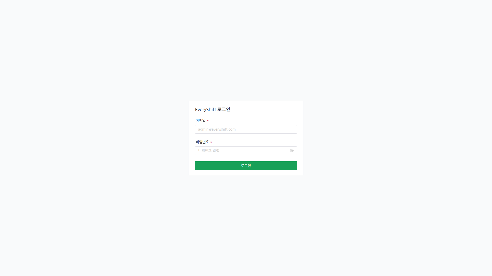
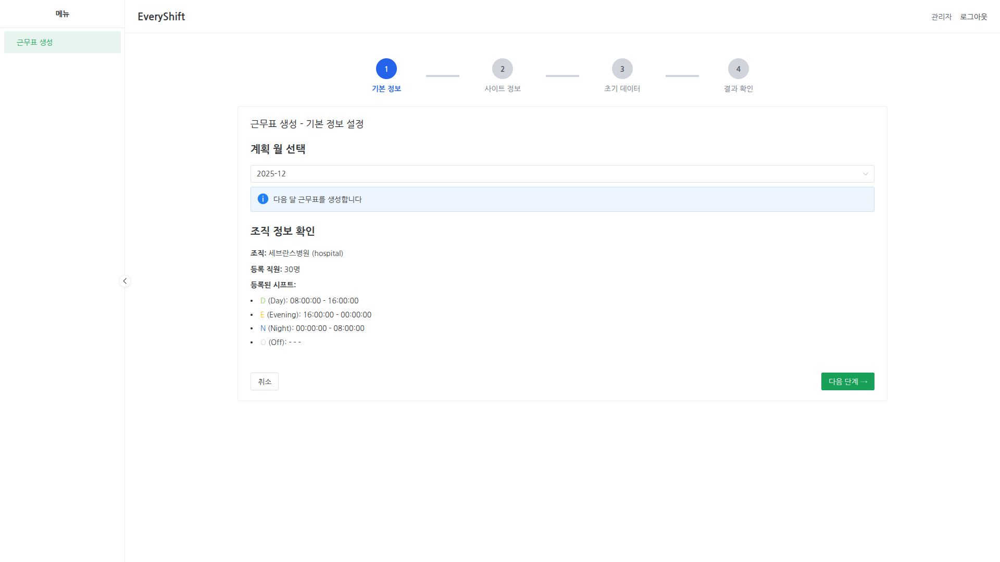
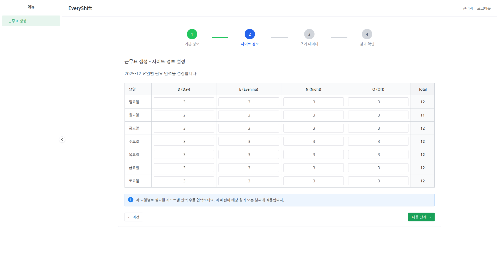
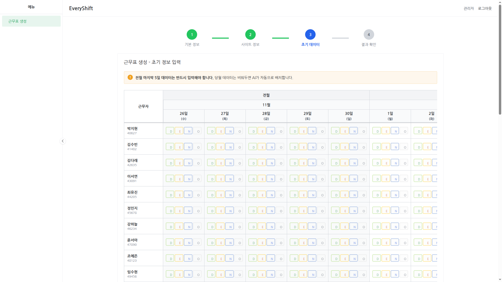
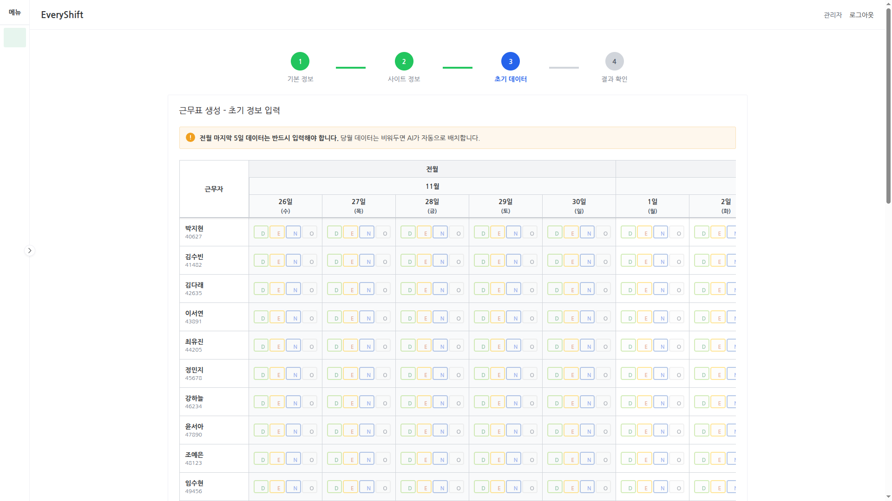

# EveryShift MVP - 간호사 근무표 생성 시스템

> 엑셀 근무표 작성 시간을 **90% 단축**하는 AI 기반 자동 스케줄링 시스템


## 📋 프로젝트 개요

병원 등 24시간 운영 조직에서 간호사 등 근무자의 교대 근무 일정을 **자동으로 생성**하여, 기존 엑셀 수작업(4-8시간)을 **수 분으로 단축**합니다.

**현재 상태**:

- Phase1 근무표 생성 MVP 완료
- 현재 기준 문서: `docs/prd/PHASE2_PRD_KR.md`
- 현재 목표: `Phase2A - Go-Live Core` (배포 필수 신뢰성 레이어)

**Phase1 구현 범위**: 4단계 워크플로우 (근무표 생성)

- **Step 1**: 기본 정보 설정 (근무표 생성 월 선택)
- **Step 2**: 사이트 정보 설정 (요일별 필요 인력 입력)
- **Step 3**: 초기 데이터 입력 (30명 × 36일 그리드, 전월 5일 필수)
- **Step 4**: AI 생성 결과 확인 및 수동 수정, Excel 다운로드

## 🎯 주요 기능

- ✅ **30명 × 36일 그리드**: TanStack Table 기반 대규모 데이터 그리드 (1,080 셀)
- ✅ **실시간 통계**: D/E/N/O 시프트별 합계 자동 계산
- ✅ **LocalStorage 자동 저장**: 페이지 새로고침 시에도 데이터 보존 (500ms debounce)
- ✅ **AI Solver 연동** (Mock): 공정한 근무표 자동 생성 및 폴링 상태 추적
- ✅ **Excel 내보내기**: XLSX 형식으로 결과 다운로드 (컬럼 너비 자동 조정)
- ✅ **데이터 검증**: 전월 마지막 5일 필수 입력 검증
- ✅ **Supabase Auth**: 이메일/비밀번호 기반 인증

## 📸 스크린샷

### 로그인 및 워크플로우

<table>
  <tr>
    <td width="50%">
      
      <p align="center"><b>로그인 페이지</b></p>
    </td>
    <td width="50%">
      
      <p align="center"><b>Step 1 - 기본 정보 설정</b></p>
    </td>
  </tr>
  <tr>
    <td width="50%">
      
      <p align="center"><b>Step 2 - 요일별 필요 인력</b></p>
    </td>
    <td width="50%">
      
      <p align="center"><b>Step 3 - 30×36 그리드</b></p>
    </td>
  </tr>
</table>

### UI 상태

<table>
  <tr>
    <td width="50%">
      
      <p align="center"><b>사이드바 축소 상태</b></p>
    </td>
    <td width="50%">
      
      <p align="center"><b>사이드바 확장 상태</b></p>
    </td>
  </tr>
</table>

## 🚀 기술 스택

### Frontend

- **Framework**: Vue 3.5.17 (Composition API with `<script setup>`)
- **Language**: TypeScript 5.8.3 (Strict mode)
- **Build**: Vite 6.3.5
- **Grid**: TanStack Table v8.21.3
- **UI Library**: Naive UI 2.43.1
- **Styling**: Tailwind CSS 3.4.17
- **State Management**: Pinia 3.0.4
- **Utilities**: Day.js, @vueuse/core, xlsx

### Backend

- **Database**: Supabase PostgreSQL
- **Authentication**: Supabase Auth
- **RLS**: Row Level Security (Admin-only access in MVP)

### Development Tools

- **Testing**: Vitest (Unit), Playwright (E2E)
- **Linting**: ESLint + Prettier
- **Package Manager**: pnpm 10.22.0

## 🛠️ 설치 및 실행

### 1. Prerequisites

- **Node.js**: 18+
- **Package Manager**: pnpm (권장) 또는 npm
- **Supabase Account**: [supabase.com](https://supabase.com)에서 프로젝트 생성

### 2. 저장소 클론

```bash
git clone <repository-url>
cd every-shift-mvp
```

### 3. 의존성 설치

```bash
# pnpm 사용 (권장)
pnpm install

# 또는 npm 사용
npm install
```

### 4. 환경 변수 설정 ⚙️

**.env.local 파일 생성**:

```bash
cp .env.example .env.local
```

**.env.local 파일 편집**:

```bash
# Supabase 프로젝트 정보 입력
VITE_SUPABASE_URL=https://xxxxx.supabase.co
VITE_SUPABASE_ANON_KEY=eyJxxxxx...

# AI Solver API (개발 모드)
# 개발에서는 반드시 빈 값 유지 (Vite /api 프록시 사용)
VITE_API_BASE_URL=
```

**중요: AI Solver URL 규칙**

- 개발(`pnpm dev`): `VITE_API_BASE_URL`를 비워서 `/api` 프록시 사용
- 프로덕션 배포: 배포 환경 변수에만 절대 URL 설정  
  `VITE_API_BASE_URL=https://every-shift-api-service-554455861916.asia-northeast3.run.app`

**Supabase 정보 확인 방법**:

1. [Supabase Dashboard](https://supabase.com/dashboard) 로그인
2. 프로젝트 선택 → Settings → API
3. URL과 anon public key 복사

### 5. Supabase 데이터베이스 설정

#### Option 1: Supabase CLI 사용 (권장)

```bash
# Supabase CLI 설치
npm install -g supabase

# Supabase 프로젝트 연결
supabase link --project-ref your-project-ref

# 마이그레이션 실행
supabase db push

# Seed 데이터 로드
supabase db seed
```

#### Option 2: Supabase Dashboard 사용

1. [Supabase Dashboard](https://app.supabase.com) 접속
2. SQL Editor에서 `supabase/migrations/` 폴더의 마이그레이션 파일 순서대로 실행
3. `supabase/seed.sql` 파일 실행하여 초기 데이터 로드

### 6. 개발 서버 실행

```bash
pnpm dev
```

브라우저에서 `http://localhost:5173` 접속

### 7. 로그인

기본 계정 정보:

- **이메일**: `admin@example.com`
- **비밀번호**: `admin12345`

## 📁 프로젝트 구조

```
everyshift-mvp/
├── src/
│   ├── components/
│   │   ├── schedule/           # 핵심 스케줄 컴포넌트
│   │   │   ├── ScheduleGrid.vue        # TanStack Table 그리드 (30×36)
│   │   │   ├── ShiftSelector.vue       # 시프트 선택 UI (D/E/N/O)
│   │   │   ├── StatisticsSummary.vue   # 실시간 통계
│   │   │   └── StepIndicator.vue       # 단계 표시기
│   │   └── layout/             # 레이아웃 컴포넌트
│   │       ├── DefaultLayout.vue
│   │       ├── Header.vue
│   │       └── Sidebar.vue
│   ├── views/
│   │   └── schedule/           # 4단계 워크플로우 페이지
│   │       ├── Step1BasicInfo.vue      # 기본 정보 입력
│   │       ├── Step2SiteInfo.vue       # 사이트 정보 입력
│   │       ├── Step3InitialData.vue    # 초기 데이터 입력 (핵심)
│   │       └── Step4Result.vue         # 결과 확인 및 편집
│   ├── composables/            # 재사용 로직
│   │   ├── useScheduleGrid.ts  # 그리드 데이터 관리
│   │   ├── useAISolver.ts      # AI Solver 통합
│   │   └── useAuth.ts          # 인증 래퍼
│   ├── stores/                 # Pinia 상태 관리
│   │   ├── auth.ts             # 인증 상태
│   │   ├── organization.ts     # 조직/직원/시프트 (읽기 전용)
│   │   └── schedule.ts         # 스케줄 워크플로우 상태
│   ├── api/                    # Backend 통신
│   │   ├── auth.ts
│   │   ├── organization.ts
│   │   ├── schedule.ts
│   │   └── solver.ts           # AI Solver API (Mock)
│   ├── types/                  # TypeScript 타입 정의
│   ├── utils/                  # 유틸리티 함수
│   │   └── excel.ts            # Excel 내보내기
│   └── router/                 # Vue Router 설정
├── supabase/
│   ├── migrations/             # DB 스키마 마이그레이션
│   └── seed.sql                # 초기 데이터 (30명 직원)
├── tests/
│   ├── unit/                   # Vitest 단위 테스트
│   └── e2e/                    # Playwright E2E 테스트
├── docs/
│   ├── prd/                    # 프로젝트 요구사항 문서
│   ├── naive/                  # Naive UI 문서
│   └── vben/                   # Vben Admin 참고 문서
└── data/
    └── tasks.json              # 개발 작업 관리
```

## 📊 데이터 모델

### 핵심 테이블 (6개)

- **organizations**: 병원/조직 정보 (Seed: 1개)
- **employees**: 직원 정보 (Seed: 30명)
- **shifts**: 시프트 정의 (D/E/N/O/H)
- **schedules**: 월별 스케줄 메타데이터
- **schedule_assignments**: 개별 배치 (employee × date)
- **site_requirements**: 요일별 필요 인력

### 관계도

```
organizations
  ├─→ employees (30명)
  ├─→ shifts (D, E, N, O, H)
  └─→ schedules
        └─→ schedule_assignments (employee + date + shift)
```

## 🎮 사용 방법

### 1단계: 로그인

```
이메일: admin@example.com
비밀번호: admin123456
```

### 2단계: 기본 정보 입력

- 근무표 생성할 월 선택 (예: 2025-01)
- 조직 정보 확인 (읽기 전용)

### 3단계: 사이트 정보 설정

- 요일별 필요 인력 입력
  - D(Day): 낮 근무
  - E(Evening): 저녁 근무
  - N(Night): 밤 근무
  - O(Off): 휴무

### 4단계: 초기 데이터 입력 ⭐ **핵심**

- 30명 × 36일 그리드 (1,080 셀)
- **전월 마지막 5일**: 필수 입력 (AI 학습용)
- 당월 데이터: 선택 입력
- 실시간 통계 확인
- LocalStorage 자동 저장

### 5단계: AI 근무표 생성

- "근무표 생성" 버튼 클릭
- 폴링 상태 표시 (created → running → complete)
- 자동으로 결과 페이지로 이동

### 6단계: 결과 확인 및 편집

- AI 생성 결과 확인
- 수동 수정 가능 (셀 클릭 → 시프트 변경)
- 통계 실시간 업데이트
- Excel 다운로드 (`schedule_2025-01.xlsx`)

## 🧪 테스트

### 단위 테스트 (Vitest)

```bash
# 모든 테스트 실행
pnpm test:unit

# Watch 모드
pnpm test:unit:watch

# 특정 파일만 테스트
pnpm test:unit excel.spec.ts
```

### E2E 테스트 (Playwright)

```bash
# E2E 테스트 실행
pnpm test:e2e

# UI 모드
pnpm test:e2e:ui

# 디버그 모드
pnpm test:e2e:debug

# 리포트 보기
pnpm test:e2e:report
```

## 📦 빌드 및 배포

### 프로덕션 빌드

```bash
pnpm build
```

### 빌드 미리보기

```bash
pnpm preview
```

## 🔧 개발 스크립트

```bash
# 개발 서버 실행
pnpm dev

# TypeScript 타입 체크
pnpm build

# ESLint 실행
pnpm lint

# Prettier 포맷팅
pnpm format
```

## ⚠️ 현재 상태와 범위

### Phase1 완료 범위

- ✅ 4단계 근무표 생성 워크플로우
- ✅ 30명 × 36일 그리드 기반 입력/수정
- ✅ 로그인 및 관리자 중심 운영 흐름
- ✅ Excel 내보내기
- ✅ 개발용 AI Solver 연동 및 결과 확인

### Phase2A 진행 범위

- ⏳ 하드 제약 충족 증명
- ⏳ 생성 불가능 사유 설명
- ⏳ 미반영 off 요청 사유 설명
- ⏳ before/after 결과 비교 리포트
- ⏳ off 요청 한도 정책
- ⏳ rolling fairness ledger

### Phase2B 이후 범위

- 계획된 셀프서브 회원가입/승인
- 관리자/직원 대시보드
- 알림 시스템
- 조직/권한 고도화
- 타 산업 확장

### 현재 기술적 제약

- 최대 30명 중심 최적화 (Virtual scrolling 없음)
- 36일 고정 (전월 5일 + 당월 31일)
- 일부 문서는 Seed 데이터 기반 Phase1 전제를 유지
- 개발 환경에서는 Mock 또는 개발용 Solver 구성을 우선 사용

## 🐛 알려진 이슈

- [ ] 대용량 데이터 (100명+) 성능 최적화 필요
- [ ] Naive UI HMR 이슈 시 전체 새로고침 필요
- [ ] Excel 내보내기 시 셀 스타일링 제한 (기본 xlsx 라이브러리)

## 🗺️ 로드맵

### Phase1: Scheduling MVP (완료)

- ✅ 4단계 워크플로우 구현
- ✅ TanStack Table 그리드
- ✅ 개발용 Solver 연동
- ✅ Excel 내보내기

### Phase2A: Go-Live Core (현재)

- [ ] 하드 제약 충족 증명
- [ ] 생성 불가능 사유 설명
- [ ] 미반영 off 요청 사유 설명
- [ ] before/after 결과 비교 리포트
- [ ] rolling fairness ledger

### Phase2B: Self-Serve & Scale (이후)

- [ ] 회원가입 및 승인 플로우
- [ ] 관리자/직원 대시보드
- [ ] 알림 시스템
- [ ] 조직/권한 고도화
- [ ] 타 산업 확장

## 📖 문서

- **현재 기준 문서**: `docs/prd/PHASE2_PRD_KR.md`
- **Phase1 개요**: `docs/prd/01-overview-architecture.md`
- **Phase1 기능/API 문서**: `docs/prd/03-features-components-api.md`
- **Naive UI 가이드**: `docs/naive/00-quick-reference.md`
- **Vben Admin 참고**: `docs/vben/en/guide/introduction/vben.md`

## 🤝 기여하기

Issue 및 Pull Request 환영합니다!

### 개발 가이드라인

1. `main` 브랜치에서 feature 브랜치 생성
2. 코드 작성 및 테스트
3. `pnpm lint` 실행하여 코드 품질 확인
4. Pull Request 생성

## 📄 라이선스

MIT License - 자유롭게 사용, 수정, 배포 가능

Copyright (c) 2025 EveryShift MVP

## 👨‍💻 개발 정보

- **개발 기간**: 2025년 1월 ~ 2025년 3월 (예정)
- **개발 팀**: Solo Developer + AI Assistant (Claude)
- **문의**: GitHub Issues

## 🙏 감사의 말

- [Vue.js](https://vuejs.org/) - Progressive JavaScript Framework
- [Vite](https://vitejs.dev/) - Next Generation Frontend Tooling
- [TanStack Table](https://tanstack.com/table) - Headless UI for building powerful tables
- [Naive UI](https://www.naiveui.com/) - Vue 3 Component Library
- [Supabase](https://supabase.com/) - Open Source Firebase Alternative
- [Vben Admin](https://vben.pro/) - Vue 3 Admin Template (Reference)

---

**Made with ❤️ using Vue 3 + TypeScript + Vite**
