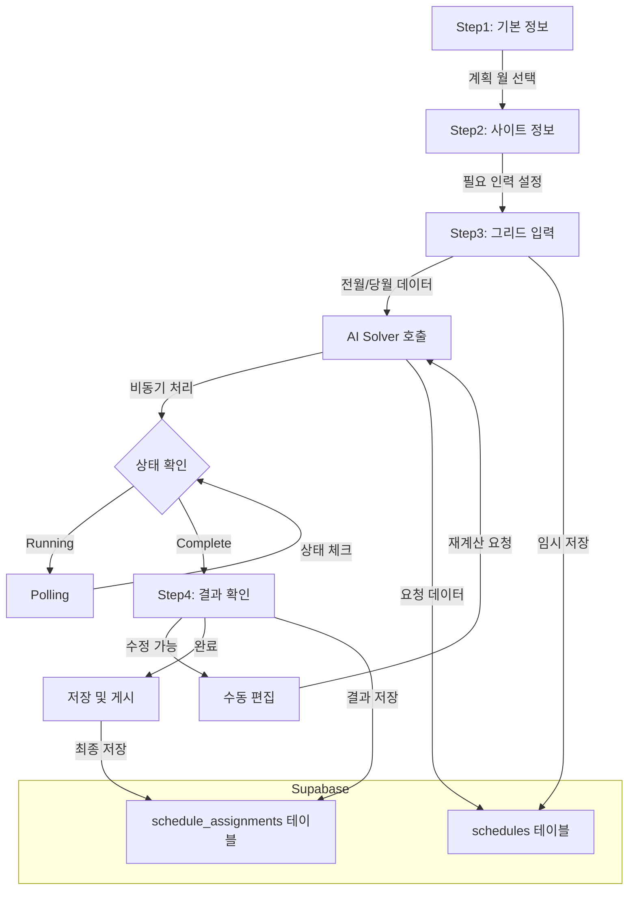

# EveryShift MVP PRD - 프로젝트 개요 및 기술 아키텍처

## 문서 정보

- **버전**: MVP 1.0
- **작성일**: 2025-11-12
- **목적**: 7장(근무표 생성) 중심 MVP 구현 가이드
- **대상**: Claude Code, Cursor를 활용한 AI 기반 개발
- **개발 기간**: 8주

---

# 목차

1. [프로젝트 개요](#1-프로젝트-개요)
2. [기술 아키텍처](#2-기술-아키텍처)

---

# 1. 프로젝트 개요

## 1.1 문제 정의

### 현재 상황

병원 등 24시간 운영 조직에서 간호사 등 근무자의 교대 근무 일정 관리는 매우 복잡합니다:

**실제 현장 분석 결과**:

- 📊 **엑셀 수작업**: 31일 × 30명 = 930개 셀을 수동으로 관리
- ⏱️ **시간 소요**: 월 1회, 4-8시간 소요
- ❌ **오류 발생**: 제약 조건 위반, 불공정한 배분
- 😓 **근무자 불만**: 야간 근무 편중, 투명성 부족

**핵심 문제**:

1. D(Day), E(Evening), N(Night) 시프트의 공정한 배분
2. 근로기준법 준수 (주 52시간 제한, 연속 야간 근무 제한)
3. 개인 휴가/선호 시간대 반영
4. 필요 인력 충족

## 1.2 MVP 목표

### 가치 제안

**"엑셀 근무표 작성 시간을 90% 단축하고, 공정성을 보장한다"**

### MVP 범위

이 MVP는 **7장(근무표 생성)에만 집중**하며, 다음을 구현합니다:

#### ✅ In-Scope (포함)

- **7.1 기본 정보 설정**: 계획 월 선택, 조직 정보 확인
- **7.2 사이트 정보 설정**: 일별 필요 인력 설정
- **7.3 근무표 초기 정보 입력**: 그리드 UI로 전월/당월 데이터 입력
- **7.4 근무표 생성 결과 확인**: AI Solver 결과 조회 및 수정

#### ❌ Out-of-Scope (제외)

- 회원가입 및 승인 프로세스 (간소화: 이메일/비밀번호만)
- 조직/직원 관리 CRUD (Seed 데이터로 제공)
- 대시보드 및 통계
- 알림 시스템
- 다국어 지원
- 모바일 대응

### 성공 지표

- ✅ **기능 완성도**: 7.1~7.4 전체 플로우 동작
- ✅ **성능**: 그리드 30명×36일 렌더링 < 2초
- ✅ **AI 연동**: Mock 데이터로 시뮬레이션 완료
- ✅ **사용성**: 엑셀 대비 직관적인 UI

## 1.3 제약사항

### 기술적 제약

- **로컬 개발만**: 배포 환경 미구성
- **AI Solver**: Google Cloud Run URL만 알고 있음 (연동 구조만 구현, Mock 응답)
- **데이터**: Seed 스크립트로 초기 데이터 제공 (CRUD 없음)
- **사용자**: Admin 단일 역할 (권한 체계 단순화)

### 그리드 단순화

Enhanced PRD의 완전 기능 대신 다음으로 단순화:

- **근무자 수**: 최대 30명
- **기간**: 전월 5일 + 당월 31일 (36일)
- **3-level 헤더**: 포함
- **가상 스크롤**: 제외 (전체 렌더링)
- **고정 컬럼**: 이름 컬럼만 고정
- **통계**: 행/열 기본 합계만 (실시간 검증 제외)
- **특수 기능**: 키보드 단축키, 패턴 복사 제외

---

# 2. 기술 아키텍처

## 2.1 기술 스택

### Frontend

|항목|기술|버전|용도|
|---|---|---|---|
|**Framework**|Vue 3|3.5.17|Composition API 기반|
|**Language**|TypeScript|5.8.3|타입 안정성|
|**Build Tool**|Vite|6.3.5|빠른 개발 경험|
|**Styling**|Tailwind CSS|3.4.17|유틸리티 CSS|
|**Admin Template**|Vben Admin|5.x|레이아웃 및 구조 참고|
|**Grid**|TanStack Table|v8|스케줄링 그리드|
|**State**|Pinia|2.x|상태 관리|
|**Date**|Day.js|1.x|날짜 처리|
|**UI Components**|Naive UI|2.42.0|폼, 모달, 버튼 등|

### Backend

|항목|기술|용도|
|---|---|---|
|**Database**|Supabase PostgreSQL|데이터 저장|
|**Auth**|Supabase Auth|이메일/비밀번호 인증|
|**RLS**|Supabase RLS|행 단위 보안|

### AI Solver (외부)

|항목|기술|상태|
|---|---|---|
|**Platform**|Google Cloud Run|개발 완료|
|**Engine**|OptaPlanner|Java 기반|
|**연동**|REST API (추정)|MVP에서는 Mock|

## 2.2 Vben Admin 활용 전략

### 채택 범위

Vben Admin의 **부분 활용** - 전체 도입이 아닌 선택적 참고:

#### ✅ 활용할 것

1. **레이아웃 구조**
    - DefaultLayout (Header + Sidebar + Content)
    - 라우팅 구조
2. **인증 패턴**
    - 로그인 플로우
    - 라우트 가드 (beforeEach)
3. **코드 스타일**
    - Composable 패턴
    - 폴더 구조

#### ❌ 사용하지 않을 것

1. Vben의 복잡한 컴포넌트 (BasicTable, VbenForm 등)
2. Vben의 설정 시스템 (preference store 등)
3. Vben의 권한 시스템 (단순화)

### 이유

- Vben의 BasicTable은 복잡한 그리드에 부적합 → TanStack Table 직접 사용
- 불필요한 기능으로 인한 학습 곡선 및 번들 크기 증가 방지

## 2.3 프로젝트 구조

```
everyshift-mvp/
├── src/
│   ├── components/
│   │   ├── layout/
│   │   │   ├── DefaultLayout.vue
│   │   │   ├── Header.vue
│   │   │   └── Sidebar.vue
│   │   ├── schedule/
│   │   │   ├── ScheduleGrid.vue        # [핵심] TanStack Table 그리드
│   │   │   ├── ShiftSelector.vue       # 시프트 선택 버튼 그룹
│   │   │   ├── StepIndicator.vue       # 단계 표시
│   │   │   └── StatisticsSummary.vue   # 통계 요약
│   │   └── ui/
│   │       ├── Button.vue
│   │       ├── Card.vue
│   │       └── Modal.vue
│   ├── composables/
│   │   ├── useAuth.ts                  # Supabase 인증
│   │   ├── useScheduleGrid.ts          # 그리드 로직
│   │   └── useAISolver.ts              # AI Solver 연동
│   ├── stores/
│   │   ├── auth.ts                     # 인증 상태
│   │   ├── schedule.ts                 # 근무표 상태
│   │   └── organization.ts             # 조직 정보
│   ├── router/
│   │   ├── index.ts
│   │   ├── routes.ts
│   │   └── guards.ts                   # 인증 가드
│   ├── views/
│   │   ├── auth/
│   │   │   └── Login.vue
│   │   └── schedule/
│   │       ├── Step1BasicInfo.vue      # 7.1 기본 정보
│   │       ├── Step2SiteInfo.vue       # 7.2 사이트 정보
│   │       ├── Step3InitialData.vue    # 7.3 초기 데이터 (그리드)
│   │       └── Step4Result.vue         # 7.4 결과 확인
│   ├── api/
│   │   ├── supabase.ts                 # Supabase 클라이언트
│   │   ├── schedule.ts                 # 근무표 API
│   │   └── solver.ts                   # AI Solver API
│   ├── types/
│   │   ├── schedule.ts
│   │   ├── employee.ts
│   │   └── shift.ts
│   ├── utils/
│   │   ├── date.ts
│   │   └── validation.ts
│   ├── assets/
│   └── main.ts
├── supabase/
│   ├── migrations/
│   │   └── 001_initial_schema.sql
│   └── seed.sql                         # 초기 데이터
├── public/
├── .env.local
├── .env.example
├── package.json
├── tsconfig.json
├── tailwind.config.js
└── vite.config.ts
```

## 2.4 데이터 플로우



### 주요 플로우 설명

1. **Step 1-2**: Supabase에서 조직/직원 데이터 조회
2. **Step 3**:
    - 그리드에서 입력한 데이터를 Pinia 스토어에 저장
    - "근무표 생성" 클릭 시 Supabase에 요청 레코드 생성
3. **AI Solver 호출**:
    - Supabase에서 데이터를 읽어 AI Solver API 호출
    - 비동기 처리: status를 'running'으로 설정
    - Polling으로 상태 확인 (5초마다)
4. **Step 4**:
    - 결과 조회 및 그리드 표시
    - 수동 수정 시 schedule_assignments 업데이트

---

**문서 버전**: MVP 1.0
**최종 수정**: 2025-11-12
**작성자**: 브라운 + Claude
**라이선스**: MIT
