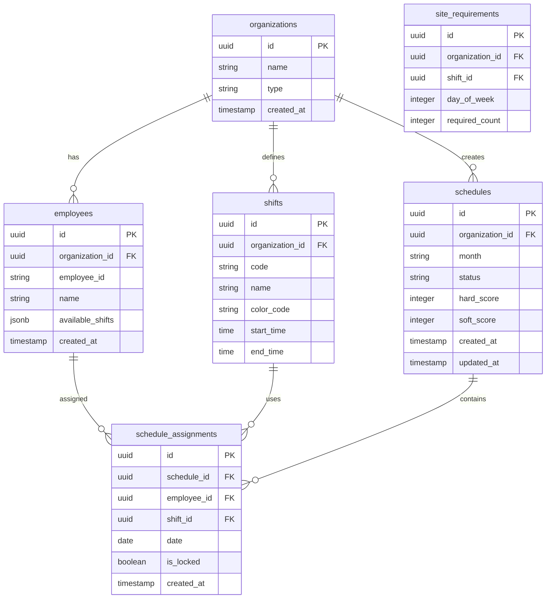

# EveryShift MVP PRD - 데이터베이스 설계 및 마이그레이션

## 문서 정보

- **버전**: MVP 1.0
- **작성일**: 2025-11-12
- **목적**: 데이터베이스 스키마 설계 및 Supabase 설정 가이드

---

# 목차

1. [데이터베이스 설계](#1-데이터베이스-설계)
2. [Supabase 설정](#2-supabase-설정)
3. [마이그레이션 실행](#3-마이그레이션-실행)

---

# 1. 데이터베이스 설계

## 1.1 MVP 테이블 (단순화)

Enhanced PRD의 13개 테이블을 MVP에 필요한 **6개**로 축소:

### ERD (Mermaid)



## 1.2 테이블 상세 스키마

### organizations (조직)

```sql
CREATE TABLE organizations (
    id UUID PRIMARY KEY DEFAULT gen_random_uuid(),
    name VARCHAR(255) NOT NULL,
    type VARCHAR(50) NOT NULL,  -- hospital, fire, police
    created_at TIMESTAMP WITH TIME ZONE DEFAULT NOW(),
    updated_at TIMESTAMP WITH TIME ZONE DEFAULT NOW()
);
```

**MVP 특징**:

- 단순화: logo_url, business_number 등 제거
- Seed 데이터: 1개 조직만 생성

### employees (직원)

```sql
CREATE TABLE employees (
    id UUID PRIMARY KEY DEFAULT gen_random_uuid(),
    organization_id UUID NOT NULL REFERENCES organizations(id),
    employee_id VARCHAR(50) NOT NULL,  -- 직번
    name VARCHAR(100) NOT NULL,
    available_shifts JSONB NOT NULL,  -- ["D", "E", "N", "O"]
    created_at TIMESTAMP WITH TIME ZONE DEFAULT NOW(),
    updated_at TIMESTAMP WITH TIME ZONE DEFAULT NOW(),
    UNIQUE(organization_id, employee_id)
);

CREATE INDEX idx_employees_org ON employees(organization_id);
```

**MVP 특징**:

- 단순화: position, site, skills 등 제거
- available_shifts: 근무 가능한 시프트 목록 (JSON 배열)

### shifts (시프트)

```sql
CREATE TABLE shifts (
    id UUID PRIMARY KEY DEFAULT gen_random_uuid(),
    organization_id UUID NOT NULL REFERENCES organizations(id),
    code VARCHAR(10) NOT NULL,  -- D, E, N, O, H
    name VARCHAR(50) NOT NULL,  -- Day, Evening, Night, Off, Holiday
    color_code VARCHAR(20) NOT NULL,  -- #92D050, #FFC000, ...
    start_time TIME,  -- 08:00:00
    end_time TIME,    -- 16:00:00
    created_at TIMESTAMP WITH TIME ZONE DEFAULT NOW(),
    UNIQUE(organization_id, code)
);
```

**데이터 예시**:

|code|name|color_code|start_time|end_time|
|---|---|---|---|---|
|D|Day|#92D050|08:00|16:00|
|E|Evening|#FFC000|16:00|00:00|
|N|Night|#4472C4|00:00|08:00|
|O|Off|#D9D9D9|NULL|NULL|

### schedules (근무표)

```sql
CREATE TABLE schedules (
    id UUID PRIMARY KEY DEFAULT gen_random_uuid(),
    organization_id UUID NOT NULL REFERENCES organizations(id),
    month VARCHAR(7) NOT NULL,  -- YYYY-MM
    status VARCHAR(20) NOT NULL DEFAULT 'created',
    -- created, running, complete, changed, error
    hard_score INTEGER DEFAULT 0,
    soft_score INTEGER DEFAULT 0,
    created_at TIMESTAMP WITH TIME ZONE DEFAULT NOW(),
    updated_at TIMESTAMP WITH TIME ZONE DEFAULT NOW(),
    UNIQUE(organization_id, month)
);

CREATE INDEX idx_schedules_org_month ON schedules(organization_id, month);
```

**상태 전이**:

```
created → running → complete
                  → error
complete → changed (수동 수정 시)
```

### schedule_assignments (근무 배정)

```sql
CREATE TABLE schedule_assignments (
    id UUID PRIMARY KEY DEFAULT gen_random_uuid(),
    schedule_id UUID NOT NULL REFERENCES schedules(id) ON DELETE CASCADE,
    employee_id UUID NOT NULL REFERENCES employees(id),
    shift_id UUID NOT NULL REFERENCES shifts(id),
    date DATE NOT NULL,
    is_locked BOOLEAN DEFAULT FALSE,  -- 잠금 여부 (수정 불가)
    created_at TIMESTAMP WITH TIME ZONE DEFAULT NOW(),
    updated_at TIMESTAMP WITH TIME ZONE DEFAULT NOW(),
    UNIQUE(schedule_id, employee_id, date)
);

CREATE INDEX idx_assignments_schedule ON schedule_assignments(schedule_id);
CREATE INDEX idx_assignments_employee_date ON schedule_assignments(employee_id, date);
```

### site_requirements (사이트 필요 인력)

```sql
CREATE TABLE site_requirements (
    id UUID PRIMARY KEY DEFAULT gen_random_uuid(),
    organization_id UUID NOT NULL REFERENCES organizations(id),
    shift_id UUID NOT NULL REFERENCES shifts(id),
    day_of_week INTEGER NOT NULL,  -- 0(일) ~ 6(토)
    required_count INTEGER NOT NULL,
    created_at TIMESTAMP WITH TIME ZONE DEFAULT NOW(),
    UNIQUE(organization_id, shift_id, day_of_week)
);
```

**데이터 예시** (요일별 필요 인력):

|day_of_week|shift_code|required_count|
|---|---|---|
|0 (일)|D|3|
|0 (일)|E|3|
|1 (월)|D|3|
|1 (월)|E|4|

## 1.3 Seed 데이터

### seed.sql

```sql
-- 1. 조직 생성
INSERT INTO organizations (id, name, type) VALUES
('00000000-0000-0000-0000-000000000001', '세브란스병원', 'hospital');

-- 2. 시프트 정의
INSERT INTO shifts (organization_id, code, name, color_code, start_time, end_time) VALUES
('00000000-0000-0000-0000-000000000001', 'D', 'Day', '#92D050', '08:00', '16:00'),
('00000000-0000-0000-0000-000000000001', 'E', 'Evening', '#FFC000', '16:00', '00:00'),
('00000000-0000-0000-0000-000000000001', 'N', 'Night', '#4472C4', '00:00', '08:00'),
('00000000-0000-0000-0000-000000000001', 'O', 'Off', '#D9D9D9', NULL, NULL);

-- 3. 직원 생성 (30명)
INSERT INTO employees (organization_id, employee_id, name, available_shifts) VALUES
('00000000-0000-0000-0000-000000000001', '40627', '박지현', '["D","E","N","O"]'),
('00000000-0000-0000-0000-000000000001', '41482', '김수빈', '["D","E","N","O"]'),
('00000000-0000-0000-0000-000000000001', '42635', '김다래', '["D","E","N","O"]'),
('00000000-0000-0000-0000-000000000001', '43891', '이서연', '["D","E","N","O"]'),
('00000000-0000-0000-0000-000000000001', '44205', '최유진', '["D","E","N","O"]'),
('00000000-0000-0000-0000-000000000001', '45678', '정민지', '["D","E","N","O"]'),
('00000000-0000-0000-0000-000000000001', '46234', '강하늘', '["D","E","N","O"]'),
('00000000-0000-0000-0000-000000000001', '47890', '윤서아', '["D","E","N","O"]'),
('00000000-0000-0000-0000-000000000001', '48123', '조예은', '["D","E","N","O"]'),
('00000000-0000-0000-0000-000000000001', '49456', '임수현', '["D","E","N","O"]'),
('00000000-0000-0000-0000-000000000001', '50789', '한지우', '["D","E","N","O"]'),
('00000000-0000-0000-0000-000000000001', '51234', '송민아', '["D","E","N","O"]'),
('00000000-0000-0000-0000-000000000001', '52567', '홍서진', '["D","E","N","O"]'),
('00000000-0000-0000-0000-000000000001', '53890', '백현지', '["D","E","N","O"]'),
('00000000-0000-0000-0000-000000000001', '54321', '문채원', '["D","E","N","O"]'),
('00000000-0000-0000-0000-000000000001', '55654', '신유리', '["D","E","N","O"]'),
('00000000-0000-0000-0000-000000000001', '56987', '오지은', '["D","E","N","O"]'),
('00000000-0000-0000-0000-000000000001', '57234', '안소희', '["D","E","N","O"]'),
('00000000-0000-0000-0000-000000000001', '58567', '류민정', '["D","E","N","O"]'),
('00000000-0000-0000-0000-000000000001', '59890', '진서영', '["D","E","N","O"]'),
('00000000-0000-0000-0000-000000000001', '60123', '표예진', '["D","E","N","O"]'),
('00000000-0000-0000-0000-000000000001', '61456', '남다은', '["D","E","N","O"]'),
('00000000-0000-0000-0000-000000000001', '62789', '권지안', '["D","E","N","O"]'),
('00000000-0000-0000-0000-000000000001', '63234', '황수아', '["D","E","N","O"]'),
('00000000-0000-0000-0000-000000000001', '64567', '탁지수', '["D","E","N","O"]'),
('00000000-0000-0000-0000-000000000001', '65890', '노윤서', '["D","E","N","O"]'),
('00000000-0000-0000-0000-000000000001', '66321', '석민주', '["D","E","N","O"]'),
('00000000-0000-0000-0000-000000000001', '67654', '양서현', '["D","E","N","O"]'),
('00000000-0000-0000-0000-000000000001', '68987', '허채린', '["D","E","N","O"]'),
('00000000-0000-0000-0000-000000000001', '69234', '설아름', '["D","E","N","O"]');

-- 4. 사이트 필요 인력 (요일별)
-- 일요일 (0)
INSERT INTO site_requirements (organization_id, shift_id, day_of_week, required_count)
SELECT
    '00000000-0000-0000-0000-000000000001'::uuid,
    id,
    0,
    CASE code
        WHEN 'D' THEN 3
        WHEN 'E' THEN 3
        WHEN 'N' THEN 3
        ELSE 0
    END
FROM shifts
WHERE organization_id = '00000000-0000-0000-0000-000000000001'
AND code IN ('D', 'E', 'N');

-- 월요일 (1)
INSERT INTO site_requirements (organization_id, shift_id, day_of_week, required_count)
SELECT
    '00000000-0000-0000-0000-000000000001'::uuid,
    id,
    1,
    CASE code
        WHEN 'D' THEN 3
        WHEN 'E' THEN 4
        WHEN 'N' THEN 3
        ELSE 0
    END
FROM shifts
WHERE organization_id = '00000000-0000-0000-0000-000000000001'
AND code IN ('D', 'E', 'N');

-- 화요일 (2)
INSERT INTO site_requirements (organization_id, shift_id, day_of_week, required_count)
SELECT
    '00000000-0000-0000-0000-000000000001'::uuid,
    id,
    2,
    CASE code
        WHEN 'D' THEN 3
        WHEN 'E' THEN 4
        WHEN 'N' THEN 3
        ELSE 0
    END
FROM shifts
WHERE organization_id = '00000000-0000-0000-0000-000000000001'
AND code IN ('D', 'E', 'N');

-- 수요일 (3)
INSERT INTO site_requirements (organization_id, shift_id, day_of_week, required_count)
SELECT
    '00000000-0000-0000-0000-000000000001'::uuid,
    id,
    3,
    CASE code
        WHEN 'D' THEN 3
        WHEN 'E' THEN 4
        WHEN 'N' THEN 3
        ELSE 0
    END
FROM shifts
WHERE organization_id = '00000000-0000-0000-0000-000000000001'
AND code IN ('D', 'E', 'N');

-- 목요일 (4)
INSERT INTO site_requirements (organization_id, shift_id, day_of_week, required_count)
SELECT
    '00000000-0000-0000-0000-000000000001'::uuid,
    id,
    4,
    CASE code
        WHEN 'D' THEN 3
        WHEN 'E' THEN 4
        WHEN 'N' THEN 3
        ELSE 0
    END
FROM shifts
WHERE organization_id = '00000000-0000-0000-0000-000000000001'
AND code IN ('D', 'E', 'N');

-- 금요일 (5)
INSERT INTO site_requirements (organization_id, shift_id, day_of_week, required_count)
SELECT
    '00000000-0000-0000-0000-000000000001'::uuid,
    id,
    5,
    CASE code
        WHEN 'D' THEN 3
        WHEN 'E' THEN 4
        WHEN 'N' THEN 3
        ELSE 0
    END
FROM shifts
WHERE organization_id = '00000000-0000-0000-0000-000000000001'
AND code IN ('D', 'E', 'N');

-- 토요일 (6)
INSERT INTO site_requirements (organization_id, shift_id, day_of_week, required_count)
SELECT
    '00000000-0000-0000-0000-000000000001'::uuid,
    id,
    6,
    CASE code
        WHEN 'D' THEN 3
        WHEN 'E' THEN 3
        WHEN 'N' THEN 3
        ELSE 0
    END
FROM shifts
WHERE organization_id = '00000000-0000-0000-0000-000000000001'
AND code IN ('D', 'E', 'N');
```

## 1.4 RLS (Row Level Security)

MVP에서는 **단순화**: Admin만 사용하므로 RLS는 최소화

```sql
-- schedules 테이블: 조직 기반 필터링만
ALTER TABLE schedules ENABLE ROW LEVEL SECURITY;

CREATE POLICY "Users can view own organization schedules"
ON schedules FOR SELECT
USING (organization_id = current_setting('app.current_organization_id')::uuid);

CREATE POLICY "Users can insert own organization schedules"
ON schedules FOR INSERT
WITH CHECK (organization_id = current_setting('app.current_organization_id')::uuid);
```

---

# 2. Supabase 설정

## 2.1 프로젝트 생성

### 1. Supabase 프로젝트 생성

1. https://supabase.com 접속
2. "New Project" 클릭
3. Organization 선택 또는 생성
4. Project name: `everyshift-mvp`
5. Database Password 설정 (안전하게 보관)
6. Region: Northeast Asia (Seoul)
7. "Create new project" 클릭

### 2. 연결 정보 확인

- Project Settings → API
- URL: `https://xxxxx.supabase.co`
- anon public key: `eyJxxxxx...`

### 3. 환경 변수 설정

```bash
# .env.local
VITE_SUPABASE_URL=https://xxxxx.supabase.co
VITE_SUPABASE_ANON_KEY=eyJxxxxx...
```

```bash
# .env.example (템플릿)
VITE_SUPABASE_URL=your_supabase_url
VITE_SUPABASE_ANON_KEY=your_supabase_anon_key
```

## 2.2 Supabase CLI 설치 (선택사항)

```bash
# 전역 설치
npm install -g supabase

# 또는 SQL Editor에서 직접 실행 가능
```

---

# 3. 마이그레이션 실행

## 3.1 SQL Editor를 통한 실행 (권장)

### 방법 1: Supabase Dashboard UI 사용

1. Supabase Dashboard 접속
2. SQL Editor 메뉴 클릭
3. "New query" 클릭
4. 아래 마이그레이션 SQL 복사 후 붙여넣기
5. "Run" 클릭하여 실행

### 마이그레이션 SQL (001_initial_schema.sql)

```sql
-- EveryShift MVP 초기 스키마
-- 버전: 1.0
-- 작성일: 2025-11-12

-- UUID 확장 활성화
CREATE EXTENSION IF NOT EXISTS "uuid-ossp";

-- 1. organizations 테이블
CREATE TABLE organizations (
    id UUID PRIMARY KEY DEFAULT gen_random_uuid(),
    name VARCHAR(255) NOT NULL,
    type VARCHAR(50) NOT NULL,
    created_at TIMESTAMP WITH TIME ZONE DEFAULT NOW(),
    updated_at TIMESTAMP WITH TIME ZONE DEFAULT NOW()
);

-- 2. employees 테이블
CREATE TABLE employees (
    id UUID PRIMARY KEY DEFAULT gen_random_uuid(),
    organization_id UUID NOT NULL REFERENCES organizations(id),
    employee_id VARCHAR(50) NOT NULL,
    name VARCHAR(100) NOT NULL,
    available_shifts JSONB NOT NULL,
    created_at TIMESTAMP WITH TIME ZONE DEFAULT NOW(),
    updated_at TIMESTAMP WITH TIME ZONE DEFAULT NOW(),
    UNIQUE(organization_id, employee_id)
);

CREATE INDEX idx_employees_org ON employees(organization_id);

-- 3. shifts 테이블
CREATE TABLE shifts (
    id UUID PRIMARY KEY DEFAULT gen_random_uuid(),
    organization_id UUID NOT NULL REFERENCES organizations(id),
    code VARCHAR(10) NOT NULL,
    name VARCHAR(50) NOT NULL,
    color_code VARCHAR(20) NOT NULL,
    start_time TIME,
    end_time TIME,
    created_at TIMESTAMP WITH TIME ZONE DEFAULT NOW(),
    UNIQUE(organization_id, code)
);

-- 4. schedules 테이블
CREATE TABLE schedules (
    id UUID PRIMARY KEY DEFAULT gen_random_uuid(),
    organization_id UUID NOT NULL REFERENCES organizations(id),
    month VARCHAR(7) NOT NULL,
    status VARCHAR(20) NOT NULL DEFAULT 'created',
    hard_score INTEGER DEFAULT 0,
    soft_score INTEGER DEFAULT 0,
    created_at TIMESTAMP WITH TIME ZONE DEFAULT NOW(),
    updated_at TIMESTAMP WITH TIME ZONE DEFAULT NOW(),
    UNIQUE(organization_id, month)
);

CREATE INDEX idx_schedules_org_month ON schedules(organization_id, month);

-- 5. schedule_assignments 테이블
CREATE TABLE schedule_assignments (
    id UUID PRIMARY KEY DEFAULT gen_random_uuid(),
    schedule_id UUID NOT NULL REFERENCES schedules(id) ON DELETE CASCADE,
    employee_id UUID NOT NULL REFERENCES employees(id),
    shift_id UUID NOT NULL REFERENCES shifts(id),
    date DATE NOT NULL,
    is_locked BOOLEAN DEFAULT FALSE,
    created_at TIMESTAMP WITH TIME ZONE DEFAULT NOW(),
    updated_at TIMESTAMP WITH TIME ZONE DEFAULT NOW(),
    UNIQUE(schedule_id, employee_id, date)
);

CREATE INDEX idx_assignments_schedule ON schedule_assignments(schedule_id);
CREATE INDEX idx_assignments_employee_date ON schedule_assignments(employee_id, date);

-- 6. site_requirements 테이블
CREATE TABLE site_requirements (
    id UUID PRIMARY KEY DEFAULT gen_random_uuid(),
    organization_id UUID NOT NULL REFERENCES organizations(id),
    shift_id UUID NOT NULL REFERENCES shifts(id),
    day_of_week INTEGER NOT NULL,
    required_count INTEGER NOT NULL,
    created_at TIMESTAMP WITH TIME ZONE DEFAULT NOW(),
    UNIQUE(organization_id, shift_id, day_of_week)
);

-- RLS 정책 (간소화)
ALTER TABLE schedules ENABLE ROW LEVEL SECURITY;

CREATE POLICY "Users can view own organization schedules"
ON schedules FOR SELECT
USING (true);  -- MVP에서는 모든 사용자가 조회 가능

CREATE POLICY "Users can insert own organization schedules"
ON schedules FOR INSERT
WITH CHECK (true);  -- MVP에서는 모든 사용자가 생성 가능
```

### Seed 데이터 실행

1. SQL Editor에서 "New query" 클릭
2. 위의 `seed.sql` 내용 복사 후 붙여넣기
3. "Run" 클릭하여 실행

## 3.2 CLI를 통한 실행 (고급)

```bash
# Supabase CLI로 마이그레이션 실행
supabase db push

# Seed 데이터 실행
supabase db seed
```

## 3.3 검증

### Table Editor에서 데이터 확인

1. Supabase Dashboard → Table Editor
2. 다음 테이블들이 생성되었는지 확인:
   - organizations (1개 레코드)
   - employees (30개 레코드)
   - shifts (4개 레코드: D, E, N, O)
   - site_requirements (21개 레코드: 7일 × 3 시프트)

### SQL로 확인

```sql
-- 조직 확인
SELECT * FROM organizations;

-- 직원 수 확인
SELECT COUNT(*) FROM employees;

-- 시프트 확인
SELECT * FROM shifts ORDER BY code;

-- 사이트 필요 인력 확인
SELECT
    sr.day_of_week,
    s.code,
    sr.required_count
FROM site_requirements sr
JOIN shifts s ON sr.shift_id = s.id
ORDER BY sr.day_of_week, s.code;
```

---

# 4. 트러블슈팅

## 4.1 Supabase 연결 오류

**증상**: "Failed to fetch" 또는 연결 실패

**원인**: 환경 변수 누락 또는 잘못된 URL/Key

**해결**:

```bash
# .env.local 확인
cat .env.local

# 올바른 형식 확인
VITE_SUPABASE_URL=https://xxxxx.supabase.co
VITE_SUPABASE_ANON_KEY=eyJxxxxx...

# Vite 재시작
npm run dev
```

## 4.2 마이그레이션 실행 오류

**증상**: SQL 실행 중 오류 발생

**원인**: 테이블이 이미 존재하거나 외래키 제약 조건 위반

**해결**:

```sql
-- 모든 테이블 삭제 (주의: 데이터 손실)
DROP TABLE IF EXISTS schedule_assignments CASCADE;
DROP TABLE IF EXISTS site_requirements CASCADE;
DROP TABLE IF EXISTS schedules CASCADE;
DROP TABLE IF EXISTS shifts CASCADE;
DROP TABLE IF EXISTS employees CASCADE;
DROP TABLE IF EXISTS organizations CASCADE;

-- 다시 마이그레이션 실행
```

## 4.3 Seed 데이터 오류

**증상**: Seed 데이터 삽입 실패

**원인**: UUID 충돌 또는 외래키 제약 조건 위반

**해결**:

```sql
-- 기존 데이터 삭제
DELETE FROM site_requirements;
DELETE FROM employees;
DELETE FROM shifts;
DELETE FROM organizations;

-- Seed 데이터 재실행
```

---

**문서 버전**: MVP 1.0
**최종 수정**: 2025-11-12
**작성자**: 브라운 + Claude
**라이선스**: MIT
