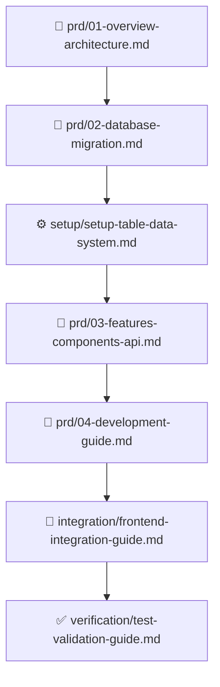

# 📚 EveryShift MVP 문서 저장소

이 디렉토리에는 EveryShift MVP 프로젝트의 모든 문서가 용도별로 정리되어 있습니다.

---

## 📁 문서 구조

```
docs/
├── README.md                    # 이 파일 (문서 안내)
├── prd/                         # 제품 기획서 (Product Requirements Document)
├── setup/                       # 설정 및 설치 가이드
├── integration/                 # 통합 가이드
└── verification/                # 테스트 및 검증
```

---

## 📋 1. PRD (제품 기획서)

**경로**: `prd/`

MVP 프로젝트의 핵심 기획 문서들입니다.

### 분할된 PRD 문서 (권장)

| 파일 | 크기 | 내용 |
|------|------|------|
| `01-overview-architecture.md` | 8.5KB | 프로젝트 개요, 기술 스택, 아키텍처 |
| `02-database-migration.md` | 19KB | DB 설계, Supabase 설정, 마이그레이션 |
| `03-features-components-api.md` | 46KB | 기능 명세(Step 1-4), 컴포넌트, API |
| `04-development-guide.md` | 17KB | 8주 개발 계획, 구현 가이드 |

### 원본 문서

| 파일 | 설명 |
|------|------|
| `PRD.md` | 원본 통합 PRD (레거시, 참고용) |

### 📖 읽는 순서 (권장)

1. **`01-overview-architecture.md`** - 전체 그림 이해
2. **`02-database-migration.md`** - DB 설정 및 마이그레이션
3. **`03-features-components-api.md`** - 기능 상세 (Step 3 그리드 핵심)
4. **`04-development-guide.md`** - 단계별 구현

---

## ⚙️ 2. Setup (설정 가이드)

**경로**: `setup/`

시스템 설정 및 설치 관련 가이드입니다.

| 파일 | 용도 |
|------|------|
| `setup-file-storage-system.md` | 파일 스토리지 시스템 Supabase 설정 |
| `setup-menu-system.md` | 메뉴 시스템 Supabase 설정 |
| `setup-table-data-system.md` | 테이블 데이터 시스템 Supabase 설정 |
| `MCP_INSTALLATION.md` | MCP (Model Context Protocol) 설치 가이드 |

### 사용 시점

- **프로젝트 초기 설정 시**: Supabase 관련 setup-* 파일들
- **Claude Code 개발 환경 구성 시**: MCP_INSTALLATION.md

---

## 🔗 3. Integration (통합 가이드)

**경로**: `integration/`

프론트엔드 및 백엔드 통합 관련 가이드입니다.

| 파일 | 용도 |
|------|------|
| `frontend-integration-guide.md` | 프론트엔드 Supabase 연동 가이드 |

### 사용 시점

- Vue 3 컴포넌트에서 Supabase 클라이언트 사용 시
- 인증, 데이터 CRUD 통합 작업 시

---

## ✅ 4. Verification (테스트 및 검증)

**경로**: `verification/`

테스트, 검증, 완료 보고서 등이 포함됩니다.

| 파일 | 용도 |
|------|------|
| `test-validation-guide.md` | Supabase 연동 테스트 가이드 |
| `final-verification-report.md` | 프로젝트 최종 검증 보고서 |

### 사용 시점

- **개발 중**: test-validation-guide.md로 기능 검증
- **프로젝트 완료 시**: final-verification-report.md로 전체 상태 확인

---

## 🚀 빠른 시작 가이드

### 신규 개발자를 위한 추천 읽기 순서



### 1단계: 프로젝트 이해 (1-2시간)

```bash
# PRD 문서 읽기
cat docs/prd/01-overview-architecture.md
cat docs/prd/02-database-migration.md
```

### 2단계: 환경 설정 (2-3시간)

```bash
# Supabase 설정
# docs/prd/02-database-migration.md 참고

# MCP 설치 (Claude Code 사용 시)
cat docs/setup/MCP_INSTALLATION.md
```

### 3단계: 기능 구현 (Week 1-8)

```bash
# 개발 가이드 참고
cat docs/prd/04-development-guide.md
# 기능 명세 참고
cat docs/prd/03-features-components-api.md
```

### 4단계: 통합 및 테스트

```bash
# 프론트엔드 통합
cat docs/integration/frontend-integration-guide.md
# 테스트
cat docs/verification/test-validation-guide.md
```

---

## 🎯 주요 문서 빠른 링크

### 핵심 기획 문서
- [프로젝트 개요](prd/01-overview-architecture.md) - 문제 정의, MVP 목표, 기술 스택
- [데이터베이스 설계](prd/02-database-migration.md) - ERD, 스키마, 마이그레이션
- [기능 명세서](prd/03-features-components-api.md) - Step 1-4 상세, 그리드 구현 ⭐
- [개발 가이드](prd/04-development-guide.md) - 8주 계획, 구현 가이드

### 설정 가이드
- [Supabase 테이블 설정](setup/setup-table-data-system.md)
- [MCP 설치](setup/MCP_INSTALLATION.md)

### 통합 및 테스트
- [프론트엔드 연동](integration/frontend-integration-guide.md)
- [테스트 가이드](verification/test-validation-guide.md)

---

## 📌 문서 사용 팁

### AI 코딩 도구와 함께 사용하기

이 문서들은 Claude Code, Cursor 등 AI 도구와 최적화되어 있습니다:

**✅ 효과적인 프롬프트**:
```
"docs/prd/03-features-components-api.md의 Step 3 그리드를
TanStack Table로 구현해줘"
```

**❌ 비효율적인 프롬프트**:
```
"근무표 시스템 만들어줘"  # 너무 광범위
```

### 문서 간 교차 참조

| 구현 작업 | 참조 문서 |
|----------|---------|
| 프로젝트 초기화 | `prd/04-development-guide.md` Week 1 |
| DB 스키마 작성 | `prd/02-database-migration.md` 섹션 1.2 |
| 그리드 컴포넌트 | `prd/03-features-components-api.md` 섹션 4.3, 5.1 |
| Supabase 연동 | `integration/frontend-integration-guide.md` |
| 테스트 작성 | `verification/test-validation-guide.md` |

---

## ⚠️ 중요 참고사항

### MVP 범위 준수

❌ **Out-of-Scope (구현하지 말 것)**:
- 회원가입/승인 프로세스 (간소화됨)
- 조직/직원 CRUD (Seed 데이터 사용)
- 대시보드 및 통계
- 알림 시스템
- 다국어 지원
- 모바일 대응

✅ **In-Scope (구현할 것)**:
- 7장(근무표 생성) 4단계 워크플로우
- 30×36 그리드 UI (Step 3 핵심)
- AI Solver Mock 연동
- 엑셀 다운로드

### 기술 제약사항

- **로컬 개발만**: 배포 환경 미구성
- **Mock AI Solver**: 실제 Cloud Run 연동 금지
- **Seed 데이터**: 조직/직원 데이터는 읽기 전용

---

## 📝 문서 변경 이력

### 2025-11-13
- ✅ 문서 구조 재구성 (용도별 폴더 분류)
- ✅ PRD, Setup, Integration, Verification 폴더 생성
- ✅ README.md 업데이트 (새 구조 반영)

### 2025-11-12
- ✅ 원본 PRD.md 4개 파일로 분할
- ✅ 각 문서에 헤더 및 목차 추가

---

## 🤝 기여 가이드

새로운 문서 추가 시 다음 규칙을 따라주세요:

1. **적절한 폴더에 배치**:
   - 기획: `prd/`
   - 설정: `setup/`
   - 통합: `integration/`
   - 검증: `verification/`

2. **파일명 규칙**:
   - 소문자, 하이픈 사용: `my-new-guide.md`
   - 숫자 접두사 (순서 중요 시): `05-new-section.md`

3. **문서 헤더 포함**:
   ```markdown
   # 제목

   ## 문서 정보
   - **버전**: X.X
   - **작성일**: YYYY-MM-DD
   - **목적**: 문서 목적
   ```

4. **README.md 업데이트**: 새 문서 추가 시 이 파일도 업데이트

---

## 📧 문의

- **프로젝트**: EveryShift MVP
- **버전**: 1.0
- **최종 수정**: 2025-11-13
- **작성자**: 브라운 + Claude
- **라이선스**: MIT

---

**Happy Coding! 🚀**
