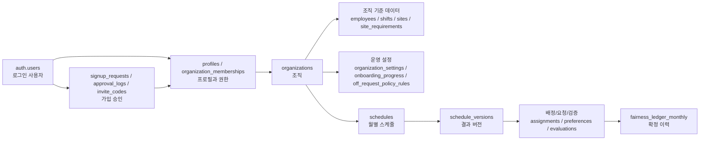
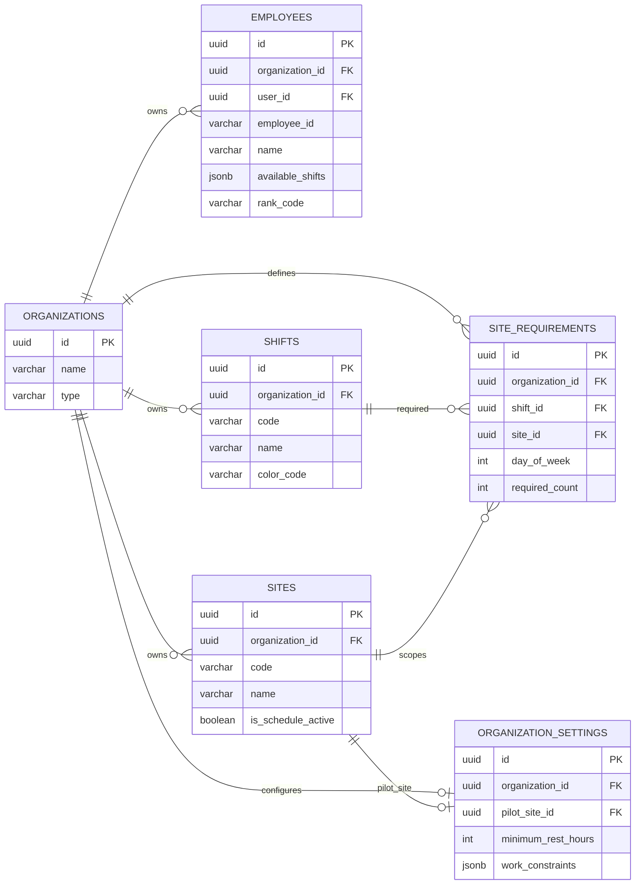
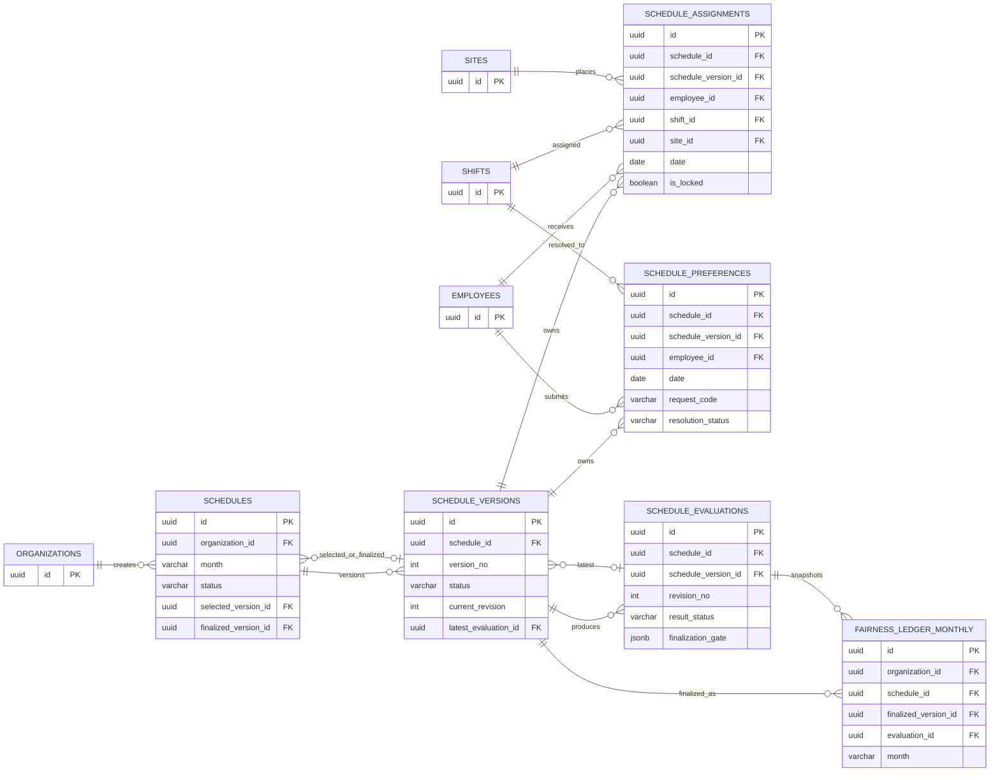
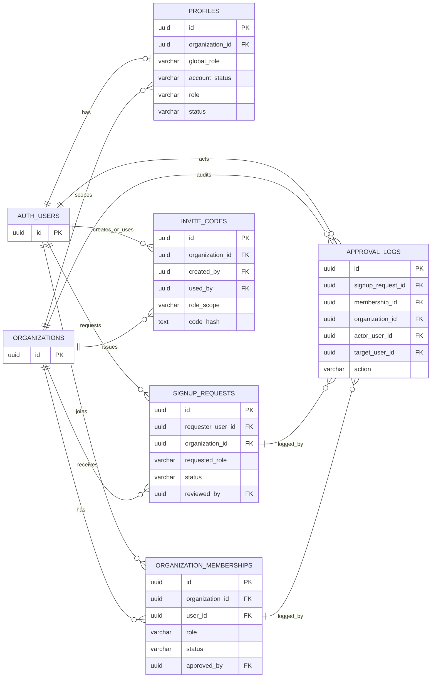
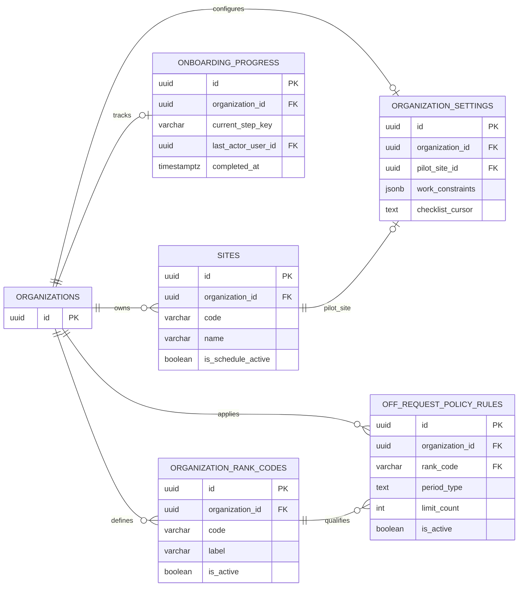

# 현재 사용 테이블 ERD 및 역할 설명

마지막 확인일: 2026-05-01

이 문서는 현재 애플리케이션 코드, Edge Function, 운영 플로우에서 실제로 사용하는 Supabase `public` schema 테이블을 기준으로 작성했다. `auth.users`는 Supabase Auth가 관리하는 외부 기준 테이블이라 ERD에는 `AUTH_USERS`로 표시했다.

## 한눈에 보기

현재 런타임에서 사용하는 테이블은 크게 네 영역으로 나뉜다.

| 영역             | 테이블                                                                                                                              | 역할                                                         |
| ---------------- | ----------------------------------------------------------------------------------------------------------------------------------- | ------------------------------------------------------------ |
| 조직 기준 데이터 | `organizations`, `employees`, `shifts`, `sites`, `site_requirements`, `organization_settings`                                       | 병원/조직, 근무자, 근무 타입, 병동, 필요 인원, 운영 제약     |
| 스케줄 생성/리뷰 | `schedules`, `schedule_versions`, `schedule_assignments`, `schedule_preferences`, `schedule_evaluations`, `fairness_ledger_monthly` | 월별 스케줄 컨테이너, 버전, 배정, 요청, 검증 결과, 확정 이력 |
| 가입/Auth/RBAC   | `profiles`, `organization_memberships`, `signup_requests`, `approval_logs`, `invite_codes`                                          | 사용자 프로필, 조직 멤버십, 가입 승인, 감사 로그, 초대 코드  |
| 운영 설정        | `onboarding_progress`, `organization_rank_codes`, `off_request_policy_rules`                                                        | 초기 설정 진행 상태, 직급 코드, Off 요청 정책                |

## ERD

전체 ERD를 하나의 Mermaid 블록으로 렌더링하면 Markdown 뷰어가 한정된 폭 안에 모든 테이블을 맞추면서 그림이 좁고 길게 압축된다. 그래서 먼저 전체 흐름을 보는 요약 맵을 두고, 실제 ERD는 도메인별로 나눠 배치했다.

### 전체 관계 맵

### 조직 기준 데이터 ERD

### 스케줄 생성/리뷰 ERD

### 가입/Auth/RBAC ERD

### 운영 설정/Off 정책 ERD

전체 ERD 원본 보기

아래 전체 ERD는 모든 사용 테이블을 한 번에 담은 참고용이다. Markdown 렌더러에 따라 폭이 좁게 압축될 수 있으므로, 평소에는 위의 분할 ERD를 기준으로 보는 편이 좋다.

```mermaid
erDiagram
    direction LR

    AUTH_USERS {
        uuid id PK
    }

    ORGANIZATIONS {
        uuid id PK
        varchar name
        varchar type
        timestamptz created_at
        timestamptz updated_at
    }

    EMPLOYEES {
        uuid id PK
        uuid organization_id FK
        uuid user_id FK
        varchar employee_id
        varchar name
        jsonb available_shifts
        varchar rank_code
    }

    SHIFTS {
        uuid id PK
        uuid organization_id FK
        varchar code
        varchar name
        varchar color_code
        time start_time
        time end_time
    }

    SITES {
        uuid id PK
        uuid organization_id FK
        varchar code
        varchar name
        boolean is_active
        boolean is_schedule_active
    }

    SITE_REQUIREMENTS {
        uuid id PK
        uuid organization_id FK
        uuid shift_id FK
        uuid site_id FK
        int day_of_week
        int required_count
    }

    ORGANIZATION_SETTINGS {
        uuid id PK
        uuid organization_id FK
        uuid pilot_site_id FK
        int max_consecutive_night_shifts
        int minimum_rest_hours
        jsonb minimum_rest_hours_by_shift
        jsonb work_constraints
        text checklist_cursor
    }

    SCHEDULES {
        uuid id PK
        uuid organization_id FK
        text public_id
        varchar month
        varchar status
        int hard_score
        int soft_score
        uuid selected_version_id FK
        uuid finalized_version_id FK
        int latest_version_no
        timestamptz finalized_at
        uuid finalized_by FK
    }

    SCHEDULE_VERSIONS {
        uuid id PK
        uuid schedule_id FK
        int version_no
        varchar name
        varchar source_type
        uuid base_version_id FK
        int current_revision
        varchar status
        jsonb input_snapshot
        jsonb input_diff_summary
        int manual_edit_count
        text active_solver_execution_id
        uuid latest_evaluation_id FK
        uuid created_by FK
    }

    SCHEDULE_ASSIGNMENTS {
        uuid id PK
        uuid schedule_id FK
        uuid schedule_version_id FK
        uuid employee_id FK
        uuid shift_id FK
        uuid site_id FK
        date date
        boolean is_locked
        varchar off_reason
        varchar off_comment
        text comment
        uuid edited_by FK
        timestamptz edited_at
    }

    SCHEDULE_PREFERENCES {
        uuid id PK
        uuid schedule_id FK
        uuid schedule_version_id FK
        uuid employee_id FK
        date date
        varchar request_code
        text request_note
        boolean is_soft
        varchar resolution_status
        uuid resolved_shift_id FK
        varchar request_source
        varchar policy_check_status
        text policy_rejection_reason
    }

    SCHEDULE_EVALUATIONS {
        uuid id PK
        uuid schedule_id FK
        uuid schedule_version_id FK
        int revision_no
        varchar result_status
        jsonb proof_summary
        jsonb violation_details
        jsonb off_request_results
        jsonb comparison_metrics
        jsonb finalization_gate
        text assignment_hash
        text solver_execution_id
    }

    FAIRNESS_LEDGER_MONTHLY {
        uuid id PK
        uuid organization_id FK
        uuid employee_id FK
        varchar month
        uuid schedule_id FK
        uuid schedule_version_id FK
        uuid finalized_version_id FK
        uuid evaluation_id FK
        int night_count
        int evening_count
        int weekend_count
        jsonb snapshot
    }

    PROFILES {
        uuid id PK
        uuid organization_id FK
        varchar global_role
        varchar account_status
        varchar role
        varchar display_name
        varchar status
        jsonb onboarding_state
    }

    ORGANIZATION_MEMBERSHIPS {
        uuid id PK
        uuid organization_id FK
        uuid user_id FK
        varchar role
        varchar status
        uuid approved_by FK
        timestamptz approved_at
        text rejection_reason
    }

    SIGNUP_REQUESTS {
        uuid id PK
        uuid requester_user_id FK
        uuid organization_id FK
        varchar requested_role
        varchar status
        varchar work_type
        varchar shift_type
        varchar requested_site_name
        text requested_skill_summary
        varchar requested_rank_code
        numeric requested_credit
        uuid reviewed_by FK
        text requester_email
    }

    APPROVAL_LOGS {
        uuid id PK
        uuid signup_request_id FK
        uuid membership_id FK
        uuid organization_id FK
        uuid actor_user_id FK
        uuid target_user_id FK
        varchar action
        text reason
        jsonb metadata
    }

    INVITE_CODES {
        uuid id PK
        uuid organization_id FK
        varchar role_scope
        text code_hash
        timestamptz expires_at
        int max_uses
        int used_count
        uuid used_by FK
        uuid created_by FK
        timestamptz revoked_at
    }

    ONBOARDING_PROGRESS {
        uuid id PK
        uuid organization_id FK
        int current_step
        varchar current_step_key
        timestamptz organization_info_confirmed_at
        uuid organization_info_confirmed_by FK
        uuid completed_by FK
        uuid last_actor_user_id FK
        timestamptz completed_at
    }

    ORGANIZATION_RANK_CODES {
        uuid id PK
        uuid organization_id FK
        varchar code
        varchar label
        int sort_order
        int display_order
        boolean is_active
    }

    OFF_REQUEST_POLICY_RULES {
        uuid id PK
        uuid organization_id FK
        varchar rank_code FK
        text period_type
        int limit_count
        int monthly_limit
        int annual_limit
        jsonb allowed_shift_codes
        date active_from
        date active_to
        boolean is_active
    }

    ORGANIZATIONS ||--o{ EMPLOYEES : owns
    ORGANIZATIONS ||--o{ SHIFTS : owns
    ORGANIZATIONS ||--o{ SITES : owns
    ORGANIZATIONS ||--o{ SITE_REQUIREMENTS : defines
    ORGANIZATIONS ||--o| ORGANIZATION_SETTINGS : configures
    ORGANIZATIONS ||--o{ SCHEDULES : creates
    ORGANIZATIONS ||--o{ ORGANIZATION_RANK_CODES : defines
    ORGANIZATIONS ||--o{ OFF_REQUEST_POLICY_RULES : applies
    ORGANIZATIONS ||--o{ PROFILES : scopes
    ORGANIZATIONS ||--o{ ORGANIZATION_MEMBERSHIPS : has
    ORGANIZATIONS ||--o{ SIGNUP_REQUESTS : receives
    ORGANIZATIONS ||--o{ APPROVAL_LOGS : audits
    ORGANIZATIONS ||--o{ INVITE_CODES : issues
    ORGANIZATIONS ||--o| ONBOARDING_PROGRESS : tracks
    ORGANIZATIONS ||--o{ FAIRNESS_LEDGER_MONTHLY : records

    AUTH_USERS ||--o| PROFILES : has
    AUTH_USERS ||--o{ EMPLOYEES : links
    AUTH_USERS ||--o{ ORGANIZATION_MEMBERSHIPS : joins
    AUTH_USERS ||--o{ SIGNUP_REQUESTS : requests
    AUTH_USERS ||--o{ APPROVAL_LOGS : acts
    AUTH_USERS ||--o{ INVITE_CODES : creates_or_uses

    SITES ||--o{ SITE_REQUIREMENTS : scopes
    SITES ||--o{ SCHEDULE_ASSIGNMENTS : places
    SITES ||--o| ORGANIZATION_SETTINGS : selected_as_pilot
    SHIFTS ||--o{ SITE_REQUIREMENTS : required
    SHIFTS ||--o{ SCHEDULE_ASSIGNMENTS : assigned
    SHIFTS ||--o{ SCHEDULE_PREFERENCES : resolved_to

    SCHEDULES ||--o{ SCHEDULE_VERSIONS : versions
    SCHEDULES ||--o{ SCHEDULE_ASSIGNMENTS : contains
    SCHEDULES ||--o{ SCHEDULE_PREFERENCES : collects
    SCHEDULES ||--o{ SCHEDULE_EVALUATIONS : evaluates
    SCHEDULES }o--o| SCHEDULE_VERSIONS : selected_or_finalized

    SCHEDULE_VERSIONS ||--o{ SCHEDULE_ASSIGNMENTS : owns
    SCHEDULE_VERSIONS ||--o{ SCHEDULE_PREFERENCES : owns
    SCHEDULE_VERSIONS ||--o{ SCHEDULE_EVALUATIONS : produces
    SCHEDULE_VERSIONS }o--o| SCHEDULE_EVALUATIONS : latest
    SCHEDULE_VERSIONS }o--o| SCHEDULE_VERSIONS : based_on

    EMPLOYEES ||--o{ SCHEDULE_ASSIGNMENTS : receives
    EMPLOYEES ||--o{ SCHEDULE_PREFERENCES : submits
    EMPLOYEES ||--o{ FAIRNESS_LEDGER_MONTHLY : summarized

    SCHEDULE_VERSIONS ||--o{ FAIRNESS_LEDGER_MONTHLY : finalized_as
    SCHEDULE_EVALUATIONS ||--o{ FAIRNESS_LEDGER_MONTHLY : snapshots

    ORGANIZATION_RANK_CODES ||--o{ OFF_REQUEST_POLICY_RULES : qualifies
    SIGNUP_REQUESTS ||--o{ APPROVAL_LOGS : logged_by
    ORGANIZATION_MEMBERSHIPS ||--o{ APPROVAL_LOGS : logged_by
```

## 핵심 관계를 쉽게 이해하기

### 1. 조직이 모든 데이터를 나눈다

`organizations`가 최상위 기준이다. 직원, 근무 타입, 병동, 스케줄, 가입 요청, 권한, 운영 설정은 모두 특정 조직에 속한다.

예를 들어 A 병원과 B 병원이 같은 앱을 쓰더라도 `organization_id`가 다르기 때문에 직원 목록, 스케줄, 가입 승인 상태가 섞이지 않는다.

### 2. 스케줄은 컨테이너와 버전으로 나뉜다

`schedules`는 "2026-05월 스케줄" 같은 월별 컨테이너다. 실제 생성 결과와 수정본은 `schedule_versions`에 저장된다.

이 구조가 중요한 이유는 Step 5에서 여러 결과를 비교하고, 하나를 선택하거나 확정해야 하기 때문이다. `schedules.selected_version_id`는 현재 검토 중인 버전이고, `schedules.finalized_version_id`는 최종 확정 버전이다.

### 3. 배정과 요청은 버전에 묶인다

`schedule_assignments`는 특정 날짜에 특정 직원이 어떤 근무를 하는지 저장한다. `schedule_preferences`는 직원의 Off/휴가/교육 같은 요청을 저장한다.

둘 다 `schedule_id`와 `schedule_version_id`를 함께 가진다. `schedule_id`는 월별 컨테이너를 찾기 위한 값이고, `schedule_version_id`는 실제로 어떤 버전의 데이터인지 보장하는 값이다.

### 4. 검증 결과는 수정 이력과 분리된다

`schedule_evaluations`는 특정 버전과 revision에 대한 검증 결과다. 하드 제약 위반, 요청 반영 여부, 비교 지표, 확정 가능 여부를 JSON으로 보관한다.

배정을 수정하면 버전의 `current_revision`이 바뀌고, 그 상태를 기준으로 새 evaluation을 만들 수 있다. 그래서 결과 리뷰 화면은 "이 검증 결과가 어떤 배정 상태를 기준으로 만들어졌는지"를 추적할 수 있다.

### 5. 확정 이력은 ledger로 남긴다

`fairness_ledger_monthly`는 확정된 스케줄 버전의 요약 이력이다. 야간/이브닝/주말 횟수, 검증 결과 스냅샷, 확정 시각을 남겨 다음 달 생성이나 공정성 확인에 활용한다.

현재 행 수는 0이지만, `finalize_schedule_version_atomic` 및 Phase2 ops 체크 경로에서 사용하는 테이블이므로 미사용 테이블로 보지 않는다.

### 6. 가입과 권한은 요청, 멤버십, 프로필로 분리된다

`signup_requests`는 "이 사용자가 이 조직에 가입하고 싶다"는 신청서다. 승인되면 `organization_memberships`에 조직별 권한과 상태가 반영된다.

`profiles`는 Supabase Auth 사용자와 앱 내부 상태를 연결한다. 다중 조직 권한 판단은 `organization_memberships`가 더 직접적인 기준이고, `profiles`는 기본 프로필과 레거시 호환 역할을 함께 한다.

`approval_logs`는 누가 어떤 신청을 승인/거절했는지 감사 기록으로 남긴다.

### 7. 초기 운영 설정은 별도 플로우로 관리한다

`sites`, `organization_settings`, `onboarding_progress`는 파일럿 운영 설정 화면에서 사용한다.

`sites`는 병동/근무지를 저장하고, `organization_settings.pilot_site_id`는 대표 파일럿 병동을 가리킨다. `onboarding_progress`는 사용자가 조직 설정을 어디까지 진행했는지 저장한다.

### 8. Off 요청 정책은 직급 코드와 규칙으로 구성된다

`organization_rank_codes`는 조직별 직급 코드 사전이다. `off_request_policy_rules`는 조직 또는 직급별 Off 요청 한도를 정의한다.

`off_request_policy_rules.rank_code`가 `NULL`이면 조직 기본 정책으로 볼 수 있고, 값이 있으면 해당 직급에 특화된 정책이다.

## 테이블별 역할

| 테이블                     | 역할                                  | 주요 관계                                                                                                   |
| -------------------------- | ------------------------------------- | ----------------------------------------------------------------------------------------------------------- |
| `organizations`            | 병원/조직의 루트 엔티티               | 대부분의 업무 테이블이 `organization_id`로 참조                                                             |
| `employees`                | 스케줄 대상 직원/간호사               | `organizations`, 선택적으로 `auth.users`, `schedule_assignments`, `schedule_preferences`와 연결             |
| `shifts`                   | D/E/N/O 등 근무 타입 정의             | `site_requirements`, `schedule_assignments`, `schedule_preferences.resolved_shift_id`에서 참조              |
| `sites`                    | 병동/근무지                           | `organization_settings.pilot_site_id`, `site_requirements.site_id`, `schedule_assignments.site_id`에서 참조 |
| `site_requirements`        | 요일/근무 타입별 필요 인원            | 현재 스케줄 생성의 canonical staffing source                                                                |
| `organization_settings`    | 조직 단위 운영 제약과 체크리스트 커서 | `organizations`, `sites`와 연결                                                                             |
| `schedules`                | 월별 스케줄 컨테이너                  | `schedule_versions`, `schedule_assignments`, `schedule_preferences`, `schedule_evaluations`의 상위          |
| `schedule_versions`        | 스케줄 생성 결과 버전                 | 배정/요청/검증 결과를 version scope로 묶음                                                                  |
| `schedule_assignments`     | 직원별 날짜별 근무 배정               | 직원, 근무 타입, 사이트, 스케줄 버전에 연결                                                                 |
| `schedule_preferences`     | Off/휴가/교육 등 요청                 | 직원, 스케줄 버전, 반영된 근무 타입과 연결                                                                  |
| `schedule_evaluations`     | 검증/비교/확정 가능성 결과            | 특정 스케줄 버전과 revision의 검증 산출물                                                                   |
| `fairness_ledger_monthly`  | 확정 스케줄의 공정성 이력             | 확정 버전, evaluation, 직원/조직별 요약                                                                     |
| `profiles`                 | Auth 사용자와 앱 프로필 연결          | `auth.users`, `organizations`와 연결                                                                        |
| `organization_memberships` | 조직별 사용자 권한과 승인 상태        | `auth.users`, `organizations`, `approval_logs`와 연결                                                       |
| `signup_requests`          | 가입/조직 참여 신청                   | 승인 대기열과 승인 처리의 입력                                                                              |
| `approval_logs`            | 승인/거절 감사 로그                   | 가입 요청, 멤버십, 승인자/대상 사용자와 연결                                                                |
| `invite_codes`             | 초대 코드 기반 가입                   | 조직, 생성자, 사용자를 추적                                                                                 |
| `onboarding_progress`      | 조직 초기 설정 진행 상태              | 조직과 마지막 작업 사용자를 추적                                                                            |
| `organization_rank_codes`  | 조직별 직급 코드 사전                 | Off 정책의 직급별 규칙 기준                                                                                 |
| `off_request_policy_rules` | Off 요청 한도/허용 근무 정책          | 조직 기본 또는 직급별 정책                                                                                  |

## 현재 제외한 테이블

아래 테이블은 현재 런타임 코드에서 직접 사용하지 않거나, 현재 제품 기준에서 canonical source가 아니어서 ERD 본문에서 제외했다.

| 테이블                       | 제외 이유                                                                          |
| ---------------------------- | ---------------------------------------------------------------------------------- |
| `analytics_metrics`          | 행 수 0, 런타임 참조 없음                                                          |
| `notifications`              | 행 수 0, 런타임 참조 없음                                                          |
| `notification_preferences`   | 행 수 0, 런타임 참조 없음                                                          |
| `employee_skills`            | 행 수 0, 런타임 참조 없음                                                          |
| `employee_site_assignments`  | 행 수 0, 런타임 참조 없음                                                          |
| `site_staffing_requirements` | 데이터는 있으나 현재 `site_requirements`가 canonical staffing source               |
| `ranks`                      | `site_requirements.rank_id`의 선택적 FK 대상이나 현재 기능에서 직접 사용하지 않음  |
| `skills`                     | `site_requirements.skill_id`의 선택적 FK 대상이나 현재 기능에서 직접 사용하지 않음 |

`site_requirements`에는 `rank_id`, `skill_id` 컬럼이 남아 있지만 현재 운영 데이터에서는 비어 있고, 스케줄 생성 경로는 `site_requirements`의 조직/근무 타입/요일/필요 인원 중심으로 동작한다.
