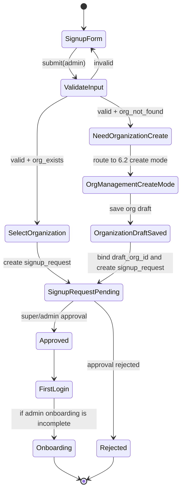

# Signup to Organization Creation Reuse Bridge (PRD 5.1 <-> 6.2)

## 1. Scope and Goal

This document defines the implementation boundary for the PRD requirement:
- PRD 5.1: if an `admin` applicant cannot select an existing organization, continue with organization creation.
- PRD 6.2: organization creation must reuse the existing Organization Management capability.

Goal:
- Avoid a separate signup-only organization creation screen.
- Reuse 6.2 with explicit route/API/authorization contracts.
- Connect missing implementation items into phase backlog (P2/P5).

## 2. State Diagram (Admin Signup -> 6.2 Reuse)

## 3. P2 <-> P5 Interface Contract

### 3.1 Route Contract
- Signup form route: `/signup`
- Reused organization management create route: `/admin/organizations/new`
- Signup bridge mode query:
  - `mode=signup`
  - `signupRequestToken=<opaque-token>`
- Return route after organization creation:
  - `/signup?resume=<token>`

Route guard behavior:
- `mode=signup` is allowed for unauthenticated signup flow context only.
- Standard `/admin/organizations/*` remains restricted to `super/admin` authenticated users.
- Guard must distinguish `signup-bridge` mode from normal admin console mode.

### 3.2 API/Data Contract
- P2 submission payload extensions:
  - `requestedRole`
  - `organizationSelectionMode`: `existing | create_new`
  - `organizationId` (required when `existing`)
  - `organizationDraftId` (required when `create_new`)
- P5 organization create response minimum:
  - `organizationDraftId`
  - `organizationName`
  - `createdByFlow`: `signup | admin_console`
- Binding rule:
  - `organizationDraftId` from 6.2 create mode must be attached to signup request before approval review.

### 3.3 Authorization Contract
- Signup phase:
  - No general admin privileges are granted.
  - Only scoped permission for `6.2 create mode` is granted by one-time bridge token.
- Post-approval:
  - Membership and full organization management privileges follow existing RBAC policy.

## 4. Gap Analysis (Current P2/P5)

Covered today:
- P2-1.1~1.5 define signup UX/API/UI/smoke in general.
- P5-1.1~1.4 define organization management scope/route/API/test in general.

Missing today:
- Explicit signup bridge route/guard contract to reuse 6.2.
- Scoped authorization model for unauthenticated signup bridge mode.
- Data binding contract between signup request and created organization draft.
- End-to-end scenario for admin signup without organization.

## 5. Added Backlog Items by Phase

P2 additions:
- P2-1.6 Signup admin no-org branch route/guard contract
- P2-1.7 Signup API payload/state extension for create_new organization mode
- P2-1.8 Signup->6.2 reuse->pending E2E scenario

P5 additions:
- P5-1.5 6.2 create mode for signup bridge entry
- P5-1.6 Organization create result binding contract back to signup

## 6. Acceptance Check

- Flow from admin signup to 6.2 organization create reuse is fully documented.
- P2/P5 interface contract is explicit (route/API/authorization).
- Missing implementation tasks are assigned to concrete phases (P2/P5).
