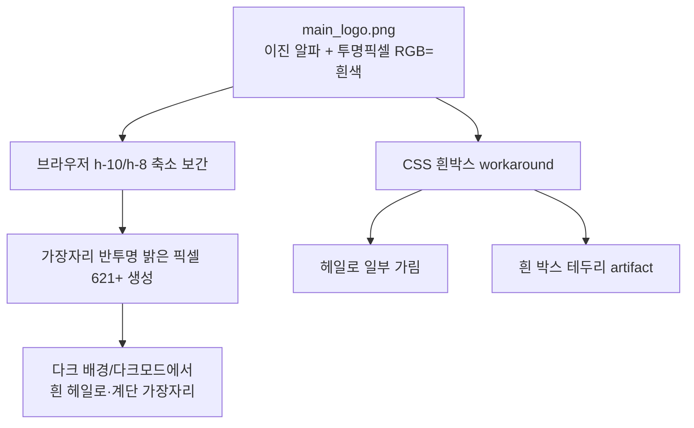

# Brand Logo 다크모드 테두리 깨짐 — 원인 분석 및 구현 Plan

> **For agentic workers:** REQUIRED SUB-SKILL: Use superpowers:subagent-driven-development (recommended) or superpowers:executing-plans to implement this plan task-by-task. Steps use checkbox (`- [ ]`) syntax for tracking.
>
> **상태:** 📋 Plan 확정 (코드 미착수)  
> **작성일:** 2026-06-15  
> **관련 컴포넌트:** `BrandLogo.vue`, `Header.vue`, `PublicHeader.vue`  
> **선행 문서:** `docs/superpowers/plans/2026-06-15-brand-logo-svg-dark-mode.ko.md` (본 문서가 RCA·구현 SSOT)

**Goal:** `main_logo.png` 래스터 로고를 테마 인식 벡터/DOM 기반 `BrandLogo`로 교체해, OS 다크모드·축소 렌더링 환경에서도 테두리 헤일로·흰 박스 artifact 없이 선명하게 표시한다.

**Architecture:** E1 로고(3색 인터록 마크 + `everyshift` 워드마크)를 **인라인 SVG path 3개 + DOM `<span>` 워드마크**로 재현한다. 색상은 `--brand-logo-mark-{1,2,3}`, `--brand-logo-wordmark` CSS 변수로 주입하고 `@media (prefers-color-scheme: dark)` 및 향후 `.dark` hook으로 전환한다. PNG용 `background: #fff` workaround는 제거한다.

**Tech Stack:** Vue 3.5 (`<script setup>`), TypeScript 5.8, Tailwind CSS 3.4, Vitest, `DESIGN.md`

---

## 1. 문제 요약

| 현상                                                                     | 사용자 체감                                          |
| ------------------------------------------------------------------------ | ---------------------------------------------------- |
| OS/브라우저 다크모드에서 로고 가장자리가 **깨지거나 흰 테두리**처럼 보임 | 브랜드 품질 저하, 헤더가 “붙여 넣은 이미지”처럼 보임 |
| 라이트 헤더에서도 확대/고해상도 시 가장자리가 거칠 수 있음               | Retina·줌에서 계단 현상                              |

**재현 위치**

- `/app` — `Header.vue` → `<BrandLogo size="md" />` (`h-10`, 약 143×40px)
- `/` — `PublicHeader.vue` → `<BrandLogo size="sm" alt="" />`

**DOM 스냅샷 (2026-06-15 기준)**

```text
img.brand-logo.brand-logo--md
  src=/src/assets/brand/main_logo.png
  bounds: 143×40 CSS px
  class: brand-logo-image (흰 배경 패치 적용)
```

---

## 2. Root Cause Analysis (코드·에셋 검증 완료)

### 2.1 1차 원인: `main_logo.png` 래스터 품질

ImageMagick으로 `src/assets/brand/main_logo.png` (560×149, RGBA) 분석 결과:

| 측정 항목        | 값                         | 해석                                       |
| ---------------- | -------------------------- | ------------------------------------------ |
| 알파 채널 고유값 | **0, 255만** (중간값 없음) | 이진(binary) 알파 — 안티앨리어싱 없음      |
| 투명 픽셀 RGB    | **`(255,255,255,0)`**      | 투명 영역에 흰색이 baked-in                |
| `bKGD` PNG 청크  | **없음**                   | 메타 배경은 없으나 픽셀 데이터 자체에 문제 |
| 불투명 픽셀      | 23,905 / 83,440 (28.7%)    |                                            |
| 완전 투명 픽셀   | 59,535 / 83,440 (71.3%)    |                                            |

**메커니즘:** 투명 픽셀이 흰색(RGB=255)인 채 알파=0으로 저장되어 있다. 브라우저가 `h-10`/`h-8`로 축소할 때 이진 알파를 **재보간**하면서 가장자리에 반투명 픽셀이 생성되고, 그 RGB에 흰색이 섞여 **밝은 fringe(헤일로)** 가 된다.

**브라우저 표시 크기(143×40)로 리사이즈 후 재측정:**

| 항목                        | 원본 560×149 | 리사이즈 143×40                   |
| --------------------------- | ------------ | --------------------------------- |
| 반투명 픽셀                 | 0            | **2,208**                         |
| 그중 밝은 fringe (RGB>180)  | —            | **621**                           |
| 흰/다크 배경 합성 mean diff | —            | **~0.49** (가장자리 시각 차이 큼) |

→ “다크모드에서 테두리 깨짐”은 **다크 배경 위에서 fringe가 두드러지는 현상**으로 설명된다.

### 2.2 2차 원인: CSS 크기 축소 + GPU 보간

```13:19:src/components/brand/BrandLogo.vue
const imageClass = computed(() => {
  if (props.size === 'md') {
    return 'brand-logo brand-logo--md h-10 w-auto object-contain object-center'
  }
  return 'brand-logo brand-logo--sm h-8 w-auto object-contain object-center'
})
```

원본 560px 너비 → 표시 ~143px (**약 25% 축소**). 이진 알파 PNG는 축소 시 브라우저가 부드러운 가장자리를 **인위 생성**하며, 위 2.1의 흰 RGB fringe가 증폭된다.

### 2.3 3차 원인: CSS workaround의 한계

```35:40:src/components/brand/BrandLogo.vue
.brand-logo-image {
  color-scheme: only light;
  background-color: #ffffff;
  border-radius: 6px;
  padding: 2px 4px;
}
```

| 의도                        | 실제 효과                                                       |
| --------------------------- | --------------------------------------------------------------- |
| PNG 헤일로를 흰 박스로 가림 | fringe가 padding 밖으로 나가면 여전히 노출                      |
| `color-scheme: only light`  | `` 픽셀 데이터는 변경하지 않음                             |
| `border-radius` + `padding` | **별도의 흰 박스 artifact** 생성 — “테두리 깨짐”의 또 다른 형태 |

### 2.4 `color-scheme: only_light` 앱 전략과의 관계

앱 셸은 라이트 고정:

```2:5:src/components/layout/DefaultLayout.vue
  <n-layout class="h-screen [color-scheme:only_light]">
    <n-layout-header
      bordered
      class="sticky top-0 z-20 flex h-16 items-center border-b border-gray-200 bg-white shadow-none"
```

- `src/style.css` `:root { color-scheme: only light; }`
- `DESIGN.md` — MVP 다크모드 UI 미지원 명시

**그러나** OS 다크모드·DevTools `prefers-color-scheme: dark` 시뮬레이션·브라우저 chrome·어두운 주변 맥락에서는 PNG fringe와 흰 박스 workaround가 **여전히 눈에 띈다**. `only_light`는 UI 크롬 잠금이지 에셋 품질 문제를 해결하지 못한다.

### 2.5 기존 대안 에셋 검토 (기각 근거)

| 에셋                     | 상태                    | 기각 이유                                                        |
| ------------------------ | ----------------------- | ---------------------------------------------------------------- |
| `dark_logo.png`          | repo에 존재, **미사용** | `main_logo.png`와 ~10% 픽셀만 다름; **동일 이진 알파 구조**      |
| `dark_logo_mono.png`     | repo에 존재, **미사용** | 동일                                                             |
| PNG 스왑 (`dark:` class) | README에서 명시적 배제  | 근본 해결 아님; MVP는 `color-scheme: light` 유지 정책            |
| PNG 재export             | 단기 가능               | 워드마크+마크 합성 래스터는 축소·테마 전환에 취약; 유지보수 부담 |

### 2.6 원인 계층 다이어그램



### 2.7 문서 정합성

`docs/launch/launch-core/assets/brand-exploration/README.md` § App Export Rules:

> Export with true transparency; do not embed white anti-aliasing … dark OS/browser modes do not show white halos.

현재 `main_logo.png`는 이 규칙을 **위반**한 상태로 판단된다.

---

## 3. 코드베이스 현황

### 3.1 관련 파일

| File                                     | 현재 역할                            | 변경 예정                 |
| ---------------------------------------- | ------------------------------------ | ------------------------- |
| `src/components/brand/BrandLogo.vue`     | PNG `` + 흰 박스 CSS            | SVG 마크 + DOM 워드마크   |
| `src/components/layout/Header.vue`       | `<BrandLogo size="md" />`            | 변경 없음                 |
| `src/components/public/PublicHeader.vue` | `<BrandLogo size="sm" alt="" />`     | 변경 없음                 |
| `tests/unit/brand-logo.spec.ts`          | `img` assertion                      | SVG/div 구조로 업데이트   |
| `tests/unit/public-landing.spec.ts`      | `[data-test="brand-logo"]` 존재 확인 | selector 유지             |
| `src/assets/brand/main_logo.png`         | 런타임 import                        | archive 참조용으로만 유지 |
| `DESIGN.md`                              | 다크모드 미지원 명시                 | Brand Logo 토큰 섹션 추가 |

### 3.2 미착수 / 부분 산출물

| File                                         | 상태                                             |
| -------------------------------------------- | ------------------------------------------------ |
| `src/components/brand/brand-logo.tokens.css` | 초안 존재 가능 — `src/style.css`에 **미 import** |
| `src/assets/brand/logo-mark.svg`             | 트레이스 시도 이력 있으나 production 미연결      |

---

## 4. 해결 방향 및 설계 결정

### 4.1 권장 솔루션: SVG path + DOM 워드마크 + CSS 토큰

| 항목           | 결정                                                 | 근거                                    |
| -------------- | ---------------------------------------------------- | --------------------------------------- |
| 마크           | 인라인 SVG `<path>` 3개                              | fill을 CSS 변수로 — 배경·테마 무관 선명 |
| 워드마크       | DOM `<span>` + Pretendard 600                        | SVG `<text>`보다 소형 크기에서 선명     |
| 색상           | `--brand-logo-mark-{1,2,3}`, `--brand-logo-wordmark` | 라이트/다크 전환                        |
| 다크 트리거    | `@media (prefers-color-scheme: dark)` + `.dark` hook | OS 다크 선대응 + 향후 in-app dark       |
| API            | `size: 'sm' \| 'md'`, `alt` prop **유지**            | breaking change 금지                    |
| PNG workaround | **제거**                                             | 흰 박스 artifact 제거                   |

### 4.2 기각한 대안

| 대안                            | 기각 이유                                                         |
| ------------------------------- | ----------------------------------------------------------------- |
| `dark_logo.png` 스왑            | 동일 이진 알파; 색만 다름                                         |
| PNG 재export만                  | 테마별 래스터 유지보수; 축소 fringe 잔존 가능                     |
| CSS `mask-image` + 컬러 fill    | 가능하나 마크 3색 분리·워드마크 별도 처리 복잡; SVG가 SSOT에 적합 |
| `color-scheme: only_light` 강화 | 에셋 픽셀 문제 미해결                                             |

### 4.3 색상 토큰

**Light (E1 근사)**

| Token                   | 용도      | 값        |
| ----------------------- | --------- | --------- |
| `--brand-logo-mark-1`   | 마크 gold | `#C9A227` |
| `--brand-logo-mark-2`   | 마크 teal | `#14B8A6` |
| `--brand-logo-mark-3`   | 마크 navy | `#1E3A5F` |
| `--brand-logo-wordmark` | 텍스트    | `#134E4A` |

**Dark (`prefers-color-scheme: dark`, `.dark`, `[data-theme='dark']`)**

| Token                   | 용도            | 값        |
| ----------------------- | --------------- | --------- |
| `--brand-logo-mark-1`   | 밝은 gold       | `#E8C547` |
| `--brand-logo-mark-2`   | 밝은 teal       | `#5EEAD4` |
| `--brand-logo-mark-3`   | 밝은 slate-blue | `#7BA3D4` |
| `--brand-logo-wordmark` | 텍스트          | `#E2F5F2` |

> `shift.*` Tailwind 색과 혼용 금지. 구현 후 WCAG 대비 육안 확인.

### 4.4 Scope Guard (범위 밖)

- PWA favicon / apple-touch-icon 일괄 교체
- 앱 전체 다크모드 UI 구현 (로고만 선제 대응)
- E1 마크 형태 변경(리디자인)

---

## 5. 파일 구조

### Create

| File                                         | Responsibility                       |
| -------------------------------------------- | ------------------------------------ |
| `src/assets/brand/logo-mark.svg`             | 마크 벡터 아카이브 (Figma handoff용) |
| `src/components/brand/brand-logo.tokens.css` | 라이트/다크 CSS 변수                 |

### Modify

| File                                                         | Responsibility                                  |
| ------------------------------------------------------------ | ----------------------------------------------- |
| `src/components/brand/BrandLogo.vue`                         | PNG → SVG + DOM 워드마크                        |
| `src/style.css`                                              | `brand-logo.tokens.css` import (`@tailwind` 위) |
| `tests/unit/brand-logo.spec.ts`                              | 구조 assertion 업데이트                         |
| `DESIGN.md`                                                  | Brand Logo Tokens 섹션                          |
| `docs/launch/launch-core/assets/brand-exploration/README.md` | SVG SSOT 명시                                   |

### Unchanged

| File                                     | Note                             |
| ---------------------------------------- | -------------------------------- |
| `src/components/layout/Header.vue`       | `<BrandLogo size="md" />`        |
| `src/components/public/PublicHeader.vue` | `<BrandLogo size="sm" alt="" />` |

---

## 6. 사전 조건 (구현자 체크)

- [ ] `main_logo.png` (560×149)에서 **마크 영역 vs 워드마크 영역** 경계 확인
- [ ] `DESIGN.md` 읽기 — brand color vs shift color 분리
- [ ] `pnpm dev`로 `/app`, `/` 헤더 before 스크린샷 확보
- [ ] DevTools → Rendering → `prefers-color-scheme: dark` 방법 확인

---

## 7. Implementation Tasks

### Task 1: SVG 마크 path 제작 + 아카이브

**Files:**

- Create: `src/assets/brand/logo-mark.svg`
- Reference: `src/assets/brand/main_logo.png`

- [ ] **Step 1: 마크 영역만 벡터 트레이스**

Figma / Illustrator / Inkscape로 **원형 인터록 마크**(워드마크 제외) trace.

요구사항:

- `<path>` 3개 — 색 영역 분리 (`fill="var(--brand-logo-mark-N)"`)
- `viewBox="0 0 40 40"` (정사각) 권장
- embedded raster `<image>` **금지**
- stroke 없이 fill only

```svg
<svg xmlns="http://www.w3.org/2000/svg" viewBox="0 0 40 40" fill="none" aria-hidden="true">
  <path d="<!-- segment 1 -->" fill="var(--brand-logo-mark-1, #C9A227)" />
  <path d="<!-- segment 2 -->" fill="var(--brand-logo-mark-2, #14B8A6)" />
  <path d="<!-- segment 3 -->" fill="var(--brand-logo-mark-3, #1E3A5F)" />
</svg>
```

- [ ] **Step 2: PNG 원본과 50% overlay 육안 비교** — 실루엣·비율 일치 gate

- [ ] **Step 3: Commit**

```bash
git add src/assets/brand/logo-mark.svg
git commit -m "assets: add vector brand mark SVG traced from E1 logo"
```

---

### Task 2: 브랜드 로고 CSS 토큰

**Files:**

- Create: `src/components/brand/brand-logo.tokens.css`
- Modify: `src/style.css`

- [ ] **Step 1: 토큰 파일 작성**

```css
:root {
  --brand-logo-mark-1: #c9a227;
  --brand-logo-mark-2: #14b8a6;
  --brand-logo-mark-3: #1e3a5f;
  --brand-logo-wordmark: #134e4a;
}

@media (prefers-color-scheme: dark) {
  :root {
    --brand-logo-mark-1: #e8c547;
    --brand-logo-mark-2: #5eead4;
    --brand-logo-mark-3: #7ba3d4;
    --brand-logo-wordmark: #e2f5f2;
  }
}

.dark,
[data-theme='dark'] {
  --brand-logo-mark-1: #e8c547;
  --brand-logo-mark-2: #5eead4;
  --brand-logo-mark-3: #7ba3d4;
  --brand-logo-wordmark: #e2f5f2;
}
```

- [ ] **Step 2: `src/style.css` 최상단에 import**

```css
@import './components/brand/brand-logo.tokens.css';
```

- [ ] **Step 3: Commit**

```bash
git add src/components/brand/brand-logo.tokens.css src/style.css
git commit -m "feat: add brand logo light/dark CSS tokens"
```

---

### Task 3: `BrandLogo.vue` SVG 전환 (TDD)

**Files:**

- Modify: `tests/unit/brand-logo.spec.ts`
- Modify: `src/components/brand/BrandLogo.vue`

- [ ] **Step 1: 실패 테스트 작성**

```typescript
import { mount } from '@vue/test-utils';
import { describe, expect, it } from 'vitest';
import BrandLogo from '@/components/brand/BrandLogo.vue';

describe('BrandLogo', () => {
  it('renders vector mark and wordmark with sm sizing', () => {
    const wrapper = mount(BrandLogo);
    const logo = wrapper.get('[data-test="brand-logo"]');

    expect(logo.attributes('aria-label')).toBe('everyshift');
    expect(logo.classes()).toContain('h-8');
    expect(logo.find('[data-test="brand-logo-mark"]').exists()).toBe(true);
    expect(logo.find('.brand-logo-wordmark').text()).toBe('everyshift');
    expect(logo.find('img').exists()).toBe(false);
  });

  it('renders md sizing when requested', () => {
    const wrapper = mount(BrandLogo, { props: { size: 'md' } });
    expect(wrapper.get('[data-test="brand-logo"]').classes()).toContain('h-10');
  });

  it('applies CSS variable fills on mark paths', () => {
    const wrapper = mount(BrandLogo);
    const paths = wrapper.findAll('[data-test="brand-logo-mark"] path');
    expect(paths.length).toBe(3);
    expect(paths[0]?.attributes('fill')).toBe('var(--brand-logo-mark-1)');
  });

  it('hides decorative label when alt is empty', () => {
    const wrapper = mount(BrandLogo, { props: { alt: '' } });
    expect(wrapper.get('[data-test="brand-logo"]').attributes('aria-hidden')).toBe('true');
  });
});
```

- [ ] **Step 2: 테스트 실행 — FAIL 확인**

```bash
pnpm vitest run tests/unit/brand-logo.spec.ts
```

Expected: FAIL (`img` still present)

- [ ] **Step 3: `BrandLogo.vue` 구현**

핵심 변경:

- `import mainLogo from '@/assets/brand/main_logo.png'` **제거**
- `` → `<div role="img">` + inline SVG + `<span class="brand-logo-wordmark">`
- `.brand-logo-image { background: #fff; ... }` **제거**

스켈레톤:

```vue
<script setup lang="ts">
import { computed } from 'vue';

const props = withDefaults(
  defineProps<{
    size?: 'sm' | 'md';
    alt?: string;
  }>(),
  {
    size: 'sm',
    alt: 'everyshift',
  }
);

const rootClass = computed(() =>
  props.size === 'md'
    ? 'brand-logo brand-logo--md h-10 gap-2.5'
    : 'brand-logo brand-logo--sm h-8 gap-2'
);
</script>

<template>
  <div
    data-test="brand-logo"
    class="inline-flex shrink-0 items-center"
    :class="rootClass"
    :role="alt ? 'img' : undefined"
    :aria-label="alt || undefined"
    :aria-hidden="alt ? undefined : 'true'"
  >
    <svg
      data-test="brand-logo-mark"
      class="brand-logo__mark block h-full w-auto shrink-0"
      viewBox="0 0 40 40"
      xmlns="http://www.w3.org/2000/svg"
      shape-rendering="geometricPrecision"
      aria-hidden="true"
    >
      <path fill="var(--brand-logo-mark-1)" d="..." />
      <path fill="var(--brand-logo-mark-2)" d="..." />
      <path fill="var(--brand-logo-mark-3)" d="..." />
    </svg>
    <span class="brand-logo-wordmark whitespace-nowrap" aria-hidden="true">everyshift</span>
  </div>
</template>

<style scoped>
.brand-logo-wordmark {
  color: var(--brand-logo-wordmark);
  font-family: var(--font-sans, 'Pretendard Variable', 'Pretendard', 'Noto Sans KR', sans-serif);
  font-weight: 600;
  letter-spacing: -0.02em;
  line-height: 1;
  -webkit-font-smoothing: antialiased;
}
.brand-logo--sm .brand-logo-wordmark {
  font-size: 15px;
}
.brand-logo--md .brand-logo-wordmark {
  font-size: 17px;
}
</style>
```

- [ ] **Step 4: 테스트 통과**

```bash
pnpm vitest run tests/unit/brand-logo.spec.ts
```

Expected: PASS (4 tests)

- [ ] **Step 5: Commit**

```bash
git add src/components/brand/BrandLogo.vue tests/unit/brand-logo.spec.ts
git commit -m "feat: replace PNG brand logo with theme-aware SVG mark"
```

---

### Task 4: 회귀 테스트 + 문서

**Files:**

- Modify: `tests/unit/public-landing.spec.ts` (필요 시)
- Modify: `DESIGN.md`
- Modify: `docs/launch/launch-core/assets/brand-exploration/README.md`

- [ ] **Step 1: public landing 테스트**

```bash
pnpm vitest run tests/unit/public-landing.spec.ts
```

`[data-test="brand-logo"]` assertion 유지.

- [ ] **Step 2: `DESIGN.md` Brand Logo Tokens 섹션 추가**

```markdown
### Brand Logo Tokens

- Logo is vector (`BrandLogo.vue`); do not ship raster wordmarks for UI chrome.
- Colors: `--brand-logo-mark-{1,2,3}`, `--brand-logo-wordmark`.
- Dark OS: `@media (prefers-color-scheme: dark)`.
- Future in-app dark: `.dark` / `[data-theme='dark']`.
- Do not add white background patches behind the logo.
```

- [ ] \*\*Step 3: brand-exploration README — SVG가 SSOT, `main_logo.png`는 legacy

- [ ] **Step 4: Commit**

```bash
git add DESIGN.md docs/launch/launch-core/assets/brand-exploration/README.md
git commit -m "docs: document SVG brand logo tokens and dark mode behavior"
```

---

### Task 5: 시각 QA + Workflow Checks

- [ ] **Step 1: 라이트 모드** — `/app`, `/` 헤더

체크리스트:

- [ ] E1 마크 형태 PNG와 동일
- [ ] 워드마크 수직 정렬
- [ ] **흰 박스 테두리 없음**
- [ ] Retina(2x) 가장자리 선명

- [ ] **Step 2: 다크 모드** — DevTools `prefers-color-scheme: dark`

체크리스트:

- [ ] 마크/텍스트 주변 **흰 헤일로 없음**
- [ ] `bg-slate-900` 위 mount 시 워드마크 가독성
- [ ] 과채도/네온 아님

- [ ] **Step 3: Workflow Checks**

```bash
pnpm lint:check
pnpm run build
```

Expected: both PASS

---

## 8. 수동 QA 시나리오

| #   | 시나리오                                            | 기대 결과                                 |
| --- | --------------------------------------------------- | ----------------------------------------- |
| 1   | 라이트 `/app` 헤더                                  | 로고 선명, 흰 테두리·박스 없음            |
| 2   | 라이트 `/` 헤더                                     | sm 사이즈 정상                            |
| 3   | `prefers-color-scheme: dark` + 흰 헤더              | 다크 토큰 적용, 헤일로 없음               |
| 4   | `prefers-color-scheme: dark` + `bg-slate-900` mount | 워드마크 읽기 가능                        |
| 5   | `alt=""` (PublicHeader)                             | `aria-hidden="true"`, 부모 `sr-only` 유지 |
| 6   | Windows 11 OS 다크모드 (가능 시)                    | 로고만 정상 (ButtonFace 이슈와 무관)      |

---

## 9. 리스크 & 완화

| 리스크                                    | 완화                                            |
| ----------------------------------------- | ----------------------------------------------- |
| 수동 SVG trace 품질 편차                  | PNG 50% overlay gate (Task 1 Step 2)            |
| 다크 토큰이 `bg-white` 헤더에서 과밝음    | 헤더 라이트 고정 — OS 다크 우선 검증            |
| SVG path 번들 증가                        | 마크 path 3개만; 워드마크는 DOM text            |
| `public-landing` color-scheme 테스트 의미 | shell `only_light` 유지 가능 — 로고만 테마 인식 |

---

## 10. 완료 기준 (Definition of Done)

- [ ] `BrandLogo.vue`가 PNG를 import하지 않음
- [ ] 라이트/다크 모두 헤일로·흰 박스 없음
- [ ] `tests/unit/brand-logo.spec.ts` 전체 통과
- [ ] `pnpm lint:check` / `pnpm run build` 통과
- [ ] `DESIGN.md`에 브랜드 로고 토큰 문서화
- [ ] E1 마크 실루엣 유지 (리디자인 아님)

---

## 11. 새 세션 시작 프롬프트 (복사용)

```text
/docs/plans/2026-06-15-brand-logo-dark-mode-fix.ko.md 플랜을 따라 Brand Logo 다크모드 수정을 구현해주세요.

순서:
1. Task 1 — E1 마크 SVG path 트레이스
2. Task 2 — CSS 토큰 + style.css import
3. Task 3 — BrandLogo.vue SVG 전환 (TDD)
4. Task 4 — 문서
5. Task 5 — 시각 QA + lint/build

근본 원인: main_logo.png 이진 알파 + 투명픽셀 RGB=흰색 → 축소 시 fringe.
PNG workaround(흰 박스)는 제거할 것.

참고: @DESIGN.md, @src/components/brand/BrandLogo.vue
```

---

## Execution Handoff

**Plan saved to:** `docs/plans/2026-06-15-brand-logo-dark-mode-fix.ko.md`

**실행 옵션:**

1. **Subagent-Driven (권장)** — Task마다 새 서브에이전트 + 단계별 리뷰
2. **Inline Execution** — 이 세션에서 `executing-plans` 스킬로 일괄 진행

원하시면 바로 Task 1부터 구현을 시작할 수 있습니다.
