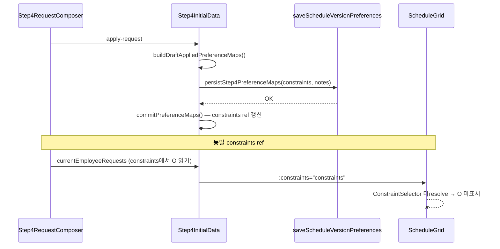

# Step4 Off 요청 — 우측 패널 vs 캘린더 그리드 불일치 분석

> **상태:** ✅ 수정 완료  
> **작성일:** 2026-06-15  
> **관련 화면:** `Step4InitialData.vue`, `ScheduleGrid.vue`, `Step4RequestComposer.vue`  
> **선행 작업:** [프리셉터 짝 peer 라벨](./2026-06-14-step4-preceptor-peer-label.ko.md) (로컬 미커밋 변경과 동시 발생)

---

## 증상

2026-05 사전 Off 요청 입력 화면에서:

| 영역                                           | 관찰                                                                                                                       |
| ---------------------------------------------- | -------------------------------------------------------------------------------------------------------------------------- |
| **우측 요청 입력 패널**                        | 근무자 `소한지 (101)` 선택, 5/4·5/28 Off 선택, 미니 캘린더에 `소한지` 배지 표시, `요청이 DB에 저장되었습니다.` 성공 메시지 |
| **좌측 사전 Off 요청 캘린더** (`ScheduleGrid`) | 동일 근무자·날짜 셀이 **빈 칸** — `O` 미표시                                                                               |

사용자 기대: 우측에서 반영·저장한 Off가 좌측 30×N 그리드에도 즉시 보여야 함.

---

## deep-interview — 확정된 사항

| 축                     | 결정                                                                                                        |
| ---------------------- | ----------------------------------------------------------------------------------------------------------- |
| **목표**               | Off 요청 반영 후 좌·우 UI가 동일한 `constraints` 상태를 시각적으로 일치시킨다                               |
| **범위**               | Step4 `mode="planning"` 그리드 렌더링 + 요청 입력 드로어 데이터 소스 비교                                   |
| **제외**               | Step5 결과 그리드, AI 솔버, 정책 거부 UX, Excel 업로드                                                      |
| **완료 기준 (분석)**   | 불일치의 단일 근본 원인과 데이터/렌더 경로를 문서로 명확히 구분                                             |
| **데이터 동기화 여부** | **정상** — 우측·좌측 모두 동일 `constraints` ref 사용. DB 저장 후 `commitPreferenceMaps`로 in-memory 갱신됨 |

### 코드베이스에서 자동 해소한 모호성

| #   | 모호했던 지점                                   | 해소                                                                                                            |
| --- | ----------------------------------------------- | --------------------------------------------------------------------------------------------------------------- |
| 1   | 우측만 다른 API/스토어를 쓰나?                  | 아니오. `currentEmployeeRequests` → `constraints.value`에서 `=== 'O'`인 날짜를 읽음                             |
| 2   | `요청 반영`이 그리드 state를 안 바꾸나?         | `applyDraftRequest` → `persistStep4PreferenceMaps` → `commitPreferenceMaps(sanitized.constraints, …)` 로 갱신함 |
| 3   | 직원 행 정렬(`displayEmployees`)이 키를 바꾸나? | 아니오. `orderEmployeesForPreceptorPairs`는 표시 순서만 변경, `employee.id` 키는 동일                           |
| 4   | 미니 캘린더 배지는 draft만 보여 주나?           | 아니오. `소한지` 텍스트는 `isExistingRequestDate`일 때만 렌더 → `constraints`에 `O`가 있어야 표시됨             |

---

## 근본 원인 (Root Cause)

### `ScheduleGrid.vue`에서 `ConstraintSelector` import 누락 (회귀)

프리셉터 peer 라벨 작업 중 `ScheduleGrid.vue` script에서 **`ConstraintSelector` 컴포넌트 import가 삭제**되었으나, template의 `<ConstraintSelector>` 사용은 그대로 남아 있다.

```diff
- import ConstraintSelector from './ConstraintSelector.vue';
+ import type { PreceptorPairDisplayMeta } from '@/utils/preceptorPairDisplayOrder';
```

| 파일                        | template                         | script import                                                             |
| --------------------------- | -------------------------------- | ------------------------------------------------------------------------- |
| `ScheduleGrid.vue` L142–155 | `<ConstraintSelector …>` 사용 중 | `ConstraintSelector` import **없음** (L300–301: `ShiftSelector`만 import) |

**런타임 동작:**

- Vue가 `ConstraintSelector`를 resolve하지 못함 → planning 모드 셀 내용이 렌더되지 않음 → 빈 `<td>`처럼 보임
- `constraints` 데이터·DB 저장·우측 패널은 정상 → **데이터 불일치가 아니라 그리드 셀 컴포넌트 미마운트**

**회귀 도입 커밋/변경:** 로컬 미커밋 diff (`2026-06-14-step4-preceptor-peer-label` 관련 `ScheduleGrid.vue` 수정)

**테스트가 놓친 이유:**

`tests/unit/schedule-grid-preceptor-peer-label.spec.ts`가 파일 상단에서 `ConstraintSelector`를 **전역 mock**하여, import 누락이 있어도 stub이 렌더됨. peer 라벨 assertion만 검증하고 **Off(`O`) 표시 회귀는 검증하지 않음**.

```ts
vi.mock('@/components/schedule/ConstraintSelector.vue', () => ({
  default: { template: '<div data-test="constraint-selector-stub" />' },
}));
```

`pnpm run build`는 unresolved component로 실패하지 않음 (Vue SFC 빌드는 통과, 런타임에서만 빈 셀).

---

## 데이터 흐름 (정상 경로)



### 우측 패널이 Off를 보여 주는 경로

1. `Step4RequestComposer.existingRequestDates` ← `currentEmployeeRequests.flatMap(row => row.dates)`
2. `currentEmployeeRequests` ← `buildCurrentEmployeeRequests(employeeId)` ← `constraints.value[employeeId][date] === 'O'`
3. `Step4MonthCalendar` → `isExistingRequestDate` 시 amber 배지 + 근무자 이름 (`소한지`)

### 좌측 그리드가 Off를 보여 줘야 하는 경로

1. `:constraints="constraints"` (동일 ref)
2. `ScheduleGrid.getConstraint(employeeId, date)` → `'O'`
3. **`ConstraintSelector`** `:current-constraint="'O'"` → 셀에 `O` 텍스트 + 회색 스타일

**단절 지점:** 3번 — 컴포넌트 import 누락.

---

## 부차 요인 (이번 증상의 주원인 아님)

| 항목                                   | 설명                                             | 이번 증상과의 관계                                                      |
| -------------------------------------- | ------------------------------------------------ | ----------------------------------------------------------------------- |
| `planning-interaction-mode="select"`   | 그리드 클릭은 Off 토글이 아니라 드로어 날짜 선택 | 설계상 의도. O 미표시와 무관                                            |
| `draftSelectedDates` apply 후 미초기화 | apply 성공 후에도 선택 하이라이트 유지           | 우측 emerald ring은 남을 수 있으나, `소한지` 배지는 persisted 요청 표시 |
| `O` 셀 스타일                          | `bg-gray-100` — 대비가 낮음                      | import 복구 후에도 가독성 이슈는 별도 UX 검토 대상                      |
| `sanitizeSnapshotToCurrentEmployees`   | 직원 UUID 불일치 시 Off 제거                     | 우측에 `소한지`가 보이면 해당 employeeId 키는 유효                      |

---

## 재현 조건

1. `ScheduleGrid.vue`에 `ConstraintSelector` import가 없는 빌드/브랜치 (현재 로컬 미커밋 상태)
2. Step4 진입 → 요청 입력 드로어에서 근무자·날짜 선택 → **요청 반영** (DB 저장 성공)
3. 좌측 캘린더: 해당 셀 빈칸 / 우측: 기존 요청 배지·성공 메시지

**DevTools 확인:** 콘솔에 `Failed to resolve component: ConstraintSelector` 경고 예상.

---

## 권장 수정

### P0 — 즉시 (1줄)

`ScheduleGrid.vue`에 import 복구:

```ts
import ConstraintSelector from './ConstraintSelector.vue';
```

### P1 — 회귀 방지 테스트

`schedule-grid-preceptor-peer-label.spec.ts` 또는 신규 spec에서:

- `ConstraintSelector` mock **없이** (또는 shallowMount + 실제 컴포넌트)
- `constraints: { [employeeId]: { '2026-05-04': 'O' } }` 전달 시 셀 텍스트 `O` assertion

### P2 — 선택적 UX

- apply 성공 후 `draftSelectedDates` 초기화 검토 (우측·좌측 선택 하이라이트 정리)

---

## 검증 체크리스트 (수정 후)

- [ ] Step4에서 Off 요청 반영 직후 좌측 그리드 해당 셀에 `O` 표시
- [ ] 페이지 새로고침 후 DB에서 복원된 Off도 그리드에 표시
- [ ] 프리셉터 짝 peer 라벨 회귀 없음 (`preceptor-pair-peer-*` data-test)
- [ ] `pnpm lint:check` / `pnpm run build` 통과
- [ ] 브라우저 콘솔에 `ConstraintSelector` resolve 경고 없음

---

## 열린 질문

| #   | 질문                                                                            | 비고                                                      |
| --- | ------------------------------------------------------------------------------- | --------------------------------------------------------- |
| 1   | 이 증상이 **로컬 미커밋 빌드**에서만 발생했는지, 배포/CI 빌드에서도 재현되는지? | 원인 diff가 아직 커밋 전이면 main 배포본은 정상일 수 있음 |
| 2   | 수정 후 `O` 셀 대비(회색) 추가 강화가 필요한지?                                 | 데이터 동기화와 별개 UX                                   |

---

## 관련 파일

| 파일                                                             | 역할                                   |
| ---------------------------------------------------------------- | -------------------------------------- |
| `src/views/schedule/Step4InitialData.vue`                        | `constraints` 단일 소스, apply/persist |
| `src/components/schedule/ScheduleGrid.vue`                       | **결함 위치** — planning 셀 렌더       |
| `src/components/schedule/ConstraintSelector.vue`                 | Off(`O`) 셀 UI                         |
| `src/components/schedule/request-entry/Step4RequestComposer.vue` | 우측 `existingRequestDates`            |
| `tests/unit/schedule-grid-preceptor-peer-label.spec.ts`          | mock으로 회귀 미탐지                   |
