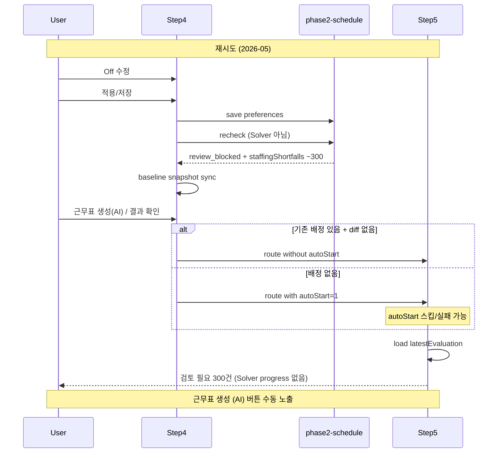

# Step4/Step5 재시도 — Solver 미실행 + recheck 오노출 개선 계획

> **For agentic workers:** REQUIRED SUB-SKILL: Use @superpowers:executing-plans (recommended) or @superpowers:subagent-driven-development to implement task-by-task. Steps use checkbox (`- [ ]`) syntax for tracking.

**Goal:** Step4에서 Off 적용/저장 후 재생성을 기대할 때 Step5가 Solver 진행 UI를 보여 주고, Solver 실행 전 `recheck` evaluation이 Solver 결과처럼 노출되지 않도록 한다.

**Architecture:** Step4 handoff는 “저장”과 “재생성 의도”를 분리해 `autoStart`·배정 초기화를 보장한다. Step5는 evaluation을 **pre-solve recheck** vs **post-solve result**로 구분해 검토 패널·상태 카드를 조건부 렌더링한다. 서버 `recheck` API는 Step4 정책 검증용으로 유지하되, Step5 first-run/pre-run surface에서는 staffing shortfall을 숨긴다.

**Tech Stack:** Vue 3 `<script setup>`, TypeScript, Pinia, Naive UI, Supabase Edge Functions (`phase2-schedule`), Vitest, Playwright.

---

**상태:** 📋 다음 세션 구현 대기  
**작성일:** 2026-06-17  
**관련 이슈:** Step4 Off 저장 후 Step5에서 “검토 필요 · 인력 부족 300건 (배정 0명)” 즉시 노출, Solver 진행 UI 미표시  
**관련 화면:** `Step4InitialData.vue`, `Step5Result.vue`  
**선행 정책:** [단일 월 근무표 정책](./2026-05-14-single-month-schedule-policy.ko.md) §3.2, §4.2, §5.1

---

## 1. 증상

| 영역               | 관찰                                                                                                                  |
| ------------------ | --------------------------------------------------------------------------------------------------------------------- |
| **사용자 기대**    | Step4 Off 입력 완료 → `근무표 생성` → Step5에서 **Solver 실행 + 진행률 UI** → 결과 대기                               |
| **실제 화면**      | Step5 진입 직후 **“검토 필요 · 인력 부족 300건”** amber alert, 메시지 `YYYY-MM-DD 인력 부족: 필요 N명, 배정 0명` 반복 |
| **Solver 진행 UI** | `근무표를 생성하고 있습니다` progress 섹션 **미표시**                                                                 |
| **Step5 하단 CTA** | **`근무표 생성 (AI)` 버튼 표시됨** (수동 시작 가능)                                                                   |
| **생성 상태 카드** | 사용자 **확인 불가**                                                                                                  |
| **맥락**           | **재시도** (2026-05), Step4에서 Off **적용/저장 후** 생성 버튼 클릭                                                   |

---

## 2. deep-interview — 확정된 사항

| 축            | 결정                                                                                           |
| ------------- | ---------------------------------------------------------------------------------------------- |
| **목표**      | Off 수정 후 Step5에서 Solver가 자동 시작되고, 완료 전에는 “생성 결과 검토” UI가 뜨지 않아야 함 |
| **범위**      | Step4 handoff, Step5 pre-run/post-run UI 분기, 관련 unit/E2E 테스트                            |
| **제외**      | 실 Solver 엔진 교체, 다중 version compare UI, Step1–3 변경                                     |
| **완료 기준** | 아래 §7 Acceptance Criteria 전부 충족                                                          |
| **재현 맥락** | 재시도 + **적용/저장 선행** + Step5에서 검토 패널 즉시 노출 + Solver progress 없음             |

### 열린 질문 → 답변 반영

| 질문                               | 답변     | 분석에 미치는 영향                                                                                                                                                         |
| ---------------------------------- | -------- | -------------------------------------------------------------------------------------------------------------------------------------------------------------------------- |
| Step5 하단 `근무표 생성 (AI)` 버튼 | **보임** | Step5 load 시 `hasCurrentMonthAssignments === false` 또는 `isPreRun` — 당월 DB 배정 없음. `autoStart`가 URL에 있었어도 스킵·실패했거나, handoff without `autoStart` 가능성 |
| 생성 상태 카드                     | **모름** | `shouldShowStatusCard` 여부 미확인. 구현 후 QA에서 카드 value(`생성 전` / `재검토 차단` / `완료`) 명시 확인                                                                |

---

## 3. 근본 원인 (Root Cause)

### 3.1 직접 원인 — Solver 전 `recheck` evaluation이 Step5 “검토 필요”로 노출

Step4 **적용/저장**(`handleSave` → `persistStep4PreferenceMaps`)은 preferences 저장 직후 **`recheckPhase2ScheduleVersion`** 을 호출한다.

```text
saveScheduleVersionPreferences(...)
  → recheckPhase2ScheduleVersion(previewVersionId)
      → buildVersionEvaluation (현재 DB 배정 기준)
      → persistVersionEvaluation (latestEvaluation 갱신)
```

- Solver **미실행** 상태에서 trust evaluator가 **요일·교대별 staffing** 을 검사한다.
- 당월 `schedule_assignments` 가 비어 있거나 D/E/N이 채워지지 않으면 `staffing_shortfall` violation이 날짜×shift만큼 누적된다 (2026-05 ≈ **300건**).
- `resultStatus === 'review_blocked'` 이면 Step5 `shouldShowReviewAttentionPanel` 이 **Solver 실행 여부와 무관하게** 패널을 연다.

**관련 코드**

| 파일                                                          | 역할                                                        |
| ------------------------------------------------------------- | ----------------------------------------------------------- |
| `Step4InitialData.vue` L2726–2732                             | 저장 후 `recheck` 호출                                      |
| `Step5Result.vue` L1317–1378                                  | `reviewAttentionSummary` / `shouldShowReviewAttentionPanel` |
| `supabase/functions/phase2-schedule/repository.ts` L2454–2482 | `recheckVersion`                                            |
| `supabase/functions/phase2-schedule/engine.ts` L355–448       | `buildStaffingViolations`, `review_blocked` 판정            |

### 3.2 간접 원인 — “적용/저장”과 “재생성 handoff”의 분리

Step4 **Next**(`handleNext`)는 handoff 시점의 diff만 본다.

```text
hasStep4Changes      = preference snapshot diff (constraints + notes)
hasConstraintChanges = constraints-only diff
shouldRegenerate     = !baseline.hasCurrentMonthAssignments || hasConstraintChanges
autoStart            = shouldRegenerate (Step5 query)
```

**적용/저장 선행 시:**

1. preferences + `recheck` 완료
2. `setBaselinePreferenceSnapshot` → baseline 동기화
3. Next 클릭 시 `hasStep4Changes === false`, `hasConstraintChanges === false`
4. **기존 당월 배정이 DB에 남아 있으면** `shouldRegenerate === false` → **`autoStart` 없음**, **배정 삭제 없음**

단일 월 정책 §4.2가 요구하는 “Off 변경 → 배정 초기화 → Solver 재실행”과 **어긋난다**.

**관련 코드**

| 파일                              | 역할                                                 |
| --------------------------------- | ---------------------------------------------------- |
| `Step4InitialData.vue` L2851–2900 | `handleNext` handoff                                 |
| `Step4InitialData.vue` L998–1009  | CTA 라벨 (`근무표 생성(AI)` vs `결과 확인으로 이동`) |
| `Step5Result.vue` L2765–2795      | `consumeRouteAutoStart` guard                        |

### 3.3 Step5 `autoStart` 조용한 스킵

`consumeRouteAutoStart`는 아래 조건에서 **토스트 없이 return** 한다.

- `hasCurrentMonthAssignments === true`
- `hasOtherActiveSolvingVersion()`
- `!canMutatePreviewVersion`

사용자는 Solver가 “실행 안 됨”인지 “실패”인지 구분하기 어렵다.

### 3.4 버전 상태 매핑으로 인한 혼란

`review_blocked` (recheck 결과) → `mapVersionStatusToSolverStatus` → **`complete`**

- `isFinished === true`, progress 섹션 조건 `isRunning` 불충족
- “생성 완료” 톤의 status badge + “검토 필요” 패널 동시 노출 가능

### 3.5 이번 재현에서의 종합 시나리오



---

## 4. 제품 결정 (구현 전 고정)

| #   | 결정                                                                                                                                                  | rationale                                            |
| --- | ----------------------------------------------------------------------------------------------------------------------------------------------------- | ---------------------------------------------------- |
| D1  | Step5 **pre-run**(Solver 미완료·미시작)에서는 **staffing shortfall recheck 결과를 기본 숨긴다**                                                       | 빈 그리드 staffing 경고는 Solver 전엔 false positive |
| D2  | Step4 CTA **`근무표 생성(AI)`** 클릭은 **재생성 의도**로 간주한다 (diff 없어도)                                                                       | 적용/저장 선행 후에도 §4.2 재생성 보장               |
| D3  | 재생성 handoff 시 **당월 배정 삭제 + `autoStart=1`** 을 한 쌍으로 실행                                                                                | 배정 잔존으로 `consumeRouteAutoStart` 스킵 방지      |
| D4  | `autoStart` 스킵 시 **한국어 info/error 메시지** 표시                                                                                                 | 조용한 실패 금지                                     |
| D5  | Step4 **적용/저장**의 `recheck`는 **정책 거부·Off 반영 상태**용으로 유지                                                                              | Step4 policy UI는 계속 recheck 필요                  |
| D6  | Step5 **post-solve** evaluation(`solverExecutionId` 있음 또는 version `review_ready`/`review_blocked` after solve)에서만 staffing 검토 패널 기본 노출 | Solver 결과 vs pre-solve 구분                        |

---

## 5. 구현 작업

### Task 1 — Step4: 재생성 의도 handoff

**Files:** `src/views/schedule/Step4InitialData.vue`, `tests/unit/step4-initial-data.spec.ts`

- [ ] `handleNext`에 **CTA 의도** 분기 추가: 버튼 라벨이 `근무표 생성(AI)`이면 `regenerationIntent = true`
- [ ] `regenerationIntent === true`일 때:
  - [ ] `hasStep4Changes` 여부와 무관하게 preferences 저장(변경 있을 때만)
  - [ ] **`deleteThisMonthVersionAssignments` 항상 실행** (blocked 상태 제외)
  - [ ] **`routeToStep5(..., { autoStart: true })`**
- [ ] `결과 확인으로 이동`일 때만 기존 no-op handoff 유지
- [ ] **실패 테스트 → 구현 → 통과**:
  - [ ] “적용/저장으로 baseline sync 후 Next” → `deleteThisMonthVersionAssignments` + `autoStart: '1'`
  - [ ] “변경 없음 + 결과 확인으로 이동” → delete/autoStart 없음

### Task 2 — Step5: pre-run vs post-solve evaluation UI

**Files:** `src/views/schedule/Step5Result.vue`, `tests/unit/step5-result.spec.ts`

- [ ] `isPreSolveRecheckEvaluation` computed 추가 (제안 조건):

  ```text
  latestEvaluation != null
  AND latestEvaluation.solverExecutionId == null
  AND !hasCurrentMonthAssignments
  AND solver.status in ('created', 'error') OR previewVersionStatus in ('draft', 'review_pending')
  ```

  (구현 시 실제 version status enum과 align — `review_blocked` from recheck-only는 pre-solve로 분류)

- [ ] `shouldShowReviewAttentionPanel`에 `!isPreSolveRecheckEvaluation` guard
- [ ] pre-run empty state와 충돌 없는지 확인: `shouldShowFirstRunEmptyState` vs status card
- [ ] **실패 테스트**:
  - [ ] recheck-only `review_blocked` + empty assignments → 검토 패널 **미표시**
  - [ ] post-solve evaluation + assignments → 검토 패널 **표시**

### Task 3 — Step5: `autoStart` 스킵 피드백

**Files:** `src/views/schedule/Step5Result.vue`, `tests/unit/step5-result.spec.ts`

- [ ] `consumeRouteAutoStart` 각 early return에 `showInfo`/`showError` (한국어):
  - [ ] `hasCurrentMonthAssignments` → “기존 배정이 있어 자동 생성을 건너뛰었습니다…”
  - [ ] `hasOtherActiveSolvingVersion` → 기존 copy 재사용
  - [ ] `!canMutatePreviewVersion` → 읽기 전용 안내
- [ ] **실패 테스트**: autoStart + assignments exist → solver 미호출 + info toast

### Task 4 — (선택) Step4 저장 성공 copy 보강

**Files:** `Step4InitialData.vue`

- [ ] 적용/저장 성공 메시지에 “**근무표 생성(AI)** 를 눌러 AI 생성을 시작하세요” 한 줄 추가 (D2 보조)
- [ ] MVP: copy-only, Task 1이 핵심

### Task 5 — E2E 회귀

**Files:** `tests/e2e/step4-existing-result-flow.spec.ts` 또는 신규 `tests/e2e/step4-regenerate-after-off-save.spec.ts`

- [ ] Step5 기존 결과 → Off 수정 → 적용/저장 → 근무표 생성 → progress UI visible
- [ ] “검토 필요 · 인력 부족 300건”이 **Solver 시작 직후**에는 없음

---

## 6. 수정 대상 파일 요약

| 파일                                      | 변경 유형                              |
| ----------------------------------------- | -------------------------------------- |
| `src/views/schedule/Step4InitialData.vue` | handoff / regeneration intent          |
| `src/views/schedule/Step5Result.vue`      | pre-solve UI guard, autoStart feedback |
| `tests/unit/step4-initial-data.spec.ts`   | handoff tests                          |
| `tests/unit/step5-result.spec.ts`         | review panel + autoStart tests         |
| `tests/e2e/*.spec.ts`                     | retry flow E2E                         |

**서버 변경:** 기본 **없음** (D5: recheck API 유지). 필요 시 후속으로 “pre-solve evaluation flag” API 필드 검토.

---

## 7. Acceptance Criteria

- [ ] **AC1** 재시도: Step4 Off 적용/저장 → `근무표 생성(AI)` → Step5 progress UI 표시 (`data-test="step5-running-progress"`)
- [ ] **AC2** AC1 직후 Solver 완료 전, “검토 필요 · 인력 부족 N건” 패널 **미표시**
- [ ] **AC3** Solver 완료 후 staffing shortfall 있으면 검토 패널 **표시** (기존 post-solve 동작 유지)
- [ ] **AC4** `autoStart` 스킵 시 사용자에게 **한국어** 이유 표시
- [ ] **AC5** `pnpm lint:check` + `pnpm run build` 통과
- [ ] **AC6** 관련 unit 테스트 추가/갱신 후 통과

---

## 8. QA 체크리스트 (수동)

1. Step5 → Off 수정 → Step4
2. Off неск 건 변경 → **적용/저장** (성공 toast 확인)
3. **`근무표 생성(AI)`** 클릭
4. Step5: blue progress + “근무표를 생성하고 있습니다” 확인
5. progress 중 amber “검토 필요 · 인력 부족” **없음** 확인
6. 생성 완료 후 결과 grid + (해당 시) 검토 패널 확인
7. 생성 상태 카드 value 기록 (`생성 전` / `생성 중` / `재검토 차단` / `완료`)

---

## 9. 리스크 및 후속

| 리스크                                                | 완화                                                                 |
| ----------------------------------------------------- | -------------------------------------------------------------------- |
| Task 1이 “결과 확인으로 이동”과 CTA 혼동              | 라벨 문자열이 아닌 explicit `regenerationIntent` 플래그 사용         |
| `isPreSolveRecheckEvaluation` heuristic 오분류        | `solverExecutionId` null + empty assignments를 primary signal로 유지 |
| 기존 “recheck 후 Step5 staffing 미리보기” 기대 사용자 | post-solve만 노출이 제품 정책 (§D1)                                  |

**후속 (본 문서 범위外):**

- `deleteThisMonthVersionAssignments` 시 `latest_evaluation_id` 초기화 여부 (서버 RPC)
- 생성 상태 카드 copy를 `pre-run` / `post-run`에 맞게 정리

---

## 10. 다음 세션 시작 프롬프트

```text
docs/plans/2026-06-17-step4-step5-prerun-recheck-autostart-fix.ko.md 를 읽고
Task 1 → Task 2 → Task 3 순으로 구현해줘.
Task 5 E2E는 unit 통과 후 진행.
완료 시 §7 Acceptance Criteria와 AGENTS.md workflow checks 보고.
```

---

## 11. 참고 코드 위치

| 주제                 | 위치                                                           |
| -------------------- | -------------------------------------------------------------- |
| Step4 저장 + recheck | `Step4InitialData.vue` ~L2716–2746                             |
| Step4 Next handoff   | `Step4InitialData.vue` ~L2851–2900                             |
| Step5 검토 패널      | `Step5Result.vue` ~L326–351, ~L1317–1378                       |
| Step5 autoStart      | `Step5Result.vue` ~L2765–2795                                  |
| recheck API          | `supabase/functions/phase2-schedule/repository.ts` ~L2454–2482 |
| staffing evaluation  | `supabase/functions/phase2-schedule/engine.ts` ~L355–448       |
